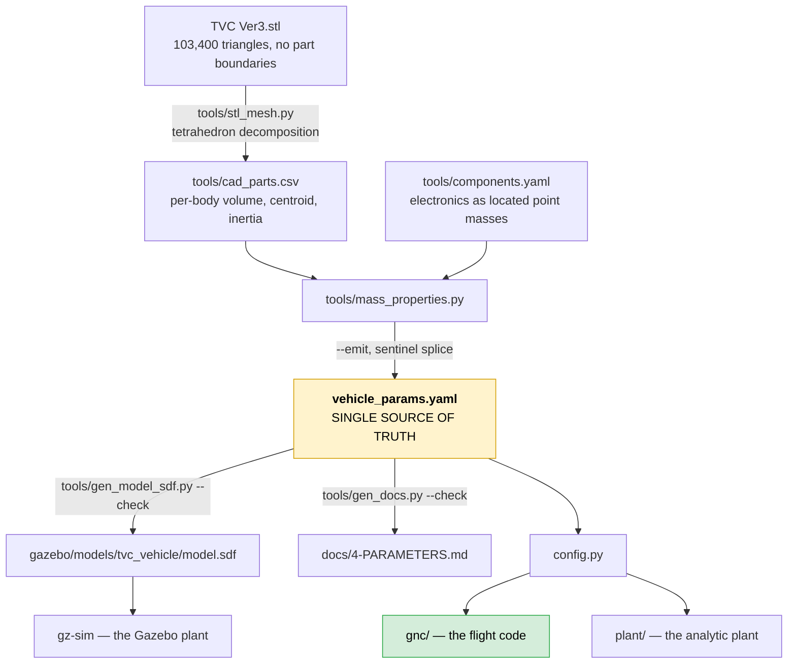

# 1 — Architecture

What every directory and every file is for, why the boundaries are where they
are, and how one control step actually flows through the system.

If you read only one section, read [§2, the two seams](#2-the-two-seams). They
are the reason the rest of the structure exists.

---

## 1. The organising principle

**This is not a simulator that a controller was later fitted into. It is a
flight-software development harness, and the simulator is one of its plants.**

That inversion is the whole design, and it is borrowed from how PX4 works: PX4's
flight code is unaware that a simulator exists. What a simulation swaps is the
*sensor and actuator boundary*, not the controller. The same binary flies SITL
and flies the vehicle.

Mirroring that here buys one specific thing: the claim *"the code we tested is
the code that flies"* becomes checkable rather than hopeful. It is checkable
because the flight code is in one directory, that directory cannot import the
simulation, and a test parses it to prove it.

The cost is that some things are in a less convenient place than they would
otherwise be — the parameter loader is outside the flight code because flight
code does no file I/O; the rigid-body dynamics are not next to the controller
that was derived against them. Those are the boundaries doing their job.

### The four principles the structure encodes

**Principle 1 — the boundary is the sensor/actuator interface, not a function
call.** Two data types cross it (§2) and nothing else does.

**Principle 2 — the harness owns the clock; the controller is a fixed-step
discrete function.** Every function in `gnc/` takes `dt` as an argument and
never reads a clock. A run is therefore reproducible, and a tolerance against a
run that cannot be repeated means nothing.

**Principle 3 — verification and validation are different activities requiring
different evidence** (Sargent). Everything in `tests/` and `verify/` is
*verification*: internal consistency. *Validation* — agreement with the real
vehicle — is level 0 here, and [6-CREDIBILITY.md](6-CREDIBILITY.md) says so on
its first page.

**Principle 4 — control allocation is its own layer** (Johansen & Fossen). The
attitude loop asks for a *virtual control effort* — a body moment and a total
thrust — and a separate layer decides which effectors produce it. That layer is
where all the vehicle-specific unpleasantness lives (§5), and keeping it
separate is what would let the same controller drive a different effector suite.

---

## 2. The two seams

Everything else is negotiable. These two are not.

```
                     ┌──────────────────────────────┐
   EstimatedState ──▶│            gnc/              │──▶ ActuatorSetpoint
      (seam A)       │   position → attitude →      │      (seam B)
                     │   rate → allocation          │
                     └──────────────────────────────┘
```

### Seam A — `EstimatedState`

The controller consumes an **estimate**, never ground truth — even today, when
the estimator is the identity function (`plant/sensors.py::PerfectEstimator`).

```python
EstimatedState(pos_i, vel_i, quat, omega_b, stamp_s)
```

Why bother, when it currently changes nothing? Because writing the loops against
truth and adding noise later is not an extra module — it is a rewrite of every
loop that assumed clean, instantaneous, unbiased measurements. The seam costs
nothing now and makes the later addition a drop-in.

`stamp_s` is there for the same reason. Estimator latency is certain to appear,
and adding the field once code depends on the struct means touching every call
site.

### Seam B — `ActuatorSetpoint`

```python
ActuatorSetpoint(motor_a, motor_b,              # normalized [0, 1]
                 gimbal_inner_rad, gimbal_outer_rad,
                 thrust_n, tau_p_nm,            # predictions, not commands
                 sat_gimbal, sat_roll, sat_thrust)
```

Motors normalized, gimbal in radians. The asymmetry is deliberate: **each is the
natural coordinate of its own calibration.** The bench thrust/torque surface is a
function of normalized commands; the allocator solves for angles. Converting
either earlier would push a calibration into the controller or a control
decision into a HAL.

The shape also matches where this is going. With
`OffboardControlMode.direct_actuator = true`, PX4 disables its own control
allocator and an external controller supplies `ActuatorMotors` / `ActuatorServos`
directly — normalized, in the FRD body frame. Both the near-term offboard path
and a future in-tree PX4 module converge on that same uORB interface.

`thrust_n` and `tau_p_nm` are what the allocation **expects to achieve**, not
what was requested. The allocator clamps to the feasible set, so the two differ
whenever a limit binds, and a consumer that logs the request instead of the
achievement reports authority the vehicle never had.

---

## 3. The layers

```
┌─ gnc/ ─────────────── FLIGHT CODE. This runs on the vehicle. ─────────────┐
│  params.py         plain structs; no defaults for measured quantities      │
│  mathx.py          quaternions, the gimballed thrust direction, clamp      │
│  pid.py            the one PID every loop uses                             │
│  position.py       horizontal position error → attitude setpoint           │
│  altitude.py       altitude cascade + the 1/cos θ thrust feedforward       │
│  attitude.py       3-axis cascade: quaternion error → rate → moment        │
│  allocation.py     moment + thrust → gimbal angles + motor commands        │
│  effectiveness.py  the measured surface, its inverse, the gimbal maps      │
│  types.py          the two seams                                           │
│  controller.py     TvcController — the facade every pipeline calls         │
└───────────────────────────────────────────────────────────────────────────┘
        ▲ EstimatedState                              │ ActuatorSetpoint
┌─ plant/ ─────────── SIMULATION ONLY. None of this flies. ─────────────────┐
│  rigidbody.py    6-DOF Newton–Euler, full inertia tensor                   │
│  actuators.py    gimbal slew + transport delay; motor lag on (T, τ_P)      │
│  sensors.py      PerfectEstimator today; noise and an EKF later            │
└───────────────────────────────────────────────────────────────────────────┘
┌─ hal/ ───────────── transport adapters. No control. ──────────────────────┐
│  gazebo.py       (T, τ_P) → the rotor speeds gz-sim's plugin needs         │
│  (later) px4.py  → ActuatorMotors/ActuatorServos, plus the FRD conversion  │
└───────────────────────────────────────────────────────────────────────────┘
┌─ harness/ ───────── owns the clock and the I/O. ──────────────────────────┐
│  mil.py          analytic plant, fixed step, deterministic                 │
│  gz.py           gz-sim plant over gz-transport, stepping on odometry      │
└───────────────────────────────────────────────────────────────────────────┘
┌─ nodes/ ─────────── ROS 2 wrappers. Thin by rule. ────────────────────────┐
│  controller.py       odometry → TvcController → ActuatorCommand           │
│  simulator.py        ActuatorCommand → analytic plant → Odometry          │
│  gazebo_bridge.py    ActuatorCommand → the three gz plugin topics         │
└───────────────────────────────────────────────────────────────────────────┘
┌─ apps/ ── GUI, 3D viewer, plotter, recorder.  ─ verify/ ── scenarios, golden ─┐
└───────────────────────────────────────────────────────────────────────────┘
```

**The dependency is one-way and `gnc/` is at the bottom of it.** A controller
that reaches into the plant is a controller that cannot fly;
`tests/test_gnc_purity.py` makes that structural rather than a review
convention — it parses the AST and fails on a forbidden import, a `while` loop,
module-level mutable state, or the string `tvc_control.plant`.

### The porting discipline, and why each rule exists

`gnc/` is the directory a PX4 C++ module will be a port of. These rules are
invisible in a diff — nothing breaks the day someone imports numpy for one
convenient call, and by the time anyone attempts the port the dependency is
load-bearing in six places. So they are enforced by test.

| rule | why |
|---|---|
| imports limited to `math`, `dataclasses`, `typing` | `math` maps to `<cmath>`, a dataclass to a struct, `typing` vanishes. A numpy array has no fixed-size C++ counterpart; a scipy call is an algorithm someone would have to reimplement under time pressure without the tests that covered the original. |
| no file I/O | parameters are injected once at startup — the shape PX4's parameter system already has. It also makes a control step's worst-case time independent of a filesystem. |
| no module-level mutable state | a module-level list is a shared buffer waiting to be found by the second controller instance |
| no `while` — every iteration count from a `range` | worst-case execution time must be a number someone can write down. The two numerical iterations here (the allocation's Newton refinement, the surface inverse) carry their bound at the call site. |
| every function takes `dt` | principle 2 |

---

## 4. One control step, end to end

Following the analytic pipeline (`harness/mil.py`), 100 Hz by default:

```
  1.  plant state x  ──PerfectEstimator──▶  EstimatedState        [seam A]

  2.  TvcController.update(state, setpoint, dt):

      a. position.py    (x, y) error + velocity  →  pitch_des, yaw_des
                        clamped to ±8°.  Only if position_hold.

      b. altitude.py    z error → climb demand → vertical accel
                        T = m(g + a_z) / cos θ            ← tilt feedforward
                        Only if altitude_hold; else T = mg.

      c. attitude.py    quaternion error → body-rate setpoint  (P)
                        rate error → angular acceleration      (PID)
                        × inertia → body moment (M_x, M_y, M_z)

      d. allocation.py  (M, T) → δ_inner, δ_outer, u_a, u_b, τ_P
                        clamped to the measured feasible set

      →  ActuatorSetpoint                                        [seam B]

  3.  plant/actuators.py   gimbal: 30 ms deadtime, then per-ring slew limit
                           motors: 100 ms lag applied to (T, τ_P)
      →  what the actuators ACHIEVED, not what was commanded

  4.  plant/rigidbody.py   ẋ = f(x, T, δ, τ_P);  RK45 over one control period
```

**Why that order.** Altitude runs *before* attitude because the allocator cannot
size the roll headroom or the gimbal angles without knowing the thrust first —
the feasible set is a function of T. Position runs before both because it
produces a *setpoint*, not an *effort*, and so belongs outside the attitude loop
entirely.

**Step 3 is the one people forget.** The rigid body integrates what the
actuators achieved. Feeding it the command instead would make every gain look
better than it is by exactly the amount of lag that was skipped — which is
precisely the difference between the old standalone Gazebo demo (no actuator
model) and the analytic simulator (both lags).

---

## 5. Where the difficulty actually is

Three places, and they are not where a reader would expect.

### The feasible set is not a box

τ_P — the differential propeller reaction torque — is the vehicle's **only**
authority about the thrust axis. It is bought with a thrust *split* between the
two props, so:

- roll authority is a **function of total thrust**: it peaks near half throttle
  and vanishes at both idle and the ceiling;
- it is **asymmetric**, because the lower prop runs in the upper prop's wake. At
  hover the reachable interval is `[−0.089, +0.147] N·m`, not `±` anything.

A symmetric cap either throws away authority on the strong side or promises what
the weak side cannot deliver. Earlier code did the latter and over-promised by
up to 0.09 N·m — the roll integrator wound up, and it looked like a tuning
problem.

### The axes are coupled through the gimbal

The props ride **on** the gimbal, so their reaction torque tilts with the thrust.
That means τ_P leaks into the lateral axes, and conversely only
`τ_P·cos δ₁·cos δ₂` of the commanded roll torque reaches body z. Both couplings
are in the moment equations in [2-THEORY.md §2](2-THEORY.md), and `allocate()`
closes the loop between them with a two-pass solve.

### Gazebo's motor model cannot represent this vehicle

`MulticopterMotorModel` computes `T = k(ω_a² + ω_b²)` and `τ_P = c(T_b − T_a)`:
separable, symmetric, linear in the split. The measured surface is none of the
three. No single `c` exists — the value needed spans 3.3× across the envelope —
and being *odd* in the split, `c` cannot represent the sign asymmetry at all.

The fix is to invert the plugin's own algebra on the command side (`hal/gazebo.py`).
The price is stated plainly: **simulated rotor speed is a control allocation
variable, not a physical RPM.** `momentConstant` becomes a solver scaling and
`maxRotVelocity` becomes solver headroom. Nothing may read ω as physics, and
because the raised ceiling means the plugin no longer enforces the real 17.79 N
limit, the allocator does — asserted in `tests/test_allocation.py`.

---

## 6. File-by-file

### Flight code — `src/tvc_control/tvc_control/gnc/`

| file | what it does |
|---|---|
| `params.py` | `VehicleParams` and `ControlGains`. **No defaults for measured quantities** — constructing one bare is a `TypeError`, not a silently wrong vehicle. Per-ring travel and slew limits are properties over the measured `gimbal_axes`. |
| `mathx.py` | Quaternion algebra on plain tuples, `thrust_axis(δ)`, `attitude_error`, `clamp`, and an `isclose` that reproduces numpy's default predicate exactly (it decides saturation flags, and a flag one step early changes anti-windup). |
| `pid.py` | One PID. `dt` is an argument; `freeze` is conditional anti-windup. |
| `position.py` | Position → tilt setpoint. Deliberately ~10× slower than the attitude loop; the derivation of both signs is preserved verbatim because both were wrong once. |
| `altitude.py` | Altitude cascade and the `1/cos θ` feedforward, with a floored divisor so a bad attitude estimate cannot demand unbounded thrust. |
| `attitude.py` | The 3-axis cascade. The rate loop outputs **angular acceleration**; inertia is applied here and nowhere else. |
| `allocation.py` | The moment/thrust → actuator map, the signed feasible set, and the saturation flags the outer loops use for anti-windup. |
| `effectiveness.py` | `ThrustTorqueSurface` — the measured cubic and its inverse (warm-started Newton, a coarse seed table for the cold path, a thrust-priority backoff ladder ending in a bisection that cannot fail). `GimbalAxisMap` — one ring's PWM↔angle map. |
| `types.py` | The seams: `EstimatedState`, `Setpoint`, `ControlMode`, `ActuatorSetpoint`. |
| `controller.py` | `TvcController`, the facade. **This facade is the unification** — once every pipeline goes through it, the difference between them is transport and integration and nothing else. |

### Simulation — `plant/`

| file | what it does |
|---|---|
| `rigidbody.py` | 13-state 6-DOF: position, velocity, quaternion, body rates. Full inertia tensor via `np.linalg.solve` — the products are **not** small here (`Iyz/Izz = 27%`) and a diagonal approximation dominates the thrust-axis response. |
| `actuators.py` | `GimbalActuator` (FIFO transport delay, then per-ring slew), `MotorLag` (on `(T, τ_P)`, switchable delay/lag/both), and `ActuatorChain` which bundles them so no harness can model a different subset. |
| `sensors.py` | `PerfectEstimator`. Ground truth relabelled as an estimate — the type conversion is where the honesty lives. |

### Everything else

| path | what it does |
|---|---|
| `hal/gazebo.py` | `rotor_speeds()` — the command-side inversion, plus `plugin_forward()` which exists so a test can assert the round trip instead of arguing it. |
| `harness/mil.py` | The analytic harness: fixed-step ZOH loop over `solve_ivp`, plus the metrics every scenario and the golden are computed from. |
| `harness/gz.py` | The Gazebo harness: one control step per odometry message, so the loop is in lockstep with simulated time. |
| `nodes/controller.py` | Subscribes to odometry, runs on a **timer** with a measured and clamped `dt`, publishes one `ActuatorCommand`. |
| `nodes/simulator.py` | The analytic plant as a ROS node, publishing `nav_msgs/Odometry` on the same topic Gazebo uses — which is what makes the two plants interchangeable. |
| `nodes/gazebo_bridge.py` | Pure fan-out to the three gz plugin topics, with a per-ring clamp as the last line of defence. |
| `config.py` | The only place vehicle numbers enter. Also `parameter_rows()`, which drives both `tvc.py params` and the generated parameter document. |
| `verify/scenarios.py` | Five closed-loop runs. Imported by `tests/test_scenarios.py` so the definitions exist once. |
| `verify/golden.py` | Captures and checks the frozen baseline. |
| `tools/mass_properties.py` | CAD solids + point masses → mass, CG, full inertia tensor; `--emit` rewrites only the sentinel-delimited block in the YAML. |
| `tools/gen_model_sdf.py` | Solves `base_link` so the SDF **composite** reproduces the YAML exactly. `--check` is a CI gate. |
| `tools/gen_docs.py` | Regenerates the numeric sections of `4-PARAMETERS.md`. `--check` is a CI gate. |
| `tools/stl_mesh.py`, `tools/gen_cad_parts.py` | Exact mesh inertia by tetrahedron decomposition, and the one-off that splits a merged STL into named bodies. |

---

## 7. Data flow between the three representations of the vehicle

There is exactly one path from CAD to a running simulation, and every arrow is a
generator with a `--check` mode.



`gen_model_sdf.py` deserves a note. The hand-written SDF used to split the mass
across six links whose placement made the Gazebo **composite** CG land at
161 mm, while the mass tool and the controller both assumed 211 mm — so Gazebo
silently simulated a different vehicle than the one the controller was tuned
for. The generator removes that failure mode by construction: it *solves* for
`base_link`'s mass, pose and inertia so that the composite of all links
reproduces the target exactly, and `--check` verifies it (CG error 2×10⁻¹⁶ mm).

---

## References

- PX4, [Simulation](https://docs.px4.io/main/en/simulation/) and
  [Offboard Mode](https://docs.px4.io/main/en/flight_modes/offboard) — the
  flight-code/simulator boundary, lockstep, and `direct_actuator`
- T. A. Johansen and T. I. Fossen, *Control allocation — a survey*,
  Automatica 49(5):1087–1103, 2013 — the allocation hierarchy of §1
- R. G. Sargent, *Verification and validation of simulation models*,
  Winter Simulation Conference, 2010 — the V&V distinction of principle 3
- NASA-STD-7009, *Standard for Models and Simulations* — the credibility
  framework [6-CREDIBILITY.md](6-CREDIBILITY.md) is structured after
