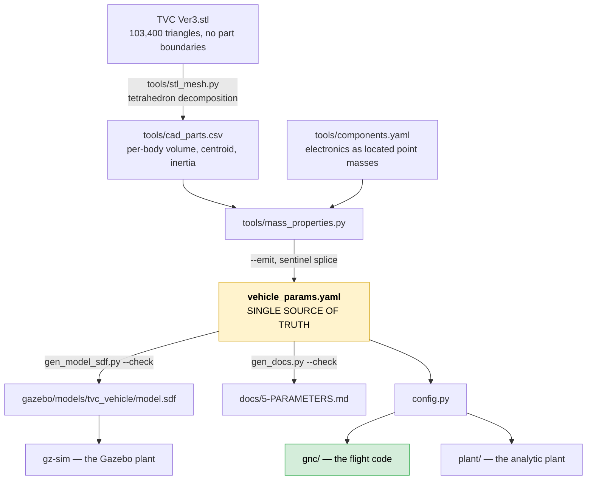

# 1 — Code map

**What every directory, file and function is.** The index in §5 is generated by
parsing the source, so it cannot disagree with the code.

For *what happens when it runs*, read [2-WALKTHROUGH.md](2-WALKTHROUGH.md).

---

## 1. The repository, top level

```
tvc.py            the only executable file here. `python tvc.py --help`.
docs/             eight numbered documents, meant to be read in order.
src/              the ROS 2 workspace source -- ALL the Python lives here.
gazebo/           the SDF vehicle, the two worlds, and the hover script.
tools/            generators: CAD -> mass properties -> parameters -> SDF, docs.
tests/            the merge gate. Pure Python; no ROS, no Gazebo, no display.
reference/        frozen baselines, the PX4 airframe, a bench servo sketch.
Dockerfile        the devcontainer image. Needed only for ROS 2 and Gazebo.
```

Everything else at top level is standard tooling config: `.github/workflows/`
(CI), `.devcontainer/` (VS Code), `requirements.txt`, `pytest.ini`, `.gitignore`,
`.dockerignore`, `.vscode/`.

---

## 2. Why the code is nested three deep

```
src/tvc_control/tvc_control/gnc/allocation.py
└─┬─┘└────┬────┘└────┬────┘
  │       │          └── the Python package
  │       └── the colcon package
  └── the ROS 2 workspace source directory
```

**This is ROS 2's convention, not a mistake.** `colcon` builds every package
under `src/`, and an `ament_python` package directory contains a Python package
of the same name. Flattening it would break `colcon build`, which is the one
thing in this repository that has never been run and therefore has the least
margin for surprises.

There are two packages: `tvc_control` (all the code) and `tvc_msgs` (one message
definition, which must be a separate CMake package because ROS 2 generates
message code with CMake).

---

## 3. The six layers, and the rule that makes them mean something

```
┌─ gnc/ ────────────── FLIGHT CODE. This runs on the vehicle. ──────────────┐
│  The controller, the allocation, the actuator effectiveness models, and    │
│  the parameter structs they read.                                          │
└───────────────────────────────────────────────────────────────────────────┘
        ▲ EstimatedState                              │ ActuatorSetpoint
┌─ plant/ ─────────── SIMULATION ONLY. None of this flies. ─────────────────┐
│  Rigid-body dynamics, actuator lag, sensor models.                         │
└───────────────────────────────────────────────────────────────────────────┘
┌─ hal/ ───────────── Transport adapters. No control. ──────────────────────┐
┌─ harness/ ───────── Owns the clock and the I/O. ──────────────────────────┐
┌─ nodes/ ─────────── ROS 2 wrappers. Thin by rule. ────────────────────────┐
┌─ apps/ ──────────── GUI, 3D viewer, plotter, recorder. ───────────────────┐
┌─ verify/ ────────── Scenarios, the baseline, the tracer. ─────────────────┐
```

**The dependency is one-way and `gnc/` is at the bottom of it.** A controller
that reaches into the plant is a controller that cannot fly, so this is
enforced by test rather than by review convention:
`tests/test_gnc_purity.py` parses `gnc/` and fails on a forbidden import, a
`while` loop, module-level mutable state, or the string `tvc_control.plant`.

That rule is what makes one specific claim checkable rather than hopeful:
**the code we test is the code that flies.**

### The porting discipline, and why each rule exists

`gnc/` is the directory a PX4 C++ module will be a port of. These rules are
invisible in a diff — nothing breaks the day someone imports numpy for one
convenient call, and by the time anyone attempts the port the dependency is
load-bearing in six places.

| rule | why |
|---|---|
| imports limited to `math`, `dataclasses`, `typing` | `math` maps to `<cmath>`, a dataclass to a struct, `typing` vanishes. A numpy array has no fixed-size C++ counterpart; a scipy call is an algorithm someone would have to reimplement under time pressure without the tests that covered the original. |
| no file I/O | parameters are injected once at startup — the shape PX4's parameter system already has. It also makes a control step's worst case independent of a filesystem. |
| no module-level mutable state | a module-level list is a shared buffer waiting to be found by the second controller instance |
| no `while`; every iteration count from a `range` | worst-case execution time must be a number someone can write down |
| every function takes `dt`; nothing reads a clock | that is what makes a run reproducible, and reproducibility is what makes comparing two plants mean anything |

---

## 4. The two seams

Everything else about the structure is negotiable. These two are not, because
they are what a future change plugs into.

### Seam A — `EstimatedState` (what the controller consumes)

```python
EstimatedState(pos_i, vel_i, quat, omega_b, stamp_s)
```

The controller consumes an **estimate**, never ground truth — even today, when
the estimator is the identity (`plant/sensors.py::PerfectEstimator`).

Why bother when it currently changes nothing? Because writing the loops against
truth and adding noise later is not an extra module — it is a rewrite of every
loop that assumed clean, instantaneous, unbiased measurements. `stamp_s` is
there for the same reason: estimator latency is certain to appear, and adding
the field once code depends on the struct means touching every call site.

### Seam B — `ActuatorSetpoint` (what the controller produces)

```python
ActuatorSetpoint(motor_a, motor_b,                    # normalized [0, 1]
                 gimbal_inner_rad, gimbal_outer_rad,  # radians
                 thrust_n, tau_p_nm,                  # predictions, not commands
                 sat_gimbal, sat_roll, sat_thrust)
```

Motors normalized, gimbal in radians. The asymmetry is deliberate: **each is the
natural coordinate of its own calibration.** The bench thrust/torque surface is a
function of normalized commands; the allocator solves for angles. Converting
either earlier would push a calibration into the controller or a control decision
into a HAL.

The shape also matches where this is going. With
`OffboardControlMode.direct_actuator = true`, PX4 disables its own allocator and
an external controller supplies `ActuatorMotors` / `ActuatorServos` directly —
normalized, FRD. Both the near-term offboard path and a future in-tree PX4
module converge on that interface.

`thrust_n` and `tau_p_nm` are what the allocation **expects to achieve**, not
what was requested; they differ whenever a limit binds, and a consumer that logs
the request instead of the achievement reports authority the vehicle never had.

---

## 5. Every module, class and function

Generated from the source by `tools/gen_docs.py`; each description is the
thing's own docstring. CI fails if this section is stale.

<!-- <<<EMIT:index -->
### `gnc/`

FLIGHT CODE -- runs on the vehicle. Pure Python by enforced rule.

**`allocation.py`** — Control allocation: desired moment + thrust -> actuator commands.

| | |
|---|---|
| class `Allocation` | What the allocator produced, plus which limits it hit. |
| `roll_headroom(T, params)` | Max \|tau_P\| available at total thrust T [N] -> N*m. |
| `roll_limits(T, params)` | Signed (min, max) tau_P [N*m] at total thrust T -- the asymmetric truth. |
| `motor_setpoint(T, tau_p, params)` | (T, tau_P) -> (u_a, u_b, T1, T2). |
| `allocate(M_des, T_des, params)` | Desired body moment (3,) and total thrust -> Allocation. |

**`altitude.py`** — Altitude cascade with tilt feedforward.

| | |
|---|---|
| class `AltitudeController` | Cascade P (altitude -> climb rate) + PID (climb rate -> accel) -> thrust. |
| &nbsp;&nbsp;&nbsp;`.reset()` | Clear the climb-rate integrator and the saturation flag. |
| &nbsp;&nbsp;&nbsp;`.update(z, vz, q, delta, z_des, dt)` | Altitude state + current gimbal -> total thrust command [N]. |

**`attitude.py`** — Three-axis attitude cascade: attitude error -> body rate -> moment -> actuators.

| | |
|---|---|
| class `AttitudeController` | Three-axis cascade: attitude error -> desired body rate  (outer, P) rate error     -> desired moment     (inner, PID) desired moment -> actuator commands  (allocation, §4b) |
| &nbsp;&nbsp;&nbsp;`.reset()` | Clear all six PIDs and the cached allocation. |
| &nbsp;&nbsp;&nbsp;`.desired_moment(q, omega, pitch_des, yaw_des, roll_des, dt)` | Attitude + rate cascade -> desired body moment (M_x, M_y, M_z) [N*m]. |
| &nbsp;&nbsp;&nbsp;`.update(q, omega, pitch_des, yaw_des, T_des, dt, roll_des=)` | Backward-compatible entry point: returns the gimbal command only. |

**`controller.py`** — TvcController -- the single entry point every pipeline calls.

| | |
|---|---|
| class `TvcController` | Flight code. Owns no clock, no I/O, and no plant. |
| &nbsp;&nbsp;&nbsp;`.reset()` | Return every loop to its start-of-run state. |
| &nbsp;&nbsp;&nbsp;`.update(state, setpoint, dt, gimbal_rad=)` | One control step. Returns what to send to the actuators. |

**`effectiveness.py`** — Actuator effectiveness: what a command actually produces, and how to invert it.

| | |
|---|---|
| class `ThrustTorqueSurface` | Bench-measured (PWM A, PWM B) -> (thrust, roll torque), and its inverse. |
| &nbsp;&nbsp;&nbsp;`.forward_norm(a, b)` | Normalized commands -> (thrust N, roll torque N*m). |
| &nbsp;&nbsp;&nbsp;`.thrust_limits()` | (min, max) total thrust the command square can reach, in newtons. |
| &nbsp;&nbsp;&nbsp;`.torque_limits_at(thrust_n)` | Signed (min, max) tau_P [N*m] reachable at a given total thrust. |
| &nbsp;&nbsp;&nbsp;`.max_torque_at(thrust_n)` | Symmetric \|tau_P\| guaranteed in BOTH directions at this thrust. |
| &nbsp;&nbsp;&nbsp;`.inverse(thrust_n, torque_nm, iters=, tol=, thrust_tol=)` | (thrust, roll torque) -> (PWM A, PWM B, achieved T, achieved tau_P). |
| class `GimbalAxisMap` | One gimbal ring: PWM <-> angle, with its own measured travel limits. |
| &nbsp;&nbsp;&nbsp;`.pwm_to_deg(pwm)` | This ring's PWM in microseconds -> deflection in degrees. |
| &nbsp;&nbsp;&nbsp;`.deg_to_pwm(deg)` | Deflection in degrees -> PWM microseconds, clamped to this ring's travel. |
| &nbsp;&nbsp;&nbsp;`.clamp_deg(deg)` | Clamp a deflection to this ring's own measured travel. |
| &nbsp;&nbsp;&nbsp;`.normalized(rad)` | Angle -> [-1, 1] against this ring's own travel, for PX4 servo output. |

**`mathx.py`** — Small fixed-size math: quaternions and the gimballed thrust direction.

| | |
|---|---|
| `quat_normalize(q)` | Renormalize to unit quaternion (mandatory after every integration step; truncation error accumulates otherwise -- see Step 1 guide, Prop. |
| `quat_to_rotmat(q)` | Body -> inertial rotation matrix R(q), from unit quaternion q=(qw,qx,qy,qz). |
| `quat_to_euler(q)` | ZYX (roll-yaw-pitch) Euler angles, for readout/plotting ONLY -- never used internally for kinematics propagation (that would reintroduce gimbal lock). |
| `euler_to_quat(pitch, yaw, roll)` | Construct a quaternion from ZYX Euler angles (used only to set up initial conditions / disturbances in a human-friendly way). |
| `thrust_axis(delta)` | Unit vector n_hat along the gimballed thrust axis, in the body frame. |
| `clamp(v, lo, hi)` | The one clamp. numpy's clip is not available in flight code. |
| `isclose(a, b)` | numpy.isclose's default predicate, reproduced exactly. |
| `quat_mul(p, q)` | Hamilton product p (x) q, both (qw, qx, qy, qz). |
| `quat_conj(q)` | Conjugate = inverse for a unit quaternion. |
| `attitude_error(q, q_des)` | Body-frame attitude error vector [rad], sign-matched to (desired - actual). |

**`params.py`** — Vehicle and gain parameters -- the plain data the controller reads.

| | |
|---|---|
| class `VehicleParams` | Physical vehicle parameters. |
| &nbsp;&nbsp;&nbsp;`.gimbal_max()` | Nominal symmetric gimbal limit, in radians. |
| &nbsp;&nbsp;&nbsp;`.gimbal_rate_max()` | Nominal servo slew rate (the SLOWER ring), in rad/s. |
| &nbsp;&nbsp;&nbsp;`.delta_min()` | Most negative travel per ring, (inner, outer), in radians. |
| &nbsp;&nbsp;&nbsp;`.delta_max()` | Most positive travel per ring, (inner, outer), in radians. |
| &nbsp;&nbsp;&nbsp;`.delta_rate_max()` | Slew limit per ring, (inner, outer), in rad/s. |
| class `ControlGains` | Cascaded PID gains: attitude loop outside, rate loop inside. |
| &nbsp;&nbsp;&nbsp;`.max_tilt()` | Largest tilt the position loop may command, in radians. |

**`pid.py`** — The one PID used by every loop in the cascade.

| | |
|---|---|
| class `PID` | Parallel-form PID with conditional anti-windup. |
| &nbsp;&nbsp;&nbsp;`.reset()` | Clear the integrator and the previous error. |
| &nbsp;&nbsp;&nbsp;`.update(err, dt, freeze=)` | freeze=True holds the integrator (conditional anti-windup). |

**`position.py`** — Position hold: horizontal position error -> attitude setpoint.

| | |
|---|---|
| class `PositionController` | Horizontal position + velocity error -> commanded tilt, in radians. |
| &nbsp;&nbsp;&nbsp;`.update(pos_i, vel_i, pos_des)` | pos_i, vel_i : inertial position [m] and velocity [m/s], (x, y, z) pos_des      : inertial target, (x, y, z); z is ignored (altitude loop) |

**`types.py`** — The two seams: what the flight code consumes, and what it produces.

| | |
|---|---|
| class `EstimatedState` | Vehicle state as the controller believes it to be. |
| class `Setpoint` | What the vehicle is being asked to do. |
| class `ControlMode` | Which outer loops are closed this run. |
| class `ActuatorSetpoint` | What the flight code commands. |

### `plant/`

SIMULATION ONLY -- none of this ever flies.

**`actuators.py`** — Actuator dynamics: what the commanded deflection actually does.

| | |
|---|---|
| class `GimbalActuator` | Rate-limited servo model for the 2-axis gimbal, with transport delay. |
| &nbsp;&nbsp;&nbsp;`.reset()` | Return the servo to centre and empty the command FIFO. |
| &nbsp;&nbsp;&nbsp;`.update(delta_cmd, dt)` | Commanded deflection -> ACHIEVED deflection after deadtime and slew. |
| class `MotorLag` | Command -> achieved (thrust, roll torque), with the measured lag. |
| &nbsp;&nbsp;&nbsp;`.reset()` | Un-initialise the lag: the next command starts settled. |
| &nbsp;&nbsp;&nbsp;`.update(T_cmd, tau_p_cmd, dt)` | Commanded (thrust, roll torque) -> what the motors actually produce. |
| class `ActuatorChain` | Every actuator dynamic, in one object, so no harness can forget a stage. |
| &nbsp;&nbsp;&nbsp;`.reset()` | Reset both stages -- gimbal FIFO and motor lag. |
| &nbsp;&nbsp;&nbsp;`.update(delta_cmd, T_cmd, tau_p_cmd, dt)` | -> (achieved delta, achieved T, achieved tau_P). |

**`rigidbody.py`** — 6-DOF rigid-body dynamics. Simulation only -- this never flies.

| | |
|---|---|
| `quat_kinematics(q, omega)` | dq/dt = 0.5 * Omega(omega) @ q  -- linear, singularity-free kinematics. |
| `dynamics(t, x, T, delta, params, tau_p=)` | x = [r(3), v(3), q(4), omega(3)]  (13 states) T:      scalar thrust magnitude [N] delta:  [delta1, delta2] gimbal deflection angles [rad] tau_p:  net propeller reaction torque about the THRUST AXIS [N*m], from the deliberate imbalance between the two counter-rotating coax props. |

**`sensors.py`** — Sensor models -- simulation only.

| | |
|---|---|
| class `PerfectEstimator` | Ground truth, relabelled as an estimate. |
| &nbsp;&nbsp;&nbsp;`.estimate(pos_i, vel_i, quat, omega_b, t)` | Plant truth -> EstimatedState. |

### `hal/`

Transport adapters: one ActuatorSetpoint into one transport's units. No control.

**`gazebo.py`** — Gazebo HAL: ActuatorSetpoint -> what gz-sim's plugins consume.

| | |
|---|---|
| `rotor_speeds(thrust_n, tau_p_nm, motor_constant, moment_constant, max_rot_velocity)` | (T, tau_P) -> (omega_a, omega_b) [rad/s] for gz.msgs.Actuators. |
| `plugin_forward(omega_a, omega_b, motor_constant, moment_constant)` | The plugin's own model, for checking the inversion round-trips. |

### `harness/`

Owns the clock and the I/O. Picks a plant, wires it to gnc/.

**`gz.py`** — Software-in-the-loop harness: gz-sim plant + the same flight code, no ROS.

| | |
|---|---|
| class `GazeboHarness` | One control step per odometry message. |
| &nbsp;&nbsp;&nbsp;`.step()` | One control step: state -> TvcController -> HAL -> the three gz topics. |
| &nbsp;&nbsp;&nbsp;`.write_log()` | Write the flight log CSV, with its axis-convention header line. |
| `main(argv=)` | Run the hover demo. Returns 0 on a stable hover, 2 otherwise. |

**`mil.py`** — Model-in-the-loop harness: analytic plant + flight code, fixed step.

| | |
|---|---|
| class `SimConfig` | Simulation run configuration: horizon, control period, targets, disturbance. |
| `simulate(vparams, gains, cfg)` | Run a closed-loop simulation with zero-order-hold control. |

### `nodes/`

ROS 2 wrappers. Thin by rule: no control math here.

**`controller.py`** — controller_node -- the flight code, wrapped in ROS 2 and nothing else.

| | |
|---|---|
| class `ControllerNode` | Subscribes to odometry, runs TvcController on a timer, publishes one ActuatorCommand. |
| &nbsp;&nbsp;&nbsp;`.on_odometry(msg)` | Cache only. Control runs on the timer -- see the dt note above. |
| &nbsp;&nbsp;&nbsp;`.control_step()` | The timer callback: one control step, at the configured rate. |
| `main(args=)` | ROS 2 entry point for `ros2 run tvc_control controller_node`. |

**`gazebo_bridge.py`** — gazebo_bridge_node -- the Gazebo HAL, as a ROS 2 node.

| | |
|---|---|
| class `GazeboBridgeNode` | Fans one ActuatorCommand out to the three gz-sim plugin topics. |
| &nbsp;&nbsp;&nbsp;`.on_cmd(msg)` | Clamp per ring, then publish the two joint commands and the rotor speeds. |
| `main(args=)` | ROS 2 entry point for `ros2 run tvc_control gazebo_bridge_node`. |

**`simulator.py`** — simulator_node -- the analytic plant, wrapped in ROS 2.

| | |
|---|---|
| class `SimulatorNode` | The analytic plant as a ROS 2 node. |
| &nbsp;&nbsp;&nbsp;`.on_cmd(msg)` | Cache the latest actuator command, rejecting a foreign axis convention. |
| &nbsp;&nbsp;&nbsp;`.tick()` | One plant step: actuator chain, then integrate, then publish. |
| &nbsp;&nbsp;&nbsp;`.publish_odometry()` | Publish the plant state as nav_msgs/Odometry, reordering the quaternion. |
| `main(args=)` | ROS 2 entry point for `ros2 run tvc_control simulator_node`. |

### `apps/`

Desktop tools. They read the simulator; they are not part of it.

**`gui.py`** — The interactive front end to the analytic harness.

| | |
|---|---|
| class `LabeledEntryGroup` | A titled group of label+entry rows bound to attributes of a dataclass instance. |
| &nbsp;&nbsp;&nbsp;`.apply_to_instance()` | Parse current entry text back into the dataclass instance. |
| class `TVCSimulatorApp` | Main application window. |
| &nbsp;&nbsp;&nbsp;`.reset_defaults()` | Reload every field from the YAML, discarding edits. |
| &nbsp;&nbsp;&nbsp;`.run_simulation()` | Read the form, run the analytic harness, redraw the plots and metrics. |
| &nbsp;&nbsp;&nbsp;`.open_3d_view()` | Open (or re-focus) the animated 3D window for the latest run. |
| &nbsp;&nbsp;&nbsp;`.run_button_disabled_call()` | Grey the Run button while a simulation is in flight. |
| `main(argv=)` | Open the GUI window. |

**`plot.py`** — Plot a Gazebo flight log.

| | |
|---|---|
| `read_log(path)` | -> {column: [float]}, after checking the convention token. |
| `main(argv=)` | Read a flight log and write the four-panel PNG. |

**`record.py`** — Capture the Gazebo chase camera into an animated GIF.

| | |
|---|---|
| `make_cb(every)` | Build the image callback that keeps one frame every `every` seconds. |
| `main(argv=)` | Record the chase camera for --duration seconds and write the GIF. |

**`view3d.py`** — Animated 3D view of a run produced by harness/mil.py.

| | |
|---|---|
| `load_binary_stl(path)` | Read a binary STL into an (n_tri, 3, 3) array of vertices, in metres. |
| `decimate(tris, cell)` | Vertex-clustering decimation: snap vertices onto a `cell`-sized grid, collapse each occupied cell to its member centroid, then drop the triangles that became degenerate or duplicated. |
| `load_vehicle_mesh(params, detail=)` | Return the decimated vehicle mesh as (n_tri, 3, 3), expressed in the BODY frame with the origin at the CM -- the frame the dynamics integrate in. |
| `build_fallback_geometry(params)` | Simple stand-in body, used only when the STL mesh is missing so the viewer still opens: a tube from the rotor plane up past the CM, plus a nose taper. |
| `shade(tris_inertial)` | Lambert-shade each face from its inertial-frame normal, so the body reads as a solid object while it rotates (flat fill turns the truss into a blob). |
| `thrust_vector_body(delta1_deg, delta2_deg, length)` | Gimballed thrust direction in the body frame, using exactly the mapping the dynamics use: F = T [sin d1, -sin d2 cos d1, cos d1 cos d2]. |
| class `View3DWindow` | Playback window: 3D vehicle animation with play/pause, scrub, and speed. |
| &nbsp;&nbsp;&nbsp;`.set_result(result, params=)` | Load (or reload, after a re-run) a simulation result and show frame 0. |
| &nbsp;&nbsp;&nbsp;`.show_frame(k)` | Pose the mesh at sample k and redraw. |
| &nbsp;&nbsp;&nbsp;`.toggle_play()` | Start or pause playback. |
| &nbsp;&nbsp;&nbsp;`.restart()` | Jump back to the first sample. |
| `main(argv=)` | Run the default scenario and animate it in a standalone window. |

### `verify/`

Verification: the scenarios, the frozen baseline, the tracer.

**`golden.py`** — The frozen numerical baseline: what this simulator produced, written down.

| | |
|---|---|
| `capture()` | Run everything the baseline covers and return it as one nested dict. |
| `main(argv=)` | Write the baseline, or with --check compare and report every drifted field. |

**`scenarios.py`** — The five closed-loop scenarios.

| | |
|---|---|
| `scenario_lateral(vp, gains, verbose)` | Lateral upset recovery: released at 8 deg on both lateral axes, hold 0. |
| `scenario_roll(vp, gains, verbose)` | Roll (thrust-axis) upset: released at 20 deg about body z, hold 0. |
| `scenario_climb(vp, gains, verbose)` | Climb to 2 m and hold, starting from the ground, attitude level. |
| `scenario_tilted_hover(vp, gains, verbose)` | Hold 2 m while commanded to a 6 deg lateral tilt, with and without the 1/cos(theta) feedforward. |
| `scenario_motor_lag_model(vp, gains, verbose)` | The roll channel under both readings of the measured 100 ms motor lag. |
| `main(argv=)` | Run all five scenarios. Returns 1 if any failed, which is the CI gate. |

**`trace.py`** — Trace one control step: every intermediate quantity, with its formula.

| | |
|---|---|
| `trace_step(k, state, setpoint, controller, chain, vp, gains, mode, dt, vehicle, verbose=)` | One step, printed. Returns (actuator setpoint, achieved, xdot). |
| `main(argv=)` | Trace --steps control steps from the --case starting condition. |

### `tvc_control/` — top level

Top level: the parameter loader and the CLI.

**`__main__.py`** — The one entry point. Everything runnable in this repository is a subcommand.

| | |
|---|---|
| `main(argv=)` | Dispatch one subcommand. With no arguments, print the command list. |

**`config.py`** — config.py -- the ONLY place vehicle numbers enter the program.

| | |
|---|---|
| class `Vehicle` | Flattened, unit-normalized view of vehicle_params.yaml. |
| &nbsp;&nbsp;&nbsp;`.weight_n()` | Vehicle weight in newtons, mass * gravity. |
| `load(path=)` | Parse vehicle_params.yaml into a Vehicle. |
| `load_vehicle_params(path=)` | Build the flight code's VehicleParams from the YAML. |
| `load_gains(profile=, path=)` | Build ControlGains from a named profile in control_gains.yaml. |
| `parameter_rows(v=)` | -> [(section, name, value, unit, source, note)] for the whole vehicle. |
| `format_parameter_table(rows=, markdown=)` | -> a printable table. markdown=False gives fixed-width text for a terminal. |
<!-- >>>EMIT:index -->

---

## 6. Everything outside the package

### `tools/` — the generators

Nothing here runs during a simulation. These produce the files the simulator
reads, and each has a `--check` mode that CI runs so a generated file cannot be
hand-edited or go stale.

| file | what it does |
|---|---|
| `stl_mesh.py` | Exact volume, centroid and inertia tensor of a closed triangle mesh, by tetrahedron decomposition from the origin — closed form, no CAD kernel, no Monte Carlo. Also splits a merged STL into its distinct solid bodies by connected-component analysis on shared vertices, because STL carries no part boundaries. Validated against a unit cube. |
| `gen_cad_parts.py` | One-off: split the STL into bodies and write the fillable `cad_parts.csv`. Geometry columns are regenerated on every run; hand-entered masses are preserved by row index. |
| `mass_properties.py` | Combines CAD solids (real mesh inertia), electronics as located point masses (parallel-axis `m·d²`), and a remainder to the design total → mass, CG, full inertia tensor. `--emit` rewrites **only** the sentinel-delimited block of `vehicle_params.yaml`, preserving every comment around it. |
| `gen_model_sdf.py` | Renders `gazebo/models/tvc_vehicle/model.sdf`, **solving** for `base_link` so the composite of all links reproduces the YAML's mass properties exactly. `--check` is a CI gate. |
| `gen_docs.py` | Regenerates the generated sections of four documents: this index, the trace in 2-WALKTHROUGH, the parameter and authority tables in 5-PARAMETERS, and the test coverage in 7-CREDIBILITY. `--check` is a CI gate. |
| `components.yaml` | Electronics and hardware as located point masses, each marked measured or `estimated: true`. The input to `mass_properties.py`. |
| `cad_parts.csv` | Per-body geometry from the STL plus hand-entered masses. The other input. |

### `gazebo/` — the physics-engine plant

| file | what it does |
|---|---|
| `models/tvc_vehicle/model.sdf` | **Generated.** The vehicle: one rigid `base_link` carrying the real mass properties, plus small token masses for the two gimbal rings and two rotors so the joints and the motor plugin have something to act on. |
| `models/tvc_vehicle/meshes/tvc_vehicle.stl` | 103,400 triangles from `TVC Ver3.step`. The same mesh `tvc.py view3d` renders, so both views show one vehicle. |
| `worlds/tvc_flight.sdf` | Airborne at 2 m and deliberately tilted, with a chase camera. Every flight demo uses this. An upright spawn sits in equilibrium with the gimbal at exactly 0 and proves nothing. |
| `worlds/tvc.sdf` | Ground plane, vehicle standing on its legs. For checking the model loads; takeoff is not solved. |
| `run_hover.sh` | Starts gz-sim **paused**, attaches the controller, then unpauses — the vehicle free-falls from 2 m in 0.6 s, so the order is not optional. |

### `reference/` — not part of the simulator

| path | what it is |
|---|---|
| `golden/` | The frozen numerical baseline, so a change claiming to move no numbers can be checked. See its own README. |
| `px4/4600_tvc_coax` | A PX4 SITL airframe configuring offboard direct actuator control. PX4 is not installed anywhere here. |
| `hardware/servo_sweep.ino` | An Arduino sketch for gimbal bring-up on the bench. No connection to the flight code and deliberately not in this repository's axis convention — it is bench equipment, not vehicle software. |

### `tests/` — the merge gate

Runs in seconds, needs nothing but Python. What each file guards is tabulated in
[7-CREDIBILITY.md](7-CREDIBILITY.md), generated from the tests themselves.

### The two parameter files

| file | answers | changes when |
|---|---|---|
| `vehicle_params.yaml` | **what is the hardware?** | the airframe is re-measured or rebuilt |
| `control_gains.yaml` | **what did we choose?** | someone tunes |

Keeping them apart means a tuning experiment does not dirty the file whose
provenance discipline is its entire value. **There is no third place** — no
fallback constants exist anywhere, and a missing YAML raises. See
[5-PARAMETERS.md](5-PARAMETERS.md).

---

## 7. From CAD to a running simulation

One path, and every arrow is a generator with a `--check` mode.



`gen_model_sdf.py` deserves a note. The hand-written SDF used to split the mass
across six links whose placement made the Gazebo **composite** CG land at
161 mm, while the mass tool and the controller both assumed 211 mm — so Gazebo
silently simulated a different vehicle than the one the controller was tuned
for, and nothing errored. The generator removes that failure mode by
construction: it *solves* for `base_link`'s mass, pose and inertia so the
composite reproduces the target exactly (current CG error: 2×10⁻¹⁶ mm).

---

## References

- PX4, [Simulation](https://docs.px4.io/main/en/simulation/) and
  [Offboard Mode](https://docs.px4.io/main/en/flight_modes/offboard) — the
  flight-code/simulator boundary, lockstep, and `direct_actuator`
- T. A. Johansen and T. I. Fossen, *Control allocation — a survey*,
  Automatica 49(5):1087–1103, 2013 — the allocation layer
- R. G. Sargent, *Verification and validation of simulation models*, WSC 2010 —
  the distinction [7-CREDIBILITY.md](7-CREDIBILITY.md) is organised around
- NASA-STD-7009, *Standard for Models and Simulations* — the credibility
  framework
