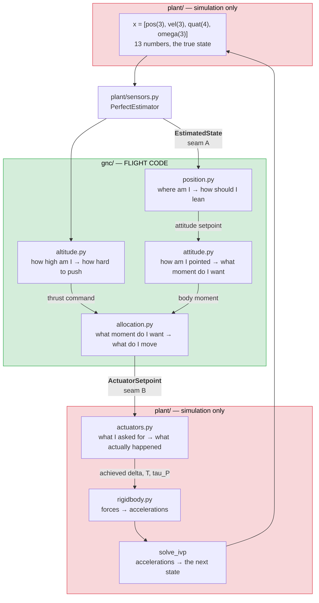

# 2 — Walkthrough

**What actually happens when the simulator runs.** Every stage, in order, with
the real numbers.

If you read one document, read this one. [1-CODE-MAP.md](1-CODE-MAP.md) says
what is where; this says what happens. [3-THEORY.md](3-THEORY.md) derives the
equations that appear here.

You can print all of it yourself:

```bash
python tvc.py trace                    # one step, every intermediate
python tvc.py trace --case roll --steps 3
python tvc.py trace --case hover       # with the position loop on
```

---

## 1. What "running the simulator" means

A run is a **loop**. Nothing is solved in closed form; the simulator repeatedly
asks two questions and integrates the answer forward:

```
    ┌──────────────────────────────────────────────────────────────┐
    │  1. Given where the vehicle is, what should the actuators do? │  ← flight code
    │  2. Given what the actuators did, where does the vehicle go?  │  ← plant
    └──────────────────────────────────────────────────────────────┘
                            repeat every dt
```

Question 1 is answered by `gnc/` and takes about 50 µs. Question 2 is answered
by `plant/` (or by Gazebo) and is a numerical integration. **The entire design
of this repository is the wall between those two questions** — question 1's code
flies, question 2's never does.

Default `dt` is 10 ms (100 Hz) in the analytic harness and 4 ms (250 Hz) in the
ROS and Gazebo paths, matching Gazebo's odometry rate.

---

## 2. The objects that flow through one step

Only two data types cross between the layers. Everything else is internal.



| | |
|---|---|
| **`EstimatedState`** | `pos_i`, `vel_i`, `quat`, `omega_b`, `stamp_s` — what the controller *believes*. Today it is truth relabelled, but the controller can never reach past it, so a noisy estimator drops in later without touching a single loop. |
| **`ActuatorSetpoint`** | `motor_a`, `motor_b` (normalized 0–1), `gimbal_inner_rad`, `gimbal_outer_rad`, plus the predicted `thrust_n` / `tau_p_nm` and three saturation flags. |

**Order matters and is forced.** Altitude runs *before* attitude because the
allocator cannot size the roll headroom or the gimbal angles without knowing the
thrust — the feasible set is a function of `T`. Position runs before both
because it produces a *setpoint*, not an *effort*.

---

## 3. One step, with the numbers

Below is the real output of `python tvc.py trace`, generated when this document
was last built. The case is a **lateral upset**: the vehicle is released at +8°
pitch and −8° yaw at 2 m, holding altitude, and asked to level out.

The tracer does not narrate the code — it *calls* it, then checks its own
numbers against what `TvcController.update()` returned. The `[checked: ...]`
line near the bottom is that comparison. If it ever said MISMATCH, this document
would be lying and would say so.

<!-- <<<EMIT:trace -->
```
TVC control-path trace
case 'lateral': released at +8 deg pitch and -8 deg yaw, holding 2 m
gains '<file default>', vehicle 1.3280 kg, hover thrust 13.028 N (73% of 17.79 N)
==============================================================================
STEP 0      t = 0.000 s      dt = 10 ms
==============================================================================

1. STATE IN  (seam A -- what the controller believes, never truth)
------------------------------------------------------------------------------
   position   (+0.0000, +0.0000, +2.0000) m       altitude 2.0000 m
   velocity   (+0.0000, +0.0000, +0.0000) m/s
   quaternion (+0.995134, +0.069587, -0.069587, +0.004866)   (qw, qx, qy, qz), body <- inertial
   euler      pitch +8.000   yaw -8.000   roll +0.000  deg   [readout only]
   body rates (+0.000000, +0.000000, +0.000000) rad/s

2. POSITION LOOP  -- OFF (mode.position_hold is false)
------------------------------------------------------------------------------
   attitude setpoint comes straight from the Setpoint:
   pitch_des +0.000 deg,  yaw_des +0.000 deg

3. ALTITUDE LOOP  -> thrust command         [gnc/altitude.py]
------------------------------------------------------------------------------
   vz_des = clamp(kp_alt*(z_des - z), +/-vz_max)
          = clamp(4.00*(2.000 - 2.000), +/-2.0)  =  +0.0000 m/s
   az_des = PID(vz_des - vz)  =  kp_vz*+0.0000 + ki_vz*I
          = 3.00*+0.0000  =  +0.0000 m/s^2
   proj   = (R(q) @ n_hat) . z_inertial   -- the useful fraction of thrust
          = 0.980631   (thrust axis is 11.30 deg off vertical)
   T      = m*(g + az_des) / max(proj, cos_min)          <- 1/cos FEEDFORWARD
          = 1.3280*(9.81 +0.0000) / 0.980631  =  13.2850 N
          without the 1/cos term this would be 13.0277 N, i.e. 1.9% low

4. ATTITUDE LOOP  -> body-rate setpoint     [gnc/attitude.py]
------------------------------------------------------------------------------
   q_des  = euler_to_quat(pitch_des, yaw_des, roll_des) = (+1.000000, +0.000000, +0.000000, +0.000000)
   e      = 2*sgn(qe_w)*qe_v  for  qe = q^-1 (x) q_des      [quaternion error]
          = (-0.139173, +0.139173, -0.009732) rad
          = (-7.974, +7.974, -0.558) deg
          sgn() picks the SHORT way round; without it a 10 deg target can
          be chased the 350 deg way, which on 7 deg of gimbal is a tumble.
   w_des  = kp_angle * e     (roll uses its OWN gain: 2.0 vs 5.0)
          = (-0.695866, +0.695866, -0.019464) rad/s

5. RATE LOOP  -> angular acceleration       [gnc/attitude.py, gnc/pid.py]
------------------------------------------------------------------------------
   rate error = w_des - omega = (-0.695866, +0.695866, -0.019464) rad/s
   alpha  = PID(rate error)  -- output is ANGULAR ACCELERATION, not torque
          pitch: 22.000 * -0.69587 = -15.3090 rad/s^2
          yaw  : 22.000 * +0.69587 = +15.3090 rad/s^2
          roll : 229.944 * -0.01946 = -4.4756 rad/s^2   <- gain is 10x bigger
          ...because Izz is 11.6x SMALLER. In torque units the two gains
          are 0.4976 and 0.4500 N*m/(rad/s) -- nearly the same loop.
   frozen = (False, False, False) (anti-windup: hold the integrator while saturated)

6. MOMENT  -- inertia applied ONCE, here     [gnc/attitude.py]
------------------------------------------------------------------------------
   M = I_diag * alpha = (-0.346229, +0.345693, -0.008759) N*m
   Diagonal inertia on purpose: this is gain scheduling, not dynamics. A
   controller that inverts its own model's cross terms would be claiming
   an accuracy the mass budget does not support (the PLANT uses the full
   tensor -- see step 10).

7. ALLOCATION  -> actuator commands         [gnc/allocation.py]
------------------------------------------------------------------------------
   7a. thrust has priority
       T_cmd = clamp(T, T_min=5.0, T_max=17.79) = 13.2850 N
   7b. how much roll torque exists at THIS thrust
       roll_limits(13.285 N) = [-0.0835, +0.1426] N*m
       ASYMMETRIC -- the lower prop runs in the upper prop's wake.
       tau_P is bought with a thrust SPLIT, so this interval shrinks to
       nothing at both idle and full throttle.
       tau_P = clamp(M_z, lo, hi) = -0.008759
   7c. solve the lateral 2x2 for the gimbal, then refine
       [M_x]   [ tau_P  -T*L ] [d1]      det = -(tau_P^2 + (T*L)^2) < 0
       [M_y] = [ -T*L  -tau_P] [d2]      so it is NEVER singular
       T*L = 13.2850 * 0.2111 = 2.8045 N*m of lateral authority per radian
       seed + 3 Newton steps on the exact trig map
       -> delta = (-7.058, +7.168) deg   [inner, outer]
   7d. cosine-loss iteration (twice): only tau_P*cos(d1)*cos(d2) reaches
       body z, and d1/d2 are not known until 7c has run.
       -> tau_P -0.008895  (was -0.008759)
   7e. stops. inner [-6.46, +6.98]  outer [-6.77, +6.86] deg -- per RING,
       measured, and neither is symmetric about its own neutral.
       SATURATED: the PAIR is scaled down, not clipped per axis --
       clipping would rotate the commanded torque toward the corner
       of the box, which is the wrong thing to do mid-recovery.
       -> delta_cmd = (-6.460, +6.561) deg
   7f. motor commands: invert the measured surface for (T, tau_P)
       -> u_a 0.8576  u_b 0.7878   (PWM 1858 / 1788 us)
       -> per-prop split T1 6.9243  T2 6.3607 N
       saturation flags: gimbal=True roll=False thrust=False

8. ACTUATOR SETPOINT  (seam B -- everything the flight code decided)
------------------------------------------------------------------------------
   motor_a          0.857573        normalized [0,1]
   motor_b          0.787777
   gimbal_inner_rad -0.112748 rad = -6.460 deg   (yaw plane, body y)
   gimbal_outer_rad +0.114519 rad = +6.561 deg   (pitch plane, body x)
   thrust_n         13.284999 N       PREDICTION, not a command
   tau_p_nm         -0.008895 N*m
   sat_gimbal True  sat_roll False  sat_thrust False

   [checked: every number above matches TvcController.update()]

9. HAL  -> transport units                  [hal/gazebo.py]
------------------------------------------------------------------------------
   split = tau_P / c      = -0.008895 / 0.040 = -0.2224 N
   omega = sqrt((T -/+ split)/2 / k)
         -> rotor A 958.58   rotor B 942.66  rad/s   (ceiling 1300)
   NOT AN RPM. These are control allocation variables -- the plugin's own
   algebra inverted so it reproduces the measured surface exactly.

10. PLANT  -- simulation only, none of this flies
------------------------------------------------------------------------------
   10a. gimbal [plant/actuators.py]
        transport deadtime 30 ms = 3 steps at this dt -- a FIFO of
        commands, because that is what a serial servo bus does.
        then a per-ring slew limit: 403 deg/s inner, 235 deg/s outer,
        so at most 4.030 / 2.350 deg of movement this step.
        -> ACHIEVED delta = (+0.0000, +0.0000) deg
   10b. motors [plant/actuators.py]
        model 'first_order', tau = 0.100 s, applied to the PAIR (T, tau_P) because
        that is what the bench measured. a = dt/(tau+dt) = 0.0909
        -> ACHIEVED T = 13.2850 N   tau_P = -0.008895 N*m
   10c. rigid body [plant/rigidbody.py]
        n_hat  = [sin d1, -sin d2 cos d1, cos d1 cos d2] = (+0.000000, -0.000000, +1.000000)
        F_body = T * n_hat = (+0.0000, -0.0000, +13.2850) N
        tau    = r_G x F + tau_P*n_hat,   r_G = (0, 0, -L) = (0, 0, -0.2111)
               = (+0.000000, +0.000000, -0.008895) N*m
        I*wdot = tau - omega x (I omega),  FULL tensor (Iyz/Izz = 27%)
        -> a_inertial = (-1.3787, -1.3923, +0.0000) m/s^2
        -> omega_dot  = (-0.0611, -0.1087, -4.5844) rad/s^2
   10d. integrate: solve_ivp RK45 over one control period, max_step=dt/4

==============================================================================
after 1 step(s): pitch +8.002  yaw -7.998  roll -0.013 deg, z 2.0000 m
==============================================================================
```
<!-- >>>EMIT:trace -->

### Four things to notice in that output

**Step 3 — the thrust command is 13.285 N, not 13.028 N.** The vehicle weighs
13.028 N, but it is tilted 11.3° so only `cos(11.3°) = 0.9806` of its thrust
points up. Dividing by that projection is the **1/cos θ feedforward**: it
cancels the altitude sag *at the instant the tilt happens* instead of waiting
for the altitude error to grow enough for feedback to notice. Without it every
attitude manoeuvre shows up as an altitude dip.

**Step 5 — the roll rate gain is 229.9 against the lateral 22.0.** That looks
alarming and is not. `Izz` is 11.6× smaller than `Ixx`, so in torque units the
two gains are 0.450 and 0.498 N·m/(rad/s) — nearly the same loop. **The large
number is a small inertia, not aggression.**

**Step 7e — the gimbal saturates on the very first step.** The allocator wanted
−7.06°/+7.17° and the stops are at −6.46°/+6.86°. When that happens the *pair*
is scaled down together, not clipped axis by axis: clipping would rotate the
realized torque toward the corner of the box, which is exactly the wrong thing
to do while recovering from an off-axis upset.

**Step 10a — the achieved gimbal deflection is 0.000°.** The command is correct
and the servo has not moved, because the 30 ms transport deadtime is three
control steps at this rate and the command is still in the FIFO. **This is the
single most important thing the plant models.** A simulator that skips it makes
every gain look better than it is, by exactly the phase margin the delay eats —
18° at the lateral crossover.

---

## 4. What happens over a whole run

`harness/mil.py::simulate` wraps the step above in a fixed-rate loop:

```python
for k in range(n_steps):
    est   = estimator.estimate(x[0:3], x[3:6], quat_normalize(x[6:10]), x[10:13], t)
    cmd   = controller.update(est, setpoint, dt, gimbal_rad=delta)
    delta, T, tau_p = chain.update(delta_cmd, alloc.T_cmd, alloc.tau_p, dt)
    sol   = solve_ivp(dynamics, [t, t+dt], x, args=(T, delta, vparams, tau_p),
                      method='RK45', max_step=dt/4)
    x     = sol.y[:, -1]
    x[6:10] = quat_normalize(x[6:10])
    t += dt
```

Four details in those seven lines carry weight:

**Zero-order hold.** The actuator command is computed once and held constant
across the whole integration interval — which is what a real digital controller
does. Recomputing it inside the integrator would model a controller that does
not exist.

**`max_step = dt/4`.** RK45 is adaptive, but it is capped so it cannot step over
the whole control period and miss the dynamics. *This choice has never been
justified by a refinement study* — see [7-CREDIBILITY.md](7-CREDIBILITY.md).

**Renormalize the quaternion every step.** Integration truncation error pushes
`|q|` off 1, and an un-normalized quaternion silently scales the rotation matrix.

**`gimbal_rad=delta` — the achieved deflection is fed back.** A simulation knows
where the gimbal actually is; the vehicle does not, because the PTK 8515 servos
give no position feedback. On hardware the flight code falls back to its own last
command, and the difference between the two is one servo lag.

The loop records 13 arrays as it goes; `_compute_metrics` reduces them to the
summary numbers the scenarios and the frozen baseline compare.

---

## 5. Every computation, filter and numerical method

The complete list. Nothing else in the control or plant path does arithmetic
more complicated than a multiply.

### In the flight code (`gnc/`) — runs every control step

| where | what it computes | method | cost |
|---|---|---|---|
| `mathx.attitude_error` | attitude error vector | `2·sgn(qe_w)·qe_v` for `qe = q⁻¹⊗q_des` | 16 mul |
| `mathx.thrust_axis` | thrust direction from gimbal angles | exact trig, not small-angle | 2 sin, 2 cos |
| `mathx.quat_to_rotmat` | body→inertial rotation | direct quaternion formula | 24 mul |
| `pid.PID.update` | every loop's output | parallel-form PID, **conditional anti-windup** (`freeze`) | 6 mul |
| `altitude` | thrust command | P → PID cascade, then `1/max(cos θ, 0.7)` | 1 div |
| `position` | attitude setpoint | PD, clamped to ±8° | 4 mul |
| `allocation._lateral_gimbal` | gimbal angles from a moment | Cramer's rule on a 2×2, then **3 Newton steps** on the exact trig map | fixed 3 iters |
| `allocation.allocate` | roll/gimbal coupling | **2 fixed-point passes** on the cosine loss `τ_P·cos δ₁·cos δ₂` | fixed 2 iters |
| `allocation.allocate` | saturation | proportional scale of the *pair*, per-ring per-sign | — |
| `effectiveness.inverse` | motor commands from `(T, τ_P)` | **warm-started Newton** on the 2×2 Jacobian, 33×33 seed table for the cold path, then a 6-rung thrust-priority backoff ladder | ≤ 40 iters × 6 |
| `effectiveness._diagonal` | the last resort | **bisection** on the balanced diagonal, where `f_T` is strictly monotone | fixed 48 iters |
| `effectiveness.torque_limits_at` | the feasible set | lookup in a 200-bin table, linearly interpolated | 2 mul |

**Every iteration count is a fixed `range`.** There is no `while` anywhere in
`gnc/`, and `tests/test_gnc_purity.py` fails the build if one appears — worst-case
execution time has to be a number someone can write down.

### In the plant (`plant/`) — simulation only

| where | what it models | method |
|---|---|---|
| `actuators.GimbalActuator` | servo transport deadtime | **FIFO of commands**, `round(30 ms / dt)` deep. Not a filter: a serial servo bus queues the command, then executes it in full. |
| `actuators.GimbalActuator` | servo slew | per-ring rate limit, `clip(target − now, ±rate·dt)` |
| `actuators.MotorLag` | motor response | **first-order lag** `y += α(u − y)`, `α = dt/(τ+dt)`, applied to the pair `(T, τ_P)`. Switchable to a pure delay — see below. |
| `rigidbody.dynamics` | rigid-body motion | Newton–Euler, `I ω̇ = τ − ω×(Iω)` solved with `np.linalg.solve` on the **full** inertia tensor |
| `harness/mil.simulate` | integration | `scipy.integrate.solve_ivp`, RK45, adaptive with `max_step = dt/4` |

> **The one open modelling question.** `MotorLag` can run the measured 100 ms
> either as a first-order lag or as a pure transport delay, because **the bench
> record does not say which it is.** At the roll loop's 21.4 rad/s crossover a
> lag costs `atan(ωτ) = 65°` of phase and a delay costs `ωT_d = 123°`. Measured
> outcome on the same 20° upset: as a lag it recovers cleanly and never
> saturates; as a delay it winds up to 72° and saturates 97% of the run. **One
> bench run settles it**, and `tvc.py validate` prints both numbers every time so
> the question cannot quietly stop being asked.

### Things people expect to find here and will not

There is **no state estimator, no Kalman filter and no sensor model.** The
controller is fed ground truth relabelled as an estimate. There is also no
low-pass on any measurement, because there is no noise to filter yet. The seam
for all of that already exists (`EstimatedState`, `plant/sensors.py`), which is
why adding it later will not touch a single control loop.

There is **no aerodynamics** — no drag, no ground effect, no wind, no blade
flapping. And no battery model, so the measured 13% thrust derate over a
discharge is recorded and not simulated.

---

## 6. What each pipeline swaps

The flight code is byte-identical in all of them. Only the two ends move.

| | state comes from | actuator command goes to | clock |
|---|---|---|---|
| **MIL** `tvc.py validate` | `plant/rigidbody.py` via `solve_ivp` | `plant/actuators.py` | a `for` loop — fully deterministic |
| **SIL, no ROS** `gazebo/run_hover.sh` | gz-sim odometry over gz-transport | gz plugin topics via `hal/gazebo.py` | **odometry arrival** — lockstep with simulated time |
| **SIL + ROS 2** `gazebo.launch.py` | the same odometry, bridged to ROS | the same topics, via `nodes/gazebo_bridge.py` | a ROS timer on `/clock` |
| **ROS 2, analytic** `analytic.launch.py` | `nodes/simulator.py` — the same `rigidbody.py` | the same `ActuatorCommand` message | a ROS timer |

The last two differ **only in which plant process starts**. That is how a
failure gets attributed: misbehaving on both means the control code, misbehaving
only in Gazebo means the physics engine or the SDF.

### Why the Gazebo path needs a translation step

gz-sim's motor plugin computes `T = k(ω_a² + ω_b²)` and `τ_P = c(T_b − T_a)`:
separable, symmetric, linear in the thrust split. The measured coax surface is
none of the three, and **no single `c` exists** — the value needed spans 3.3×
across the envelope, and being *odd* in the split it cannot represent the
surface's sign asymmetry at all.

So `hal/gazebo.py` inverts the plugin's own algebra on the command side: given
the `(T, τ_P)` the allocator chose off the measured surface, solve for the ω pair
that makes the plugin produce exactly that. Closed form, exact to 7×10⁻¹⁵ N.

The price is stated in the trace at step 9: **simulated rotor speed is not an
RPM.** It is a control-allocation variable, `momentConstant` is a solver scaling
and `maxRotVelocity` is solver headroom. Nothing may read ω as physics, and
because the raised ceiling means the plugin no longer enforces the real 17.79 N
limit, the allocator does — and a test asserts it.

---

## 7. Where to look when something is wrong

| symptom | look at | why |
|---|---|---|
| the vehicle drifts away instead of returning | `gnc/position.py` sign derivation | both signs were wrong once; the loop becomes positive feedback |
| an axis never recovers | `tvc.py trace --case roll` step 7b | the feasible set may be empty at that thrust |
| altitude dips on every manoeuvre | trace step 3, `proj` | the 1/cos feedforward is off or the gimbal estimate is stale |
| a limit binds constantly in steady state | trace step 7e, `sat_*` flags | not a tuning problem: the vehicle lacks the authority the gains assume |
| the gimbal does not move at all in Gazebo | `tests/test_axis_convention.py` | a mistyped SDF joint name — the joint exists, no plugin drives it, nothing errors |
| Gazebo and the analytic plant disagree | run `analytic.launch.py` first | it isolates control code from physics engine |
| every `dt` is wrong and varies with load | `/clock` bridging | ROS time is wall-clock while Gazebo runs on simulated time |

The full debugging catalogue — including the four failures that each cost a day
and looked like control bugs — is in [6-RUNNING.md](6-RUNNING.md).
