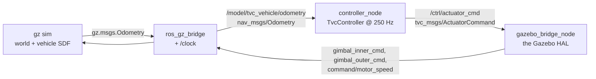

# 6 — Running the simulator

Every pipeline, what it is for, what its output means, and what goes wrong.

Everything runnable goes through one entry point:

```bash
python tvc.py --help
```

| command | what it does | needs |
|---|---|---|
| `validate` | the five closed-loop scenarios | Python |
| `trace` | every computation in one control step, with the numbers | Python |
| `golden` | capture or `--check` the frozen numerical baseline | Python |
| `params` | every vehicle number with its provenance | Python |
| `plot <csv>` | render a Gazebo flight log | + matplotlib |
| `gui` | the interactive form + plots | + a display |
| `view3d` | animate a run on the CAD mesh | + a display |
| `hover` | fly the Gazebo vehicle | devcontainer |
| `record` | Gazebo chase camera → GIF | devcontainer |

---

## Install

Host, for everything that does not need Gazebo or ROS:

```bash
pip install -r requirements.txt
python tvc.py validate
```

That is the whole setup. Nothing needs building, and no environment variable is
required.

For the Gazebo and ROS 2 pipelines you need the devcontainer — see
[DEVCONTAINER.md](DEVCONTAINER.md).

---

## Pipeline 1 — MIL: the analytic plant

**The fast inner loop. Use this first, always.** No ROS, no Gazebo, no display,
deterministic, and it finishes in about twenty seconds.

```bash
python tvc.py validate            # the five scenarios
python tvc.py validate --verbose  # + the control-authority budget
python tvc.py validate --gains analytic_legacy    # A/B a gain profile
```

`harness/mil.py` steps a fixed-rate zero-order-hold loop: estimator → controller
→ actuator chain → `solve_ivp` over one control period. No randomness anywhere,
so two runs agree to the last bit.

### What the five scenarios are for

Each asserts one threshold chosen to catch one specific **structural** mistake,
and each is loose enough that ordinary retuning does not trip it. A test that
fails when someone changes a gain teaches people to ignore it.

| scenario | catches |
|---|---|
| **lateral upset** — released at 8° on both lateral axes | a sign error in the gimbal allocation, or a gimbal limit so tight the vehicle cannot recover from a routine upset |
| **roll upset** — released at 20° about the thrust axis | the `τ_P·n̂` term missing from the moment sum, or the roll loop not closed. Both leave body z drifting forever, and before τ_P became a control input this scenario could only fail. |
| **climb and hold** — ground to 2 m | altitude cascade sign or windup errors |
| **tilted hover** — 6° tilt, with and without the feedforward | the `1/cos θ` feedforward missing. An A/B on the *same* scenario, so it is a claim about the feedforward rather than about a gain set. |
| **motor lag model** | nothing — it *reports*. It runs the roll upset under both readings of the measured 100 ms and prints the pessimistic number every time, so the open question cannot quietly stop being mentioned. |

### Reading the output

```
control authority at hover (T = 13.03 N, 73% of the 17.79 N ceiling):
  lateral  0.3094 N.m ->  13.68 rad/s^2   gimbal -6.46..+6.98 / -6.77..+6.86 deg, L = 0.2111 m
  roll     0.0888 N.m ->  45.38 rad/s^2   Iz is 11.6x smaller than Ix
```

- **`saturated N% of the run`** — how often a limit bound. A few percent during
  a transient is normal; a large number in *steady state* means the vehicle does
  not have the authority the gains assume, which is a vehicle problem and not a
  tuning one.
- **`peak |tau_P| = X of Y available`** at 100% means the roll channel is asking
  for everything it has.
- **`AS A DELAY: peak roll 72.5 deg, 97% saturated`** — the open question. See
  [3-THEORY.md §7](3-THEORY.md).

---

## Pipeline 2 — the desktop tools

```bash
python tvc.py gui        # form on the left, four plots on the right
python tvc.py view3d     # animate the default case on the CAD mesh
```

The GUI drives the same `harness/mil.py` as `validate`. It exposes a *subset* of
the parameters — mass, inertia, lever arm, actuator limits, the lateral gain set,
and the scenario. The roll-channel gains, the altitude cascade and the motor-lag
switch are set in `control_gains.yaml` and `vehicle_params.yaml`, where a choice
can be committed and reviewed rather than lost when the window closes.

`view3d` renders the *same* `tvc_vehicle.stl` Gazebo shows, posed from the logged
quaternion history — never from Euler angles, so it stays correct through
attitudes where Euler would go singular. It decimates the 103k-triangle mesh and
caches the result next to the STL.

---

## Pipeline 3 — SIL without ROS

**The quickest way to get real physics under the controller.** No colcon build:
it drives gz-sim directly over gz-transport.

```bash
bash gazebo/run_hover.sh                           # headless, 30 simulated s
bash gazebo/run_hover.sh --gui                     # with the Gazebo window
bash gazebo/run_hover.sh --duration 60 --altitude 3.0
bash gazebo/run_hover.sh --log flight.csv
python tvc.py plot flight.csv                      # then plot it
bash gazebo/run_hover.sh --record flight.gif       # chase camera to a GIF
```

The script starts the world **paused** and the *controller* unpauses it, from
inside `harness/gz.py`, once it has subscribed. Both halves of that matter:

- **Paused.** The vehicle free-falls from its 2 m spawn in about 0.6 s, so a
  controller attaching to an already-running world finds it on the ground — and
  the resulting plot looks exactly like a control failure.
- **By the controller, not by a `sleep` in this script.** Otherwise the number of
  uncontrolled physics steps depends on how fast the host got Python to its
  first publish. That is not a rounding effect: two consecutive 30 s runs peaked
  at 14.6° and 58.0° of thrust-axis roll from the same nominal initial
  condition. With the controller owning the start the same pair peaks at 0.8°
  and 2.3°.

`harness/gz.py` steps once per odometry message rather than on a wall clock, and
takes `dt` from the simulator's own stamps, so the control loop runs in lockstep
with simulated time. That is what makes a run reproducible, and a tolerance
against a run that cannot be repeated means nothing.

```bash
python tvc.py hover --check-golden --unpause tvc_flight   # against the frozen run
```

compares fourteen metrics of the run against
`reference/golden/hover_baseline.json`. Metrics, not samples: the run is
reproducible in aggregate but two runs still differ by up to 1.5° of roll at any
single sample, because the first accepted odometry message can land a physics
step apart.

Pass/fail: altitude error < 0.30 m, tilt < 15°, drift < 1.00 m. Loose on purpose
— it is a smoke test that the vehicle stays where it was put.

---

## Pipeline 4 — SIL with ROS 2

The architecture that ships.

```bash
# first time only
colcon build --packages-select tvc_msgs
source install/setup.bash
colcon build --packages-select tvc_control
source install/setup.bash

ros2 launch tvc_control gazebo.launch.py               # with the window
ros2 launch tvc_control gazebo.launch.py gui:=false    # headless (Windows/macOS hosts)
ros2 launch tvc_control analytic.launch.py             # same nodes, analytic plant
```

Both launch files run. The vehicle holds 2.000 m with pitch and yaw inside
±0.01°, and messages cross the `ros_gz_bridge` in both directions.

> ⚠ **The thrust-axis channel holds a 1.5–2.5° limit cycle here that Pipeline 3
> does not have** — same control code, same gains, same plant. It is the channel
> with 11.5× less inertia and the slowest actuator, so the bridge's transport
> delay costs margin exactly where there is least. Bounded and attributable, not
> explained. See [7-CREDIBILITY.md](7-CREDIBILITY.md).

`analytic.launch.py` leaves `position_hold` false, so the vehicle holds attitude
and altitude exactly and translates away at a constant velocity imparted by the
world's initial tilt. That is the launch file doing what it says, not drift.

Five processes:



`analytic.launch.py` replaces `gz sim` + the bridge + the HAL with
`simulator_node`, which publishes `nav_msgs/Odometry` on the **same topic**.
That is what makes the two plants interchangeable, and it is how a failure gets
attributed: misbehaving on both plants means the control code; misbehaving only
in Gazebo means the physics engine or the SDF.

### Topics

| topic | type | direction |
|---|---|---|
| `/model/tvc_vehicle/odometry` | `nav_msgs/Odometry` | plant → controller |
| `/ctrl/actuator_cmd` | `tvc_msgs/ActuatorCommand` | controller → HAL / plant |
| `/tvc_vehicle/gimbal_inner_cmd` | `std_msgs/Float64` | HAL → gz |
| `/tvc_vehicle/gimbal_outer_cmd` | `std_msgs/Float64` | HAL → gz |
| `/tvc_vehicle/command/motor_speed` | `actuator_msgs/Actuators` | HAL → gz |
| `/clock` | `rosgraph_msgs/Clock` | gz → everything |

**One message, not several topics.** Thrust, gimbal and τ_P must be
time-aligned: the `1/cos θ` feedforward and the τ_P cross-terms in the allocation
are computed against each other, so splitting them lets a subscriber pair values
from different control steps and quietly fly a different vehicle.

### Launch arguments

| argument | default | |
|---|---|---|
| `gui` | `true` | `false` runs the server only — **required on Windows and macOS hosts**, where the container has no display |
| `world` | `gazebo/worlds/tvc_flight.sdf` | airborne and deliberately tilted |
| `gain_profile` | `''` | a profile name from `control_gains.yaml`; empty uses the file default |
| `altitude_hold` / `position_hold` | `true` / `true` | which outer loops are closed |
| `z_des` | `2.0` | target altitude, m |

---

## The checks

All four run in CI; the first is the merge gate.

```bash
python -m pytest tests/ -q
python tvc.py golden --check
python tools/gen_model_sdf.py --check
python tools/gen_docs.py --check
```

| check | guards |
|---|---|
| `pytest` | the flight code's porting discipline, the axis convention, allocation exactness, the sign chain, and the five scenarios |
| `golden --check` | that a change claiming to move no numbers moved none. It names every drifted field with its old and new value. |
| `gen_model_sdf --check` | that the Gazebo model still reproduces the YAML's mass properties (and that nobody hand-edited a generated file) |
| `gen_docs --check` | that the documented numbers still match the YAML |

**Never regenerate the golden to make a failing check pass.** A legitimate
physics or parameter change gets its own commit saying which numbers moved and
why — see [reference/golden/README.md](../reference/golden/README.md).

---

## Regenerating the vehicle

The path from CAD to a running simulation. Only needed after a mass, position or
geometry change.

```bash
python tools/mass_properties.py tools/components.yaml \
       --emit src/tvc_control/tvc_control/vehicle_params.yaml
python tools/gen_model_sdf.py     # rewrite the Gazebo model
python tools/gen_docs.py          # rewrite the numeric doc sections
python tvc.py golden              # the numbers changed on purpose; re-freeze
```

`--emit` rewrites **only** the block between the `EMIT:mass_properties` sentinels,
preserving every hand-written comment around it. Everything else in the YAML is
hand-maintained bench data.

---

## Things that cost real debugging time

Recorded because each looked like a control problem and was not.

| symptom | cause |
|---|---|
| altitude controller commands full thrust into the ground | `OdometryPublisher` **defaults to 2D**. Without `<dimensions>3</dimensions>` the message silently carries no `z` and no `vz`, so the controller reads 0 forever. |
| the vehicle behaves as if two worlds are fighting | dead simulators accumulate. `gz` is a **Ruby wrapper**, so the real process has `comm == ruby` and `pkill -x gz` matches nothing. `pkill -f "gz sim"` also matches the shell running the script, which then kills itself. `run_hover.sh` matches on both. |
| the vehicle is thrown over at spawn | the lowest leg point is z = −0.171 m in the model frame; spawning below that starts the legs inside the ground plane. |
| a flawless plot that proves nothing | a perfectly upright spawn sits in equilibrium with the gimbal at exactly 0. The flight world is deliberately tilted. |
| a loop that accelerates away instead of returning | a sign error. Both position-loop signs were wrong once; roll reached −44 rad/s. Every sign is now derived in a comment where it is used and asserted in `tests/test_axis_convention.py`. |
| every measured `dt` is wrong, and varies with machine load | `/clock` not bridged, so ROS time is wall-clock while Gazebo runs on simulated time. |
| a gimbal that never moves | a mistyped SDF joint name. Nothing errors — the joint exists, no plugin drives it. `tests/test_axis_convention.py` is the only thing that catches this. |

---

## Still open

- **Takeoff from the ground.** `worlds/tvc.sdf` spawns on the legs, but the hover
  demo uses the airborne world. Ground contact during spin-up is its own problem:
  the legs are the only contact and the vehicle is tall and narrow.
- **Landing.** Needs touchdown detection and thrust cutoff.
- **PX4 SITL.** `reference/px4/4600_tvc_coax` configures offboard direct actuator
  control; PX4 itself is not in the container image and is not needed for
  anything above.
