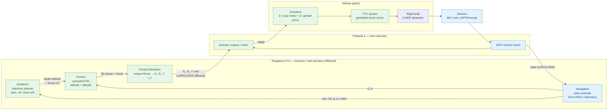
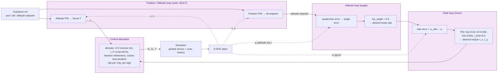

# TVC VTVL — Controller Design & GNC Architecture

*Draft — control-system block diagram and design outline for the electric TVC
VTVL demonstrator (POSTECH UGRP 2026).*

This document adapts the generic sounding-rocket GNC architecture (de Lajarte
2021, Fig. 1.4 / 4.2) to **this** vehicle: coaxial contra-rotating propellers
for thrust magnitude + a 2-DOF gimbal for thrust direction, with the compute
split across Raspberry Pi (research / offboard) and Pixhawk (real-time). It is
meant to be the reference figure + text for the report and to pin down the
signal interfaces before they harden into firmware.

---

## 1. Scope & conventions

- **Controlled DOF:** attitude (roll, pitch), altitude (z), and — later —
  lateral position (x, y). Yaw/spin about the thrust axis is **not** gimbal-
  controllable; it comes from differential RPM between the two coax rotors.
- **Attitude representation:** unit quaternion throughout the loop; Euler angles
  are computed for readout/plotting only (no gimbal-lock singularity).
- **Actuators:** `T` (total thrust, via motor PWM), `δ₁` (pitch-plane gimbal),
  `δ₂` (pitch-plane gimbal), and `τ_P` (roll via differential prop torque, **built**).
- **Gimbal authority:** measured per ring and ASYMMETRIC — inner −6.46…+6.98°
  at 403 °/s, outer −6.77…+6.86° at 235 °/s, both with ~30 ms transport
  deadtime. (This said ±15° at 180°/s, a design-intent guess superseded by
  the bench. Rate-limited (
  ~577°/s bench).

---

## 2. Top-level GNC architecture

For the *software/system* view — which file feeds which, and how one controller
drives three interchangeable plants — see
[`figures/system_architecture.svg`](figures/system_architecture.svg). The
diagram below is the *control-theoretic* view of the same system.

The classic Guidance → Navigation → Control loop, mapped onto our hardware
split. Green = forward command path, blue = feedback (state) path.



**Placement note (from the control-placement decision):**
- **Now (Placement A):** the *Control* + *Allocation* blocks run as ROS2 nodes
  on the RPi, streaming setpoints to **stock PX4** over uXRCE-DDS at ~100 Hz.
- **Later (Placement B):** the same *Control* + *Allocation* math is ported
  Python→C++ into a **frozen custom PX4 build** and runs onboard the Pixhawk at
  1 kHz. The block diagram is unchanged; only the RPi↔PX4 boundary moves left.

---

## 3. Controller detail — cascaded loops

This is the "controller design" figure proper: the nested loops inside the
*Control* block, matching `AttitudeController` in `physics.py`. Slowest loop
outermost, fastest innermost.



### Loop responsibilities

| Loop | Rate (target) | Input error | Gain / law | Output | Status |
|------|---------------|-------------|------------|--------|--------|
| Position (x,y) | 250 Hz | pos error | PD → tilt cmd | attitude setpoint | **built** |
| Altitude (z) | 250 Hz | alt/vel error | P-PID + 1/cosθ FF | `T` | **built** |
| Attitude (angle) | ~100 Hz (→1 kHz) | quaternion error | `Kp_angle` (P-only) | body-rate setpoint | **built** |
| Rate (ω) | ~100 Hz (→1 kHz) | rate error | full PID + anti-windup | torque `τ_x, τ_y` | **built** |
| Allocation | with rate loop | — | 2×2 inverse + Newton, signed feasible set | `δ₁, δ₂, τ_P, u_a, u_b` | **built** |
| Roll (τ_P) | 250 Hz | roll error | P-PID → differential prop torque | `τ_P` | **built** |

The **attitude + rate loops + allocation** already exist and are validated
(`physics.py`, `controller_node.py`). The **position/altitude/yaw** loops are
the extensibility path — they slot in outboard of the existing attitude loop
without touching it.

---

## 4. Signal & interface table (current ROS2 topics)

The topic boundary is the clean seam the placement decision is built around:
everything left of `/ctrl/gimbal_cmd` is portable into custom PX4 later.

| Signal | ROS2 topic | Msg type | Producer → Consumer |
|--------|-----------|----------|---------------------|
| Vehicle attitude/state | `/sim/vehicle_attitude` | `sensor_msgs/Imu` | sim/EKF → controller |
| Gimbal command | `/ctrl/gimbal_cmd` | `tvc_msgs/GimbalCommand` (δ₁, δ₂) | controller → bridge |
| Gimbal pitch (plant) | `/tvc_vehicle/gimbal_pitch` | `std_msgs/Float64` | bridge → Gazebo |
| Gimbal roll (plant) | `/tvc_vehicle/gimbal_roll` | `std_msgs/Float64` | bridge → Gazebo |
| Motor speed | `/tvc_vehicle/command/motor_speed` | `actuator_msgs/Actuators` | bridge → Gazebo |

> **Gap to close for the full profile:** thrust `T` is currently held at a fixed
> hover speed in `gazebo_bridge_node.py`. Adding the altitude loop means `T`
> becomes a live command on the interface (new field on `GimbalCommand` or a
> dedicated `/ctrl/thrust_cmd`), not a constant.

---

## 5. Draft outline (for the report section)

1. **Introduction & scope** — what is controlled, what is not (yaw caveat),
   quaternion convention.
2. **GNC architecture overview** — Fig. §2; guidance/navigation/control mapped
   to RPi + Pixhawk split; Placement A vs B.
3. **Plant model** — 6-DOF Newton-Euler, gimballed-thrust force/torque map,
   coax reaction torque, actuator (rate-limited servo) model. *(→ `physics.py`)*
4. **Controller design** — Fig. §3; cascaded loop derivation:
   1. Attitude (angle) loop — quaternion error → rate setpoint.
   2. Rate loop — PID + anti-windup → torque.
   3. Control allocation — exact inverse gimbal map, saturation handling.
   4. Altitude loop — thrust command, with 1/cosθ feedforward.
   5. Position + roll loops — outer guidance, differential prop torque.
5. **Gain selection & tuning** — current gains, tuning method, GUI/param sweep.
6. **Interfaces** — §4 signal table; topic boundary; port-to-PX4 plan.
7. **Validation** — Python SIL → Gazebo SITL → tethered → free hover → full
   profile; metrics (settling time, gimbal utilization, saturation).
8. **Future work** — convex-optimization guidance, wind rejection, onboard
   1 kHz firmware.

---

## 6. Open decisions to resolve before finalizing

- [ ] **Lever-arm convention:** `pivot` vs `rotor_plane` (≈1.27× torque
      difference) — `vehicle_params.yaml` still defaults to `pivot`.
- [ ] **Thrust on the interface:** extend `GimbalCommand` vs new thrust topic.
- [ ] **Where the altitude loop lives:** RPi node now, or wait for Placement B.
- [ ] **Yaw strategy:** confirm differential-RPM authority from bench data
      before drawing it into the final allocation block.
```
