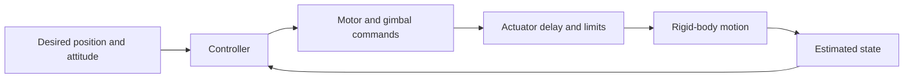
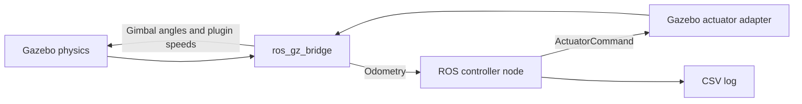

# Understand the TVC pipeline

This is a simulation of the POSTECH UGRP electric TVC demonstrator. Two counter-rotating propellers produce lift. A two-axis gimbal tilts that thrust to control pitch and yaw. Differential propeller torque controls rotation about the thrust axis, called roll here.

The research proposal targets a Raspberry Pi 5 and Pixhawk 6C. This repository is the simulation stage of that project. It currently uses Python and Gazebo; the MATLAB simulation mentioned in the proposal is not present.

## 1. Learn it in this order

1. Run `python tvc.py gui`. Observe the initial tilt settling while altitude stays near 2 m.
2. Change target altitude to 2.5 m and run again. The altitude plot shows how the thrust controller responds.
3. Disable horizontal position hold before experimenting with pitch/yaw targets. Otherwise the position controller generates those angle targets itself.
4. Use **Play CAD motion** to watch the computed attitude. This is playback of the Python result, not another physics simulator.
5. Open `simulation.py`, then `control/controller.py`. The first connects the parts; the second orders the control calculations.
6. Use Gazebo/ROS when you want to study the separate programs and the physics engine.

Commands below assume your chosen Python environment is active. On Windows you can instead use `.venv\Scripts\python`, as in the README.

## 2. What happens in one simulation step



The Python simulation owns the clock. For each control period, it reads the current state, calls the controller, applies actuator delay and limits, then integrates the equations of motion with SciPy. It records the resulting position, quaternion, angles, rates, thrust and gimbal angles.

The controller runs these calculations in order:

| Stage | Input | Output | Implementation |
|---|---|---|---|
| Position control | Horizontal position/velocity error | Desired pitch/yaw | `control/position.py` |
| Altitude control | Altitude and vertical velocity error | Total thrust | `control/altitude.py` |
| Attitude control | Quaternion and angular-rate error | Desired moments | `control/attitude.py` |
| Allocation | Thrust and moments | Two gimbal angles and two motor commands | `control/allocation.py` |

Position and altitude hold can be disabled independently. Attitude control always runs. With altitude hold disabled, the controller requests the configured vehicle weight as thrust. When tilted, that does not automatically maintain altitude.

The familiar vertical approximation is `m*z_acceleration = T*cos(tilt) - m*g`. The implemented physics also includes horizontal motion, quaternion attitude, angular velocity, a full inertia tensor, and rotational coupling. This is a six-degree-of-freedom model, not just that one vertical equation.

Allocation respects gimbal travel and available motor authority. Motor response is a coupled measured surface: each propeller's command influences total thrust and roll torque. The motors cannot be treated as two independent identical thrust curves.

## 3. Two ways to run the same controller

| Route | What runs | Use it for |
|---|---|---|
| Python | Controller + analytic physics in one process | Tuning, understanding equations, quick plots, GUI |
| Gazebo/ROS | Gazebo + ROS bridge + controller node + actuator adapter | 3D physics, ROS communication, preparation for hardware integration |

The CLI and GUI both call `simulation.simulate`. They share the default settings, so a default terminal run and a freshly opened GUI describe the same experiment.

```bash
python tvc.py sim --duration 10 --altitude 2.5 --output out/climb
python tvc.py gui
python tvc.py plot out/climb.csv out/climb.png
```

For an attitude experiment, use `python tvc.py sim --no-position-hold --yaw 5`. Position hold replaces the pitch/yaw targets with its own commands. An altitude change in this example starts airborne; it is not a ground takeoff demonstration.

`sim` writes a CSV and a four-panel PNG. The GUI displays the same four quantities: altitude, horizontal position, attitude and gimbal angles. Save CSV exports its latest run, including session edits. The plot toolbar can save its image.

CSV time is simulated time in seconds. Position is metres, plotted angles are degrees, thrust is newtons and torque is N m. Each file declares `rocket_v2` in its first line so the plotter can reject incompatible axis conventions. The Python log contains achieved analytic actuator values; the ROS log records controller commands alongside the most recently received state. It is not actuator feedback.

### ROS data flow



A ROS **node** is a program participating in this message network. A **topic** is a named stream of messages. ROS does not calculate the vehicle dynamics or decide the control law here; those remain in Gazebo/`physics/` and `control/` respectively.

| Topic | Meaning |
|---|---|
| `/model/tvc_vehicle/odometry` | Position, orientation, velocity and angular rate |
| `/ctrl/actuator_cmd` | Output of the shared Python controller |
| `/tvc_vehicle/gimbal_inner_cmd` | Inner-ring angle, radians |
| `/tvc_vehicle/gimbal_outer_cmd` | Outer-ring angle, radians |
| `/tvc_vehicle/command/motor_speed` | Two Gazebo plugin speeds |
| `/clock` | Gazebo simulated time for the ROS nodes |

Launch starts Gazebo paused, gives the programs four seconds to connect, then unpauses. The controller normally runs at 250 Hz. `Ctrl+C` stops the launch and closes the CSV. The world spawns the vehicle airborne and tilted to demonstrate recovery.

The launch builds a temporary `model.sdf` from the current YAML settings. `src/tvc_control/gazebo/generate_model.py` distributes your configured total mass and inertia across the simulation's articulated links. It **does not read the CAD or derive vehicle inertia from geometry**. The temporary model is removed at normal shutdown.

## 4. Where settings live

All persistent settings are in `src/tvc_control/tvc_control/settings/`. GUI edits are temporary and do not rewrite these files. Restart a run after editing a file. ROS builds without `--symlink-install` need a rebuild to copy changed settings.

| File/block | What you edit |
|---|---|
| `vehicle.yaml: mass_properties` | Mass [kg], CG [mm], full inertia about CG [kg m²] |
| `vehicle.yaml: geometry` | Rotor plane and choice of thrust lever arm |
| `vehicle.yaml: gimbal` | Per-ring travel, neutral, calibration, speed and delay |
| `vehicle.yaml: rotors` | Gazebo solver constants and maximum vehicle thrust |
| `vehicle.yaml: thrust_torque_surface` | Measured two-motor calibration coefficients |
| `vehicle.yaml: motor_dynamics` | Analytic lag/delay and optional battery model |
| `vehicle.yaml: aero` | Optional estimated drag and ground effect; off by default |
| `vehicle.yaml: env` | Gravity |
| `gains.yaml` | Position, altitude, attitude and rate-controller gains |

The current mass is 1.328 kg. Mass and inertia were retained from the previous design estimates and are now edited directly. Replacing the visual CAD does not change them. The remaining gain profile is named `simulation`; its numeric values are the previous default's values. The old name `flight_validated` was misleading because its validation was in simulation.

The fit-quality and bench-response values alongside calibrations are source context, not extra programs. Keep them when replacing a calibration so you can tell which measurements produced it.

### Axes and units

| Quantity | Convention |
|---|---|
| Body +z | Thrust direction; rotation about it is **roll** |
| Body +x | Rotation about it is **pitch** |
| Body +y | Rotation about it is **yaw** |
| Quaternion | `(w, x, y, z)`, rotates body coordinates into world coordinates |
| ROS quaternion message | Stored as fields `x, y, z, w`; the wrapper converts explicitly |
| Inertia | `xx/yy/zz` refer to body axes, not aircraft-style Euler names |
| Motor command | Normalized 0–1 within the calibrated PWM range |
| Gimbal command | Radians internally; degrees in GUI/plots |

These pitch/yaw/roll names differ from common aircraft naming. The gimbal controls the two lateral axes; differential propeller torque controls the thrust axis. The TVC lever arm affects pitch/yaw authority. It is not the roll-torque lever arm.

## 5. What moves onto the real vehicle

The supplied research plan assigns these roles:

| Computer | Intended responsibility |
|---|---|
| Raspberry Pi 5 | Higher-level control/guidance, experiment management, logging |
| Pixhawk 6C | Sensor acquisition, state estimation, fast stabilization, motor/servo outputs |
| Development computer | Simulation, tuning and inspection |

ROS is retained because it provides a useful software interface on the Pi. If PX4 is selected as the Pixhawk firmware, it has a ROS 2 integration path with firmware-specific messages and middleware. This repo has not implemented that connection. See the official [PX4 ROS 2 guide](https://docs.px4.io/main/en/ros2/user_guide) and [companion-computer overview](https://docs.px4.io/main/en/companion_computer/).

Currently **all** control loops run in Python. The `ActuatorCommand` message belongs to this simulation; it is not a PX4 hardware message. Following the proposal's split requires deciding which outer loops run on the Pi, implementing/configuring the TVC stabilization and allocation on the Pixhawk, and defining the commands between them. The present Gazebo adapter cannot drive real ESCs or servos.

Sensor drivers/estimation, firmware integration, actuator calibration, timing, arming and command-loss behavior remain hardware work. ROS connectivity alone does not complete them. No placeholder hardware implementation has been added during cleanup.

The proposal's experimental sequence remains ground test → rotation rig → tethered test → free flight. The repository's three software smoke checks are unrelated to replacing those physical research experiments.

## 6. Every remaining file

Paths in the next table are relative to the repository root. The source remains inside conventional ROS packages so `colcon build` can install it normally.

| File | Why it remains |
|---|---|
| `README.md` | Setup and everyday commands |
| `docs/GUIDE.md` | This explanation and complete file map |
| `tvc.py` | Source-checkout entry point; adds the package to Python's import path |
| `requirements.txt` | Four direct Python dependencies |
| `Dockerfile` | Linux development environment for ROS and Gazebo |
| `.devcontainer/devcontainer.json` | Opens that environment and mounts this checkout |
| `.dockerignore` | Keeps generated files out of the image build context |
| `.gitignore` | Keeps caches, build products and results out of version control |
| `.gitattributes` | Consistent line endings and binary-file handling |
| `tests/test_core.py` | Three fast checks: finite state, actuator bounds, CSV round trip |
| `src/tvc_control/gazebo/generate_model.py` | Creates the Gazebo model from manually configured physical values |
| `src/tvc_control/gazebo/worlds/tvc_flight.sdf` | Ground, lighting, 1 ms physics step and airborne starting pose |
| `src/tvc_control/gazebo/models/tvc_vehicle/model.config` | Gazebo model metadata |
| `src/tvc_control/gazebo/models/tvc_vehicle/meshes/tvc_vehicle.stl` | Your final visual mesh; millimetres, scaled by 0.001 |
| `src/tvc_control/package.xml` | ROS package identity and dependencies |
| `src/tvc_control/setup.py` | Installs Python, settings, launch file and Gazebo assets |
| `src/tvc_control/setup.cfg` | Places executable scripts where ROS expects them |
| `src/tvc_control/resource/tvc_control` | Required empty marker for ROS package discovery |
| `src/tvc_control/launch/gazebo.launch.py` | Starts and connects the Gazebo/ROS programs |
| `src/tvc_msgs/package.xml` | Identity/dependencies for the custom message package |
| `src/tvc_msgs/CMakeLists.txt` | Generates ROS bindings from the message definition |
| `src/tvc_msgs/msg/ActuatorCommand.msg` | Message fields for two motor commands, two gimbal commands and diagnostics |

The following paths are relative to **`src/tvc_control/tvc_control/`**. The repeated name is intentional: the outer folder is the ROS build package; the inner folder is the importable Python package.

| File | Responsibility |
|---|---|
| `__init__.py` | Marks the Python package |
| `__main__.py` | Dispatches the four commands: `sim`, `gui`, `gazebo`, `plot` |
| `config.py` | Loads YAML and converts settings to controller data |
| `settings/vehicle.yaml` | Physical values, calibration and simulation assumptions |
| `settings/gains.yaml` | Active controller gains |
| `simulation.py` | Python clock, feedback loop, integration and results |
| `gui.py` | Settings form, run button, plots and CSV export |
| `plotting.py` | Shared plot layout and CSV reading/writing |
| `view3d.py` | Mesh loading, visual simplification and motion playback |
| `control/__init__.py` | Marks the control package |
| `control/controller.py` | Orders and connects the control loops |
| `control/types.py` | State, target, mode and actuator-output data structures |
| `control/params.py` | Parameter/gain data structures and unit conversions |
| `control/position.py` | Horizontal position/velocity to tilt target |
| `control/altitude.py` | Altitude/vertical velocity to total thrust |
| `control/attitude.py` | Quaternion/rate errors to requested moments |
| `control/pid.py` | PID calculation with integral limiting |
| `control/allocation.py` | Requested thrust/moments to feasible actuator commands |
| `control/effectiveness.py` | Motor calibration surface and gimbal calibration maps |
| `control/mathx.py` | Rotation and quaternion mathematics |
| `physics/__init__.py` | Marks the physics package |
| `physics/rigidbody.py` | Translational and rotational equations of motion |
| `physics/actuators.py` | Gimbal slew/delay, motor response and optional derating |
| `physics/sensors.py` | Wraps true state as an estimate; no real estimator yet |
| `physics/battery.py` | Optional bench-fitted battery discharge model |
| `physics/aero.py` | Optional drag and ground-effect estimates |
| `ros/__init__.py` | Marks the ROS adapter package |
| `ros/controller.py` | ROS input/output around the shared controller, plus CSV logging |
| `ros/gazebo_bridge.py` | Translates controller output to Gazebo plugin commands |

### Hidden and generated folders

`.git/` is version history, not another program. Keep it. `.devcontainer/` contains the one Linux-environment configuration. The other three dotfiles above are small build/version-control rules.

Running tools can create `.venv/` (installed dependencies), `__pycache__/` (Python bytecode), `build/`, `install/`, `log/` (ROS build products), and `out/` (your results). They are ignored by Git and are not authored source. CAD playback caches simplified geometry in the operating system's temporary directory. You do not need to read any of these to understand the controller.

## 7. What results currently establish

The code can simulate attitude recovery, altitude changes and position hold, and produce plots. It does not yet implement a full takeoff/hover/descent/landing state machine, ground-contact control, a physical rig/tether model, or a hardware estimator.

Important model limits retained from the investigation:

- Python includes the configured motor lag and gimbal delay/slew. Gazebo currently uses different, much faster plugin responses. They share control calculations but are not dynamically identical plants.
- The optional battery fit is from an older approximately 3S, 4200 mAh bench setup. The proposal specifies a 6S, 6300 mAh pack. Battery sag stays off by default; final hardware needs matching calibration.
- Aerodynamic values are estimates and default to disabled. The motor/propeller calibration and existing mass/inertia also need checking against the final assembled hardware.
- The Gazebo model renderer currently uses only the solved base link's vertical position and rounds it. The small configured lateral CG offsets therefore are not reproduced exactly. This cleanup did not retune the physical model.
- Near saturation, logged requested roll torque can differ slightly from the torque implied by the inverted motor commands. Logs are not proof of actual hardware torque.
- The short post-cleanup ROS/Gazebo run held altitude and recovered lateral tilt, but retained about 2 degrees of roll error with small oscillations. The smoke run verifies the connected pipeline, not final controller tuning.
- The analytic model starts with perfect state information. Sensor noise, estimation error, latency and hardware timing are not validated by a clean hover plot.

## 8. Cleanup and recovery

Removed from the active tree: CAD mass/inertia extraction, CAD parts lists, documentation generators, frozen golden comparisons, duplicate teaching traces, Monte Carlo/scenario runners, standalone GIF recording, the direct non-ROS Gazebo runner, the duplicate ROS analytic route, old gain profiles, CI/editor extras, and the large test suite. Their historical value is preserved in the archive.

The full `TVC Final.stl` replaces the earlier visual mesh. OBJ, MTL and STEP originals remain in Downloads; this runtime only needs the STL. It displays geometry without the OBJ material colours.

Recovery location on this machine: `C:\Users\tae06\CODE\tvc-testbed-cleanup-20260920`.

- `tracked-before.zip`: tracked files before the initial cleanup.
- `before-minimal-cleanup/`: working-tree snapshot before this larger simplification.
- `minimal-removed/`: retired files from this pass.
- `removed/`: earlier retired outputs and tools, including generated user artifacts.
- `MINIMAL-PLAN.md` and `minimal-validation/`: working notes and check outputs, kept outside the source tree.

No Git commit or push was made by this cleanup. Review the current diff before committing the new structure.
