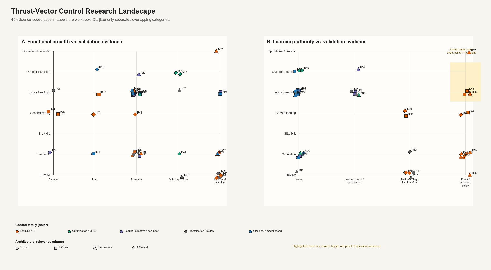

# TVC Ashby research reader

Source workbook: `C:\Users\tae06\Downloads\TVC_Ashby_Research_Corpus.xlsx`

This reader indexes **45 papers** using the same IDs as the Ashby plot. It is designed for reading the corpus one paper at a time, without treating blank specifications as zero or treating method-transfer papers as direct competitors.

## How to read the plot

- **Panel A** maps demonstrated functional breadth against validation maturity.
- **Panel B** maps how much authority learning has in the control loop against validation maturity.
- **Color** is a plot-only grouping of related control families; the original detailed family is preserved in every paper entry.
- **Marker shape** shows architectural relevance: exact, close, analogous, or method transfer.
- Point locations are categorical. Small deterministic jitter only separates overlaps; it has no quantitative meaning.
- The highlighted region is a search target, not proof that no work exists outside this corpus.

## Coding scales

| Code | Functional scope | Validation | Learning authority |
|---:|---|---|---|
| 0 | — | Review | None |
| 1 | Attitude | Simulation | Learned model / adaptation |
| 2 | Pose | SIL / HIL | Residual / high-level / safety |
| 3 | Trajectory | Constrained rig | Direct / integrated policy |
| 4 | Online guidance | Indoor free flight | — |
| 5 | Integrated mission | Outdoor free flight | — |
| 6 | — | Operational / on-orbit | — |

## Corpus at a glance

- Relevance rings: 1 Exact: 7, 2 Close: 15, 3 Analogous: 16, 4 Method: 7
- Free-flight or operational evidence (codes 4–6): **21 papers**.
- Simulation-only evidence (code 1): **13 papers**.
- This is an evidence map, not a ranking of algorithm quality.

## Evidence-based gap matrix

The statements below are claims about this corpus only.

| Candidate region | Assessment | Evidence | Implication |
|---|---|---|---|
| Experimental RL for any thrust-vector vehicle | Not a gap | Osedo 2023 and tiltable-rotor hardware studies demonstrate this. | Do not claim general novelty. |
| Free-flight RL on a single coaxial propulsion unit with a 2-axis gimbal | Strongly sparse | Closest direct RL evidence is constrained one-axis; exact 2-axis papers use conventional control or simulation. | High-priority region to verify with further backward/forward citation search. |
| RL versus NMPC on any vectored-thrust vehicle | Not a gap | 2026 tiltable-quadrotor work reports direct comparison. | Narrow claim to exact architecture if pursued. |
| RL versus model-based control on the same coaxial 2-axis platform | Strongly sparse | No direct experimental comparison located in this corpus. | Potential benchmark contribution. |
| System identification of coaxial thrust-vector vehicles | Not a gap | Denton 2025 identifies a flight-test state-space model. | Novelty must involve method, online use, model order, or decision consequence. |
| Active or online identification followed by controller adaptation | Probable gap | Active-ID methods exist for multirotors, but direct coaxial-gimbal evidence was not found. | Good cross-domain transfer question. |
| Mass, CoG and inertia generalization in thrust-vector RL | Partially explored | Osedo 2023 tests variations on a one-axis rig. | Two-axis free-flight generalization remains sparse. |
| Safe or constraint-certified RL for 2-axis coaxial TVC | Probable gap | Safe-RL methods and planar hardware exist, but exact-platform evidence was not found. | Would require explicit flight-envelope and actuator constraints. |
| Integrated learned guidance and control | Not a conceptual gap | Planetary and reusable-launch simulations already study integrated RL G&C. | Hardware transfer, not algorithm existence, is the sparse part. |
| Integrated learned GNC on low-cost electric TVC hardware | Strongly sparse | Direct electric platforms use optimal/model-based or PID GNC. | Requires onboard navigation and careful safety architecture. |
| Outdoor onboard learning control on exact coaxial-gimbal architecture | Strongly sparse | Outdoor model-based demonstrations and learning demonstrations occur in separate architecture families. | Evidence chain should separate localization, control and learning authority. |
| Common reproducible benchmark across classical, nonlinear, MPC and learning control | Strong platform opportunity | Methods are scattered across different hardware and metrics. | A common test protocol may be more defensible than another isolated controller. |

## Paper-by-paper catalog

## 1 Exact (7 papers)

### R01 — [Design, Optimal Guidance and Control of a Low-cost Re-usable Electric Model Rocket](https://arxiv.org/abs/2103.04709)

**Citation:** Spannagl et al. (2021), IROS 2021.  
**Architecture:** Single electric propulsion unit with 2-axis TVC; Rocket-like electric VTOL.  
**Actuation:** Electric propeller; Two-axis thrust vectoring; Underactuated.  
**Control:** Optimization-based — Offset-free MPC position control.  
**Learning:** None; algorithm: Not reported; authority code: 0.  
**GNC scope:** Real-time minimum-fuel, free-final-time optimal guidance; estimation: Onboard state estimation; details require full-text extraction; function: Online guidance (code 4).  
**Validation:** Outdoor free flight (code 5); free flight: Yes; environment: Indoor and outdoor.  
**Constraints and uncertainty:** Optimal-control and MPC constraints; Offset-free disturbance handling.  
**Identification / compute:** Not central; onboard compute: Yes; control rate: Not reported.  
**Reported evidence:** Reliable autonomous operation reported; hardware: Yes; open source: Unknown.  
**Why it matters:** Direct low-cost electric rocket-like GNC benchmark  
**Evidence status:** Abstract verified. **Uncertainty:** Some platform specifications unavailable.  
**Corpus note:** All computation reported onboard; platform cost below USD 1000.  
**Identifier:** 10.1109/IROS51168.2021.9636430.

### R02 — [Optimal Thrust Vector Control of an Electric Small-Scale Rocket Prototype](https://infoscience.epfl.ch/entities/publication/5fd7b257-9910-4f4c-8f73-ed06bc37bf77)

**Citation:** Linsen et al. (2022), ICRA 2022.  
**Architecture:** Small-scale electric thrust-vectored rocket; Rocket-like electric VTOL.  
**Actuation:** Electric propulsion; Thrust vectoring; Underactuated.  
**Control:** Optimization-based — Real-time optimal control / NMPC.  
**Learning:** None; algorithm: Not reported; authority code: 0.  
**GNC scope:** Continuous-time optimal guidance; estimation: EKF estimates disturbances and actuator offsets; function: Online guidance (code 4).  
**Validation:** Outdoor free flight (code 5); free flight: Yes; environment: Indoor and outdoor.  
**Constraints and uncertainty:** Optimal-control constraints; Disturbance and actuator-offset estimation.  
**Identification / compute:** Not central; onboard compute: Embedded hardware; control rate: Not reported.  
**Reported evidence:** Flight validation reported; hardware: Yes; open source: PolyMPC library referenced.  
**Why it matters:** Direct benchmark for integrated optimal GNC  
**Evidence status:** Abstract verified. **Uncertainty:** Detailed vehicle specifications need PDF extraction.  
**Corpus note:** Guidance and tracking solved online on embedded hardware.  
**Identifier:** 10.1109/ICRA46639.2022.9811938.

### R03 — [The E-Rocket: Low-cost Testbed for TVC Rocket GNC Validation](https://arxiv.org/abs/2512.06535)

**Citation:** Santos et al. (2025), arXiv.  
**Architecture:** Contra-rotating coaxial electric propulsion with servo gimbal; Rocket-like coaxial electric VTOL.  
**Actuation:** Contra-rotating BLDC propellers; Servo-actuated gimbal; Underactuated.  
**Control:** Classical — PID trajectory tracking.  
**Learning:** None; algorithm: Not reported; authority code: 0.  
**GNC scope:** Reference trajectory tracking; estimation: PX4-based stack; details require full text; function: Trajectory tracking (code 3).  
**Validation:** Indoor free flight (code 4); free flight: Yes; environment: Indoor.  
**Constraints and uncertainty:** Not emphasized; Not emphasized.  
**Identification / compute:** Not reported in abstract; onboard compute: PX4 plus ROS 2 dual-computer stack; control rate: Not reported.  
**Reported evidence:** Accurate trajectory tracking reported; hardware: Yes; open source: Unknown.  
**Why it matters:** Closest published architecture to current platform  
**Evidence status:** Abstract verified. **Uncertainty:** Preprint; many numerical specifications not extracted.  
**Corpus note:** Baseline platform-validation paper rather than advanced-control comparison.  
**Identifier:** arXiv:2512.06535.

### R04 — [Dynamics Modeling and Nonlinear Attitude Controller Design for a Rocket-Type Unmanned Aerial Vehicle](https://www.sciencedirect.com/science/article/abs/pii/S0019057824003173)

**Citation:** Chih et al. (2024), ISA Transactions.  
**Architecture:** Gimbal-based coaxial rotor system; Rocket-type coaxial-rotor UAV.  
**Actuation:** Coaxial rotors; Gimbal-based coaxial rotor system; Underactuated.  
**Control:** Robust / nonlinear — LMI-based robust PID with nonlinear allocation.  
**Learning:** None; algorithm: Not reported; authority code: 0.  
**GNC scope:** None; estimation: Not established from abstract; function: Attitude stabilization (code 1).  
**Validation:** Simulation (code 1); free flight: No; environment: Numerical.  
**Constraints and uncertainty:** Allocation nonlinearity; Robust stability/performance formulation.  
**Identification / compute:** No; onboard compute: Not reported; control rate: Not reported.  
**Reported evidence:** Simulation tracking and robustness; hardware: No convincing flight validation located; open source: Unknown.  
**Why it matters:** Exact architecture but weak experimental evidence  
**Evidence status:** Abstract verified. **Uncertainty:** Hardware status should be checked in full text.  
**Corpus note:** Do not plot as free-flight evidence without full-text confirmation.  
**Identifier:** S0019057824003173.

### R05 — [Design, Development, and Flight Testing of a Tube-Launched Coaxial-Rotor Based Micro Air Vehicle](https://doi.org/10.1177/17568293221117189)

**Citation:** Denton et al. (2022), International Journal of Micro Air Vehicles.  
**Architecture:** Coaxial rotors with pitch/roll thrust vectoring; Cylindrical tube-launched MAV.  
**Actuation:** Coaxial rotors; Pitch/roll thrust vectoring; differential RPM yaw; Underactuated.  
**Control:** Classical — Cascaded feedback control.  
**Learning:** None; algorithm: Not reported; authority code: 0.  
**GNC scope:** Basic flight commands; estimation: Requires full-text extraction; function: Position/pose control (code 2).  
**Validation:** Outdoor free flight (code 5); free flight: Yes; environment: Indoor and outdoor flight testing reported.  
**Constraints and uncertainty:** Tube-launch packaging; Not emphasized.  
**Identification / compute:** Follow-up paper performs identification; onboard compute: Yes; control rate: Not reported.  
**Reported evidence:** Hover and flight-test performance; hardware: Yes; open source: Unknown.  
**Why it matters:** Exact mechanism family without rocket-testbed framing  
**Evidence status:** Metadata and follow-up-reference verified. **Uncertainty:** Controller details and numerical specs need PDF extraction.  
**Corpus note:** Important example of architecture-first rather than rocket-first literature.  
**Identifier:** 10.1177/17568293221117189.

### R06 — [System Identification of a Thrust-Vectoring, Coaxial-Rotor-Based Gun-Launched Micro Air Vehicle in Hovering Flight](https://journals.sagepub.com/doi/10.1177/17568293251361078)

**Citation:** Denton et al. (2025), International Journal of Micro Air Vehicles.  
**Architecture:** Coaxial rotors with pitch/roll thrust vectoring; Cylindrical tube-launched MAV.  
**Actuation:** Coaxial rotors; Pitch/roll thrust vectoring; differential RPM yaw; Underactuated.  
**Control:** Model identification — Flight-test-based LTI state-space identification.  
**Learning:** Model learning; algorithm: Not reported; authority code: 1.  
**GNC scope:** None; estimation: Flight-data identification; function: Attitude stabilization (code 1).  
**Validation:** Indoor free flight (code 4); free flight: Yes; environment: Hover flight tests.  
**Constraints and uncertainty:** Compact 40-mm-class packaging; Identified aerodynamic stability derivatives.  
**Identification / compute:** Offline flight-test identification; onboard compute: Not central; control rate: Not reported.  
**Reported evidence:** Mode decoupling, eigenvalues and damping terms; hardware: Yes; open source: Unknown.  
**Why it matters:** Direct evidence that system identification itself is not an empty field  
**Evidence status:** Full-text verified. **Uncertainty:** Vehicle/control-rate fields not extracted.  
**Corpus note:** Longitudinal and lateral modes were nearly identical due to axisymmetry.  
**Identifier:** 10.1177/17568293251361078.

### R07 — [Dynamic Modeling and LQR Control of a Single Coaxial Drone with 2DOF Thrust Vectoring Mechanism](https://arxiv.org/abs/2609.21099)

**Citation:** Jokar et al. (2026), arXiv.  
**Architecture:** Single coaxial drone with 2-DOF vectoring mechanism; Single coaxial drone.  
**Actuation:** Coaxial rotors; 2-DOF pendulum/gimbal mechanism; Underactuated.  
**Control:** Linear optimal — LQR about hover.  
**Learning:** None; algorithm: Not reported; authority code: 0.  
**GNC scope:** None; estimation: EKF using GPS, barometer and IMU; function: Position/pose control (code 2).  
**Validation:** Simulation (code 1); free flight: No; environment: High-fidelity simulation.  
**Constraints and uncertainty:** Not emphasized; Sensor noise and actuator dynamics in simulation.  
**Identification / compute:** No experimental identification; onboard compute: Not applicable; control rate: Not reported.  
**Reported evidence:** Estimation and stabilization performance; hardware: No; open source: Unknown.  
**Why it matters:** Exact conceptual topology; confirms lack of hardware validation  
**Evidence status:** Abstract verified. **Uncertainty:** Very recent preprint.  
**Corpus note:** Do not treat simulation as experimental validation.  
**Identifier:** arXiv:2609.21099.

## 2 Close (15 papers)

### R08 — [QuadRocket: An Aerial Robotic Testbed for Adaptive Thrust-Vector Control of Rocket-Like Vehicles](https://arxiv.org/abs/2607.02474)

**Citation:** Santos et al. (2026), arXiv.  
**Architecture:** Quadrotor beneath rocket body via universal joint; Flying inverted pendulum / rocket-like robot.  
**Actuation:** Quadrotor acts as vector actuator; Virtual vectored force through universal joint; Underactuated coupled system.  
**Control:** Adaptive nonlinear — Adaptive backstepping plus dynamic-surface control.  
**Learning:** Adaptive control, not RL; algorithm: Not reported; authority code: 1.  
**GNC scope:** Trajectory tracking; estimation: Motion-capture-based experiment; function: Trajectory tracking (code 3).  
**Validation:** Indoor free flight (code 4); free flight: Yes; environment: Indoor.  
**Constraints and uncertainty:** Nonminimum-phase behavior addressed; Unknown constant disturbances.  
**Identification / compute:** No; onboard compute: Not established; control rate: Not reported.  
**Reported evidence:** Trajectory tracking and disturbance compensation; hardware: Yes; open source: Unknown.  
**Why it matters:** Rocket-like adaptive-control comparison platform  
**Evidence status:** Abstract verified. **Uncertainty:** Preprint.  
**Corpus note:** Actuator is a quadrotor, not a physical gimballed propulsion unit.  
**Identifier:** arXiv:2607.02474.

### R09 — [Uniaxial Attitude Control of Uncrewed Aerial Vehicle with Thrust Vectoring under Model Variations by Deep Reinforcement Learning and Domain Randomization](https://link.springer.com/article/10.1186/s40648-023-00260-0)

**Citation:** Osedo et al. (2023), ROBOMECH Journal.  
**Architecture:** Two EDFs with synchronized vectoring on one-axis rig; EDF thrust-vector UAV on rotational rig.  
**Actuation:** Two 120-mm EDFs; Two synchronized vector actuators; Constrained one-axis.  
**Control:** Reinforcement learning — PPO policy with LSTM and domain randomization.  
**Learning:** Direct low-level control; algorithm: PPO; authority code: 3.  
**GNC scope:** Pitch-reference tracking; estimation: Pixhawk sensing; function: Attitude stabilization (code 1).  
**Validation:** Constrained rig (code 3); free flight: No; environment: Laboratory rig.  
**Constraints and uncertainty:** Rig limits and actuator ranges; Mass, inertia and CoG randomized.  
**Identification / compute:** Thrust response measurement; onboard compute: Raspberry Pi 3 Model B plus Pixhawk 4; control rate: 50.  
**Reported evidence:** Success within randomization range; failure outside range; hardware: Yes; open source: Unknown.  
**Why it matters:** Closest hardware RL evidence, but only one rotational axis  
**Evidence status:** Full-text verified. **Uncertainty:** Not free flight and not 2-axis.  
**Corpus note:** Pixhawk operated at 200 Hz; neural controller at 50 Hz; ±25° vector range.  
**Identifier:** 10.1186/s40648-023-00260-0.

### R10 — [Servo Integrated Nonlinear Model Predictive Control for Overactuated Tiltable-Quadrotors](https://arxiv.org/abs/2405.09871)

**Citation:** Li et al. (2024), IEEE RA-L / arXiv.  
**Architecture:** Overactuated tiltable quadrotor; Tiltable quadrotor.  
**Actuation:** Four rotors with servos; Independent rotor tilt; Overactuated.  
**Control:** Optimization-based — Full-dynamics servo-integrated NMPC.  
**Learning:** None; algorithm: Not reported; authority code: 0.  
**GNC scope:** Pose-reference tracking; estimation: Onboard flight stack; function: Trajectory tracking (code 3).  
**Validation:** Indoor free flight (code 4); free flight: Yes; environment: Real flight.  
**Constraints and uncertainty:** Rotor thrust and servo working ranges; Robust real-world testing.  
**Identification / compute:** Servo model used; onboard compute: Yes; control rate: 100.  
**Reported evidence:** Rapid, robust and smooth pose tracking; hardware: Yes; open source: Unknown.  
**Why it matters:** Shows actuator dynamics in advanced TVC control is not generally novel  
**Evidence status:** Abstract verified. **Uncertainty:** Architecture is distributed tilt, not single gimbal.  
**Corpus note:** Servo integration was reported as important for optimizer convergence.  
**Identifier:** arXiv:2405.09871.

### R11 — [Learning Agile and Robust Omnidirectional Aerial Motion on Overactuated Tiltable-Quadrotors](https://arxiv.org/abs/2602.21583)

**Citation:** Zhang et al. (2026), arXiv.  
**Architecture:** Overactuated tiltable quadrotor; Tiltable quadrotor.  
**Actuation:** Four tiltable rotors; Distributed thrust vectoring; Overactuated.  
**Control:** Reinforcement learning — End-to-end learned coordinated rotor-joint control.  
**Learning:** Direct low-level control; algorithm: Not extracted; authority code: 3.  
**GNC scope:** SE(3) target pose control; estimation: Real hardware flight stack; function: Position/pose control (code 2).  
**Validation:** Indoor free flight (code 4); free flight: Yes; environment: Real flight.  
**Constraints and uncertainty:** Physical randomization kept consistent; System identification plus domain randomization.  
**Identification / compute:** Yes; onboard compute: Yes; control rate: Not reported.  
**Reported evidence:** Compared with NMPC; zero-shot transfer; hardware: Yes; open source: Unknown.  
**Why it matters:** Best adjacent evidence for RL-versus-NMPC on vectored thrust  
**Evidence status:** Abstract verified. **Uncertainty:** Preprint; distributed overactuated architecture.  
**Corpus note:** Exact quantitative metrics require full-text extraction.  
**Identifier:** arXiv:2602.21583.

### R12 — [Allocation for Omnidirectional Aerial Robots: Incorporating Power Dynamics](https://arxiv.org/abs/2412.16107)

**Citation:** Cuniato et al. (2024), arXiv.  
**Architecture:** Tilt-rotor aerial robot; Omnidirectional tilt-rotor.  
**Actuation:** Multiple tilting propellers; Distributed tilt; Overactuated.  
**Control:** Control allocation — Differential and dynamics-aware allocation.  
**Learning:** None; algorithm: Not reported; authority code: 0.  
**GNC scope:** Dynamic trajectory tracking; estimation: Real aerial robot; function: Trajectory tracking (code 3).  
**Validation:** Indoor free flight (code 4); free flight: Yes; environment: Real flight.  
**Constraints and uncertainty:** Redundancy, singularity and propeller limits; Not central.  
**Identification / compute:** Actuator models used; onboard compute: Yes / not fully extracted; control rate: Not reported.  
**Reported evidence:** Angular velocity improvement and smoother allocation; hardware: Yes; open source: Unknown.  
**Why it matters:** Transfers allocation and power-dynamics questions to single-gimbal systems  
**Evidence status:** Abstract verified. **Uncertainty:** Publication status and full specifications need confirmation.  
**Corpus note:** Demonstrates that allocation can be a primary research axis.  
**Identifier:** arXiv:2412.16107.

### R13 — [Learning to Fly Omnidirectional Micro Aerial Vehicles with an End-To-End Control Network](https://arxiv.org/abs/2312.05125)

**Citation:** Cuniato et al. (2024), Experimental Robotics / ISER.  
**Architecture:** Overactuated tilt-rotor platform; Omnidirectional MAV.  
**Actuation:** Tilting rotors; Distributed tilt; Overactuated.  
**Control:** Reinforcement learning — End-to-end pose controller.  
**Learning:** Direct low-level control; algorithm: RL with imitation component; authority code: 3.  
**GNC scope:** Pose control; estimation: Not extracted; function: Position/pose control (code 2).  
**Validation:** Indoor free flight (code 4); free flight: Yes; environment: Experimental.  
**Constraints and uncertainty:** Not established; Inertial and force disturbances.  
**Identification / compute:** Not central; onboard compute: Unknown; control rate: Not reported.  
**Reported evidence:** Compared with traditional controller under disturbances; hardware: Yes; open source: Unknown.  
**Why it matters:** Early experimental end-to-end control for omnidirectional flight  
**Evidence status:** Abstract verified. **Uncertainty:** Exact action definition and hardware details need full text.  
**Corpus note:** Useful predecessor to 2026 tiltable-quadrotor work.  
**Identifier:** 10.1007/978-3-031-63596-0_33.

### R14 — [Geometric Tracking Control of Omnidirectional Multirotors for Aggressive Maneuvers](https://arxiv.org/abs/2209.10024)

**Citation:** Lee et al. (2025), IEEE Robotics and Automation Letters.  
**Architecture:** Omnidirectional multirotor; Omnidirectional multirotor.  
**Actuation:** Variable-direction rotors; Distributed vectoring; Fully actuated.  
**Control:** Geometric nonlinear — Rotor-dynamics-aware geometric PD.  
**Learning:** None; algorithm: Not reported; authority code: 0.  
**GNC scope:** Aggressive trajectory tracking; estimation: Not extracted; function: Trajectory tracking (code 3).  
**Validation:** Indoor free flight (code 4); free flight: Yes; environment: Aggressive flight experiments.  
**Constraints and uncertainty:** Rotor settling time; Not central.  
**Identification / compute:** Rotor model used; onboard compute: Unknown; control rate: Not reported.  
**Reported evidence:** Improved tracking versus geometric PD baseline; hardware: Yes; open source: Unknown.  
**Why it matters:** Strong comparison point for dynamics-aware nonlinear control  
**Evidence status:** Abstract verified. **Uncertainty:** Publication year follows accepted journal metadata.  
**Corpus note:** No rotor-state measurement required.  
**Identifier:** arXiv:2209.10024.

### R15 — [FLOAT Drone: A Fully-Actuated Coaxial Aerial Robot for Close-Proximity Operations](https://arxiv.org/abs/2503.00785)

**Citation:** Lin et al. (2025), IROS 2025 / arXiv.  
**Architecture:** Fully actuated coaxial dual-rotor with control surfaces; Compact coaxial aerial robot.  
**Actuation:** Coaxial dual rotor; Control surfaces in rotor downwash; Fully actuated.  
**Control:** Hierarchical model-based — Position and attitude controllers.  
**Learning:** None; algorithm: Not reported; authority code: 0.  
**GNC scope:** Close-proximity operation; estimation: Not extracted; function: Integrated autonomous mission (code 5).  
**Validation:** Indoor free flight (code 4); free flight: Yes; environment: Close-proximity experiments.  
**Constraints and uncertainty:** Coupled interaction and airflow; Real-world disturbances.  
**Identification / compute:** Aerodynamic characterization; onboard compute: Unknown; control rate: Not reported.  
**Reported evidence:** Functional close-proximity capability; hardware: Yes; open source: Unknown.  
**Why it matters:** Broadens coaxial platform framing beyond rocket imitation  
**Evidence status:** Abstract verified. **Uncertainty:** Uses control surfaces rather than gimbal.  
**Corpus note:** Important architecture comparison for new-drone positioning.  
**Identifier:** arXiv:2503.00785.

### R16 — [FLOAT Drone for Physical Interaction: Lateral Airflow Reduction, Wrench Modeling, and Adaptive Control](https://arxiv.org/abs/2607.04260)

**Citation:** Lin et al. (2026), arXiv.  
**Architecture:** FLOAT coaxial UAV with servo-driven control surfaces; Compact coaxial aerial robot.  
**Actuation:** Coaxial dual rotor; Servo-driven control surfaces; Fully actuated.  
**Control:** Adaptive / allocation — Constrained nonlinear allocator with aerodynamic wrench model.  
**Learning:** Model learning / adaptation; algorithm: Not reported; authority code: 1.  
**GNC scope:** Physical interaction tasks; estimation: Force and flight sensing; function: Integrated autonomous mission (code 5).  
**Validation:** Indoor free flight (code 4); free flight: Yes; environment: Flight and contact interaction.  
**Constraints and uncertainty:** Wrench limits and interaction clearance; Payload, ground effect and interaction disturbances.  
**Identification / compute:** Polynomial wrench model from force measurements; onboard compute: Real-time allocation; control rate: Not reported.  
**Reported evidence:** Control accuracy, disturbance rejection and manipulation clearance; hardware: Yes; open source: Unknown.  
**Why it matters:** Shows system ID plus advanced allocation on compact coaxial architecture  
**Evidence status:** Abstract verified. **Uncertainty:** Preprint.  
**Corpus note:** Mechanism differs, but research structure is highly transferable.  
**Identifier:** arXiv:2607.04260.

### R17 — [Gimballed Rotor Mechanism for Omnidirectional Quadrotors](https://arxiv.org/pdf/2511.15909)

**Citation:** Cristobal et al. (2025), arXiv.  
**Architecture:** Modular gimballed rotor mechanism; Omnidirectional quadrotor.  
**Actuation:** Four gimballed rotors; Modular gimballed rotor units; Fully actuated.  
**Control:** Platform design / allocation — Requires full-text extraction.  
**Learning:** None; algorithm: Not reported; authority code: 0.  
**GNC scope:** None; estimation: Not extracted; function: Position/pose control (code 2).  
**Validation:** Simulation / bench evidence unclear (code 1); free flight: Unconfirmed; environment: Unconfirmed.  
**Constraints and uncertainty:** Mechanical efficiency and actuation geometry; Not extracted.  
**Identification / compute:** Unknown; onboard compute: Unknown; control rate: Not reported.  
**Reported evidence:** Mechanism feasibility; hardware: Prototype mechanism reported; open source: Unknown.  
**Why it matters:** Direct gimbal-mechanism comparison outside rocket framing  
**Evidence status:** Metadata only. **Uncertainty:** Validation status requires full-text review.  
**Corpus note:** Keep uncertain until the complete paper is reviewed.  
**Identifier:** arXiv:2511.15909.

### R18 — [Developmental Reinforcement Learning of Control Policy of a Quadcopter UAV with Thrust Vectoring Rotors](https://arxiv.org/abs/2007.07793)

**Citation:** Deshpande et al. (2020), arXiv.  
**Architecture:** Quadcopter with four thrust-vectoring rotors; Tilt-rotor quadcopter.  
**Actuation:** Four tilting rotors; Distributed tilt; Overactuated.  
**Control:** Reinforcement learning — Developmental policy transfer.  
**Learning:** Direct low-level control; algorithm: Policy transfer RL; authority code: 3.  
**GNC scope:** Hover and waypoint navigation; estimation: Simulation states; function: Trajectory tracking (code 3).  
**Validation:** Simulation (code 1); free flight: No; environment: Physics-based simulation.  
**Constraints and uncertainty:** High-dimensional action space; Initial conditions and fault tolerance in simulation.  
**Identification / compute:** No; onboard compute: No; control rate: Not reported.  
**Reported evidence:** Learning speed and simulated robustness; hardware: No; open source: Unknown.  
**Why it matters:** Shows RL concept is older than exact-platform hardware evidence  
**Evidence status:** Abstract verified. **Uncertainty:** Simulation-only.  
**Corpus note:** Do not count as experimental RL.  
**Identifier:** arXiv:2007.07793.

### R19 — [Quaternion Feedback Based Autonomous Control of a Quadcopter UAV with Thrust Vectoring Rotors](https://arxiv.org/abs/2006.15686)

**Citation:** Kumar et al. (2020), arXiv.  
**Architecture:** Quadcopter with thrust-vectoring rotors; Tilt-rotor quadcopter.  
**Actuation:** Four tilting rotors; Distributed tilt; Overactuated.  
**Control:** Nonlinear / quaternion feedback — Quaternion state feedback plus allocation.  
**Learning:** None; algorithm: Not reported; authority code: 0.  
**GNC scope:** Waypoint navigation; estimation: Simulation; function: Trajectory tracking (code 3).  
**Validation:** Simulation (code 1); free flight: No; environment: Numerical.  
**Constraints and uncertainty:** Singularity-free attitude representation; Not central.  
**Identification / compute:** No; onboard compute: No; control rate: Not reported.  
**Reported evidence:** Attitude and waypoint tracking; hardware: No; open source: Unknown.  
**Why it matters:** Method comparison for overactuated thrust vectoring  
**Evidence status:** Abstract verified. **Uncertainty:** Simulation-only.  
**Corpus note:** Useful for control-allocation taxonomy, not hardware-gap claims.  
**Identifier:** arXiv:2006.15686.

### R20 — [Fixed-Time Convergence Attitude Control for a Tilt Trirotor Unmanned Aerial Vehicle Based on Reinforcement Learning](https://www.sciencedirect.com/science/article/pii/S0019057822003111)

**Citation:** Authors not extracted (2023), ISA Transactions.  
**Architecture:** Tilt trirotor on limited-motion ball joint; Tilt-trirotor UAV.  
**Actuation:** Three tilting rotors; Tilt rotors; Overactuated.  
**Control:** RL-enhanced robust control — Fixed-time robust attitude control with RL.  
**Learning:** Adaptive / uncertainty compensation; algorithm: Not extracted; authority code: 2.  
**GNC scope:** Attitude reference; estimation: Not extracted; function: Attitude stabilization (code 1).  
**Validation:** Constrained rig (code 3); free flight: No; environment: Physical attitude rig.  
**Constraints and uncertainty:** Ball-joint test envelope; Model uncertainty and external disturbances.  
**Identification / compute:** No; onboard compute: Unknown; control rate: Not reported.  
**Reported evidence:** Fixed-time convergence; hardware: Yes; open source: Unknown.  
**Why it matters:** Additional evidence that RL on TVC hardware is not wholly absent  
**Evidence status:** Abstract verified. **Uncertainty:** Authors and implementation details need extraction.  
**Corpus note:** Rig allows free yaw and limited roll/pitch, not free flight.  
**Identifier:** S0019057822003111.

### R21 — [Soliro: A Hybrid Dynamic Tilt-Wing Aerial Manipulator with Minimal Actuators](https://arxiv.org/abs/2312.05110)

**Citation:** Authors not extracted (2023), arXiv.  
**Architecture:** Split tilt-wing with minimal actuators; Hybrid tilt-wing aerial manipulator.  
**Actuation:** Tilt rotors / wing; Split tilt-wing; Nearly omnidirectional.  
**Control:** Model-based — Platform modeling and control.  
**Learning:** None; algorithm: Not reported; authority code: 0.  
**GNC scope:** Aerial manipulation tasks; estimation: Not extracted; function: Integrated autonomous mission (code 5).  
**Validation:** Indoor free flight (code 4); free flight: Yes; environment: Experimental.  
**Constraints and uncertainty:** Minimal-actuator design; Not extracted.  
**Identification / compute:** Unknown; onboard compute: Unknown; control rate: Not reported.  
**Reported evidence:** Concept and task feasibility; hardware: Yes; open source: Unknown.  
**Why it matters:** Broadens application scope beyond flight-only benchmarks  
**Evidence status:** Abstract verified. **Uncertainty:** Detailed evidence requires PDF.  
**Corpus note:** Included for application-space mapping, not mechanism equivalence.  
**Identifier:** arXiv:2312.05110.

### R22 — [Control and Experiments of a Novel Tiltable-Rotor Aerial Platform Comprising Quadcopters and Passive Hinges](https://www.sciencedirect.com/science/article/abs/pii/S0957415822001453)

**Citation:** Authors not extracted (2023), Aerospace Science and Technology.  
**Architecture:** Quadcopters connected by passive hinges; Modular tiltable-rotor platform.  
**Actuation:** Multiple quadrotor modules; Passive-hinge tilting; Fully actuated.  
**Control:** Model-based — Full-actuation control.  
**Learning:** None; algorithm: Not reported; authority code: 0.  
**GNC scope:** 6-DOF motion; estimation: Not extracted; function: Trajectory tracking (code 3).  
**Validation:** Indoor free flight (code 4); free flight: Yes; environment: Real experiments.  
**Constraints and uncertainty:** Hinge and module geometry; Not extracted.  
**Identification / compute:** Unknown; onboard compute: Unknown; control rate: Not reported.  
**Reported evidence:** 6-DOF maneuvering; hardware: Yes; open source: Unknown.  
**Why it matters:** Architecture and control-allocation comparison  
**Evidence status:** Abstract verified. **Uncertainty:** Detailed fields need PDF.  
**Corpus note:** Distinct mechanism but same decoupled-force objective.  
**Identifier:** S0957415822001453.

## 3 Analogous (16 papers)

### R23 — [Deep Reinforcement Learning for Six Degree-of-Freedom Planetary Powered Descent and Landing](https://arxiv.org/abs/1810.08719)

**Citation:** Gaudet et al. (2020), Advances in Space Research.  
**Architecture:** 6-DOF multi-engine lander; Planetary lander.  
**Actuation:** Multiple rocket engines; Engine thrust commands; 6-DOF constrained.  
**Control:** Reinforcement learning — Integrated PPO guidance and control.  
**Learning:** Direct integrated G&C; algorithm: PPO; authority code: 3.  
**GNC scope:** Powered descent and pinpoint landing; estimation: Estimated state as policy input; function: Integrated autonomous mission (code 5).  
**Validation:** Simulation (code 1); free flight: No; environment: 6-DOF simulation.  
**Constraints and uncertainty:** Landing and fuel objectives; Noise and parameter uncertainty.  
**Identification / compute:** No; onboard compute: No hardware deployment; control rate: Not reported.  
**Reported evidence:** Landing accuracy, fuel efficiency and robustness; hardware: No; open source: Unknown.  
**Why it matters:** Method source for integrated learned guidance; not direct hardware evidence  
**Evidence status:** Abstract verified. **Uncertainty:** Simulation-only.  
**Corpus note:** Important to separate integrated-GNC novelty from hardware-transfer novelty.  
**Identifier:** 10.1016/j.asr.2019.12.030.

### R24 — [Propulsive Landing of Launchers' First Stages with Deep Reinforcement Learning](https://www.sciencedirect.com/science/article/abs/pii/S0094576524006751)

**Citation:** Iafrate et al. (2025), Acta Astronautica.  
**Architecture:** 6-DOF propulsive landing vehicle; Reusable booster.  
**Actuation:** Rocket propulsion; Thrust vector commands; Constrained 6-DOF.  
**Control:** Reinforcement learning — Integrated deep-RL guidance and control.  
**Learning:** Direct integrated G&C; algorithm: Not extracted; authority code: 3.  
**GNC scope:** Atmospheric powered landing; estimation: Simulation; function: Integrated autonomous mission (code 5).  
**Validation:** Simulation (code 1); free flight: No; environment: 6-DOF simulation.  
**Constraints and uncertainty:** Landing constraints; Robustness analysis reported.  
**Identification / compute:** No; onboard compute: No hardware evidence located; control rate: Not reported.  
**Reported evidence:** Landing performance; hardware: No; open source: Unknown.  
**Why it matters:** Modern RL landing method source  
**Evidence status:** Abstract verified. **Uncertainty:** Simulation-only; full action definition pending.  
**Corpus note:** Do not present as experimental RL.  
**Identifier:** S0094576524006751.

### R25 — [End-to-End GNC Solution for Reusable Launch Vehicles](https://doi.org/10.3390/aerospace12040339)

**Citation:** Authors not extracted (2025), Aerospace.  
**Architecture:** High-fidelity launcher simulation; Reusable launcher.  
**Actuation:** Rocket propulsion; Launcher effectors; Constrained 6-DOF.  
**Control:** Integrated model-based GNC — End-to-end guidance, navigation and control architecture.  
**Learning:** None; algorithm: Not reported; authority code: 0.  
**GNC scope:** Precision landing; estimation: Integrated navigation; function: Integrated autonomous mission (code 5).  
**Validation:** Simulation (code 1); free flight: No; environment: Functional engineering simulator.  
**Constraints and uncertainty:** Mission and landing constraints; High-fidelity robustness assessment.  
**Identification / compute:** No; onboard compute: Simulation architecture; control rate: Not reported.  
**Reported evidence:** Robustness and landing performance; hardware: No; open source: Unknown.  
**Why it matters:** Defines full GNC scope beyond low-level TVC  
**Evidence status:** Abstract verified. **Uncertainty:** Simulation-only.  
**Corpus note:** Useful for functional-scope axis.  
**Identifier:** 10.3390/aerospace12040339.

### R26 — [Coupling of Advanced Guidance and Robust Control for the Descent and Precise Landing of Reusable Launchers](https://www.mdpi.com/2226-4310/11/11/914)

**Citation:** Authors not extracted (2024), Aerospace.  
**Architecture:** Advanced guidance plus robust control; Reusable launcher.  
**Actuation:** Rocket propulsion; Propulsive and aerodynamic effectors; Constrained 6-DOF.  
**Control:** Optimal guidance plus robust control — Fuel-optimal guidance coupled with robust control.  
**Learning:** None; algorithm: Not reported; authority code: 0.  
**GNC scope:** Online descent and landing trajectory generation; estimation: Not extracted; function: Online guidance (code 4).  
**Validation:** Simulation (code 1); free flight: No; environment: Realistic scenario simulation.  
**Constraints and uncertainty:** Operational and landing constraints; Robust-control assessment.  
**Identification / compute:** No; onboard compute: Computational feasibility discussed; control rate: Not reported.  
**Reported evidence:** Guidance/control coupling performance; hardware: No; open source: Unknown.  
**Why it matters:** Reference for separating guidance sophistication from validation maturity  
**Evidence status:** Abstract verified. **Uncertainty:** Simulation-only.  
**Corpus note:** Advanced method does not imply high experimental maturity.  
**Identifier:** 10.3390/aerospace11110914.

### R27 — [Autonomous Planning In-Space Assembly Reinforcement-Learning Free-Flyer (APIARY) International Space Station Astrobee Testing](https://arxiv.org/abs/2512.03729)

**Citation:** Chapin et al. (2025), arXiv.  
**Architecture:** NASA Astrobee 6-DOF free-flyer; Space free-flyer.  
**Actuation:** Cold-gas / fan-based Astrobee actuation; Distributed 6-DOF propulsion; Fully actuated.  
**Control:** Reinforcement learning — PPO policy.  
**Learning:** Direct 6-DOF control; algorithm: PPO; authority code: 3.  
**GNC scope:** Goal-pose control and assembly behavior; estimation: Astrobee onboard navigation; function: Integrated autonomous mission (code 5).  
**Validation:** On-orbit / operational (code 6); free flight: Yes; environment: International Space Station.  
**Constraints and uncertainty:** On-orbit operational constraints; Randomized goal poses and mass distributions.  
**Identification / compute:** Ground testing and simulation calibration; onboard compute: Yes; control rate: Not reported.  
**Reported evidence:** Simulation, ground and flight validation; hardware: Yes; open source: Unknown.  
**Why it matters:** Strong aerospace RL validation-chain analogue  
**Evidence status:** Abstract verified. **Uncertainty:** Different actuation physics.  
**Corpus note:** Shows aerospace RL hardware deployment is feasible outside TVC.  
**Identifier:** arXiv:2512.03729.

### R28 — [Learning to Swim: Reinforcement Learning for 6-DOF Control of Thruster-Driven Autonomous Underwater Vehicles](https://arxiv.org/abs/2410.00120)

**Citation:** Cai et al. (2024), arXiv.  
**Architecture:** Thruster-driven 6-DOF AUV; Small AUV.  
**Actuation:** Multiple thrusters; Distributed thrusters; 6-DOF.  
**Control:** Reinforcement learning — Full 6-DOF learned control.  
**Learning:** Direct low-level control; algorithm: Not extracted; authority code: 3.  
**GNC scope:** Station keeping and trajectory tracking; estimation: Onboard AUV state; function: Trajectory tracking (code 3).  
**Validation:** Indoor free flight (code 4); free flight: Yes; environment: Real underwater deployment.  
**Constraints and uncertainty:** Vehicle and energy limits not central; Domain randomization of physical parameters.  
**Identification / compute:** Approximate simulator calibration; onboard compute: Yes; control rate: Not reported.  
**Reported evidence:** Zero-shot transfer comparable to tuned PID; hardware: Yes; open source: Simulator reported.  
**Why it matters:** Strong analogue for multi-actuator nonlinear sim-to-real  
**Evidence status:** Abstract verified. **Uncertainty:** Different fluid physics.  
**Corpus note:** Use for sim-to-real methodology, not direct prior-art exclusion.  
**Identifier:** arXiv:2410.00120.

### R29 — [Deep Reinforcement Learning for Vectored Thruster Autonomous Underwater Vehicle Control](https://onlinelibrary.wiley.com/doi/10.1155/2021/6649625)

**Citation:** Liu et al. (2021), Complexity.  
**Architecture:** Vectored-thruster AUV; Vectored-thruster AUV.  
**Actuation:** Vectored marine thruster; Vectored thrust; Nonlinear underactuated.  
**Control:** Reinforcement learning — Continuous-action DRL controller.  
**Learning:** Direct low-level control; algorithm: Not extracted; authority code: 3.  
**GNC scope:** Navigation / tracking; estimation: Sensor-measurable state inputs; function: Trajectory tracking (code 3).  
**Validation:** Simulation (code 1); free flight: No; environment: Marine simulation.  
**Constraints and uncertainty:** Not extracted; Currents and model uncertainty discussed.  
**Identification / compute:** No; onboard compute: No; control rate: Not reported.  
**Reported evidence:** Control accuracy; hardware: No; open source: Unknown.  
**Why it matters:** Cross-domain analogue for single-vector propulsion  
**Evidence status:** Abstract verified. **Uncertainty:** Simulation-only.  
**Corpus note:** Useful for action-space and reward comparison.  
**Identifier:** 10.1155/2021/6649625.

### R30 — [Adaptive Low-Level Control of Autonomous Underwater Vehicles Using Deep Reinforcement Learning](https://www.sciencedirect.com/science/article/abs/pii/S0921889018301519)

**Citation:** Carlucho et al. (2018), Robotics and Autonomous Systems.  
**Architecture:** Thruster-driven AUV; AUV.  
**Actuation:** Multiple thrusters; Distributed thruster control; Multi-input nonlinear.  
**Control:** Reinforcement learning — Actor-critic adaptive low-level controller.  
**Learning:** Direct low-level control; algorithm: Actor-critic; authority code: 3.  
**GNC scope:** Goal-oriented tracking; estimation: Onboard-measurable states; function: Trajectory tracking (code 3).  
**Validation:** Simulation / hardware unclear (code 1); free flight: Unconfirmed; environment: Unconfirmed.  
**Constraints and uncertainty:** Not extracted; Adaptive response to uncertain dynamics.  
**Identification / compute:** Online adaptation; onboard compute: Unknown; control rate: Not reported.  
**Reported evidence:** Adaptive control performance; hardware: Unconfirmed; open source: Unknown.  
**Why it matters:** Early low-level DRL control analogue  
**Evidence status:** Abstract verified. **Uncertainty:** Hardware validation not confirmed from abstract.  
**Corpus note:** Keep validation conservative until full text is checked.  
**Identifier:** S0921889018301519.

### R31 — [Power-Budgeted Underwater Vehicle Control via Constrained Reinforcement Learning](https://arxiv.org/abs/2606.25680)

**Citation:** Wang et al. (2026), arXiv.  
**Architecture:** Multiple simulated AUVs; AUV benchmark vehicles.  
**Actuation:** Thrusters; Distributed thrust; Multi-input.  
**Control:** Constrained reinforcement learning — PPO-Lagrangian.  
**Learning:** Direct control with explicit power constraint; algorithm: PPO-Lagrangian; authority code: 3.  
**GNC scope:** Station keeping and tracking; estimation: Simulation state; function: Trajectory tracking (code 3).  
**Validation:** Simulation (code 1); free flight: No; environment: MarineGym.  
**Constraints and uncertainty:** Average thruster power budget in physical units; Multiple vehicles and tasks.  
**Identification / compute:** No; onboard compute: No; control rate: Not reported.  
**Reported evidence:** Power, smoothness and accuracy; hardware: No; open source: Unknown.  
**Why it matters:** Shows energy can be a physical constraint rather than reward weight  
**Evidence status:** Abstract verified. **Uncertainty:** Simulation-only preprint.  
**Corpus note:** Potential metric design source for electric TVC.  
**Identifier:** arXiv:2606.25680.

### R32 — [Neural-Fly Enables Rapid Learning for Agile Flight in Strong Winds](https://arxiv.org/abs/2205.06908)

**Citation:** O'Connell et al. (2022), Science Robotics.  
**Architecture:** Standard multirotor; Quadrotor.  
**Actuation:** Fixed rotors; Body-attitude-mediated thrust direction; Underactuated.  
**Control:** Learning-enhanced adaptive control — DAIML representation plus composite adaptation.  
**Learning:** Learned model / online adaptation; algorithm: Not reported; authority code: 1.  
**GNC scope:** Agile trajectory tracking; estimation: Onboard sensors for outdoor tests; function: Trajectory tracking (code 3).  
**Validation:** Outdoor free flight (code 5); free flight: Yes; environment: Wind tunnel and outdoor.  
**Constraints and uncertainty:** Stability-guaranteed controller; Wind and cross-vehicle variation.  
**Identification / compute:** 12 minutes of flight data for representation; onboard compute: Yes; control rate: Not reported.  
**Reported evidence:** Tracking error under winds up to 12.1 m/s; hardware: Yes; open source: Unknown.  
**Why it matters:** Alternative to end-to-end RL for disturbance adaptation  
**Evidence status:** Abstract verified. **Uncertainty:** Fixed-rotor architecture.  
**Corpus note:** Important control-versus-learning conceptual comparison.  
**Identifier:** 10.1126/scirobotics.abm6597.

### R33 — [A Comparative Study of Nonlinear MPC and Differential-Flatness-Based Control for Quadrotor Agile Flight](https://arxiv.org/abs/2109.01365)

**Citation:** Sun et al. (2022), IEEE Transactions on Robotics.  
**Architecture:** Standard quadrotor; Quadrotor.  
**Actuation:** Fixed rotors; Body-attitude-mediated thrust direction; Underactuated.  
**Control:** Comparative model-based — NMPC versus differential-flatness-based control.  
**Learning:** None; algorithm: Not reported; authority code: 0.  
**GNC scope:** Agile trajectory tracking; estimation: Motion capture for main real-world experiments; function: Trajectory tracking (code 3).  
**Validation:** Indoor free flight (code 4); free flight: Yes; environment: Agile real-world flight.  
**Constraints and uncertainty:** Dynamic feasibility and computation; Aerodynamic effects.  
**Identification / compute:** Drag model studied; onboard compute: Controllers tested in real time; control rate: Not reported.  
**Reported evidence:** Tracking accuracy, robustness and computation; hardware: Yes; open source: Unknown.  
**Why it matters:** Template for fair same-hardware controller comparison  
**Evidence status:** Abstract verified. **Uncertainty:** Not thrust-vector hardware.  
**Corpus note:** Shows inner-loop design can dominate headline controller choice.  
**Identifier:** arXiv:2109.01365.

### R34 — [Dynamic System Identification, and Control for a Cost Effective Open-Source VTOL MAV](https://arxiv.org/abs/1701.08623)

**Citation:** Sa et al. (2017), Field and Service Robotics.  
**Architecture:** Commercial DJI Matrice 100; Quadrotor MAV.  
**Actuation:** Fixed rotors; Body-attitude-mediated; Underactuated.  
**Control:** System identification plus MPC — IMU-only identification followed by MPC.  
**Learning:** Model learning; algorithm: Not reported; authority code: 1.  
**GNC scope:** Trajectory tracking; estimation: Built-in IMU; function: Trajectory tracking (code 3).  
**Validation:** Indoor free flight (code 4); free flight: Yes; environment: Hover, step and wind-disturbance tests.  
**Constraints and uncertainty:** MPC; Wind disturbances.  
**Identification / compute:** Offline dynamic identification; onboard compute: Commercial autopilot; control rate: Not reported.  
**Reported evidence:** RMS position and attitude errors; hardware: Yes; open source: Yes.  
**Why it matters:** Method template for identification-to-control workflow  
**Evidence status:** Abstract verified. **Uncertainty:** Fixed-rotor architecture.  
**Corpus note:** Useful reproducibility benchmark.  
**Identifier:** arXiv:1701.08623.

### R35 — [Sampling-Based Motion Planning for Active Multirotor System Identification](https://arxiv.org/abs/1612.05143)

**Citation:** Bähnemann et al. (2016), arXiv.  
**Architecture:** Multirotor MAV; Multirotor MAV.  
**Actuation:** Fixed rotors; Body-attitude-mediated; Underactuated.  
**Control:** Active identification — Belief-space sampling-based motion planning.  
**Learning:** Model learning; algorithm: Not reported; authority code: 1.  
**GNC scope:** Information-seeking trajectory planning; estimation: EKF belief dynamics; function: Online guidance (code 4).  
**Validation:** Indoor free flight (code 4); free flight: Yes; environment: Real multirotor experiment.  
**Constraints and uncertainty:** User-defined experiment budget; Parameter covariance.  
**Identification / compute:** Active, trajectory-planned identification; onboard compute: Not extracted; control rate: Not reported.  
**Reported evidence:** Parameter convergence time and uncertainty; hardware: Yes; open source: Unknown.  
**Why it matters:** Candidate methodology for automated TVC identification  
**Evidence status:** Abstract verified. **Uncertainty:** Not TVC-specific.  
**Corpus note:** Demonstrated fourfold reduction in convergence time and uncertainty.  
**Identifier:** arXiv:1612.05143.

### R36 — [Review of Advanced Guidance and Control Algorithms for Space/Aerospace Vehicles](https://www.sciencedirect.com/science/article/abs/pii/S0376042121000014)

**Citation:** Chai et al. (2021), Progress in Aerospace Sciences.  
**Architecture:** Multiple aerospace vehicle classes; Multiple.  
**Actuation:** Multiple; Multiple; Multiple.  
**Control:** Review — Taxonomy of advanced guidance and control.  
**Learning:** Review coverage; algorithm: Not reported; authority code: 0.  
**GNC scope:** Broad aerospace guidance; estimation: Review coverage; function: Integrated autonomous mission (code 5).  
**Validation:** Literature review (code 0); free flight: N/A; environment: N/A.  
**Constraints and uncertainty:** Review coverage; Review coverage.  
**Identification / compute:** Review coverage; onboard compute: N/A; control rate: Not reported.  
**Reported evidence:** Taxonomy and comparative discussion; hardware: N/A; open source: Unknown.  
**Why it matters:** Defines the broad GNC-method universe  
**Evidence status:** Abstract verified. **Uncertainty:** Secondary source.  
**Corpus note:** Use to seed categories, not as an experimental data point.  
**Identifier:** S0376042121000014.

### R37 — [Review of Data-Driven Computational Guidance for Unmanned Aerospace Vehicles](https://doi.org/10.1016/j.paerosci.2025.101129)

**Citation:** He et al. (2025), Progress in Aerospace Sciences.  
**Architecture:** Unmanned aerospace vehicles; Multiple.  
**Actuation:** Multiple; Multiple; Multiple.  
**Control:** Review — End-to-end and neural-assisted guidance taxonomy.  
**Learning:** Review coverage; algorithm: Not reported; authority code: 2.  
**GNC scope:** Data-driven computational guidance; estimation: Review coverage; function: Online guidance (code 4).  
**Validation:** Literature review (code 0); free flight: N/A; environment: N/A.  
**Constraints and uncertainty:** Resource and mission constraints; Review coverage.  
**Identification / compute:** Review coverage; onboard compute: N/A; control rate: Not reported.  
**Reported evidence:** Method taxonomy; hardware: N/A; open source: Unknown.  
**Why it matters:** Broadens learning beyond low-level control  
**Evidence status:** Metadata and abstract verified. **Uncertainty:** Secondary source.  
**Corpus note:** Useful for separating end-to-end guidance from neural assistance.  
**Identifier:** 10.1016/j.paerosci.2025.101129.

### R38 — [Reinforcement Learning in Spacecraft Control Applications: Advances, Prospects, and Challenges](https://www.sciencedirect.com/science/article/abs/pii/S136757882200089X)

**Citation:** Tipaldi et al. (2022), Annual Reviews in Control.  
**Architecture:** Multiple spacecraft classes; Multiple spacecraft.  
**Actuation:** Multiple; Multiple; Multiple.  
**Control:** Reinforcement learning review — RL taxonomy across spacecraft control.  
**Learning:** Review coverage; algorithm: Not reported; authority code: 3.  
**GNC scope:** Landing, orbit control and maneuver planning; estimation: Review coverage; function: Integrated autonomous mission (code 5).  
**Validation:** Literature review (code 0); free flight: N/A; environment: N/A.  
**Constraints and uncertainty:** Spacecraft mission constraints; Challenges reviewed.  
**Identification / compute:** Review coverage; onboard compute: N/A; control rate: Not reported.  
**Reported evidence:** Prospects and challenges; hardware: N/A; open source: Unknown.  
**Why it matters:** Prevents overclaiming RL novelty in aerospace  
**Evidence status:** Metadata and abstract verified. **Uncertainty:** Secondary source.  
**Corpus note:** Use as a search hub for spacecraft RL.  
**Identifier:** 10.1016/j.arcontrol.2022.07.004.

## 4 Method (7 papers)

### R39 — [Residual Reinforcement Learning for Robot Control](https://arxiv.org/abs/1812.03201)

**Citation:** Johannink et al. (2019), ICRA 2019.  
**Architecture:** Robot manipulator; Robot manipulator.  
**Actuation:** N/A; N/A; Fully actuated manipulator.  
**Control:** Residual reinforcement learning — Conventional controller plus learned residual.  
**Learning:** Residual correction; algorithm: Model-free continuous-control RL; authority code: 2.  
**GNC scope:** Task policy; estimation: Robot state; function: Position/pose control (code 2).  
**Validation:** Constrained rig (code 3); free flight: N/A; environment: Real block-assembly task.  
**Constraints and uncertainty:** Real-world contact task; Friction and contact mismatch.  
**Identification / compute:** Implicit residual learning; onboard compute: Real-time; control rate: Not reported.  
**Reported evidence:** Task success; hardware: Yes; open source: Unknown.  
**Why it matters:** Transferable hybrid architecture for safe staged learning  
**Evidence status:** Abstract verified. **Uncertainty:** Method-only; different robot class.  
**Corpus note:** Include as method source, never as direct vehicle prior art.  
**Identifier:** 10.1109/ICRA.2019.8794127.

### R40 — [Safe Learning in Robotics: From Learning-Based Control to Safe Reinforcement Learning](https://www.annualreviews.org/doi/10.1146/annurev-control-042920-020211)

**Citation:** Brunke et al. (2022), Annual Review of Control, Robotics, and Autonomous Systems.  
**Architecture:** Multiple robot classes; Multiple.  
**Actuation:** Multiple; Multiple; Multiple.  
**Control:** Safe learning review — Learning-based control, safe RL and certification taxonomy.  
**Learning:** Multiple; algorithm: Not reported; authority code: 2.  
**GNC scope:** Multiple; estimation: Multiple; function: Integrated autonomous mission (code 5).  
**Validation:** Literature review (code 0); free flight: N/A; environment: N/A.  
**Constraints and uncertainty:** Formal and empirical safety; Dynamics and environment uncertainty.  
**Identification / compute:** Review coverage; onboard compute: N/A; control rate: Not reported.  
**Reported evidence:** Open challenges and benchmark needs; hardware: N/A; open source: Unknown.  
**Why it matters:** Defines safety dimensions for learned TVC control  
**Evidence status:** Metadata and abstract verified. **Uncertainty:** Secondary source.  
**Corpus note:** Highlights need for realistic physics-based benchmarks.  
**Identifier:** 10.1146/annurev-control-042920-020211.

### R41 — [Robot Learning from Randomized Simulations: A Review](https://www.frontiersin.org/journals/robotics-and-ai/articles/10.3389/frobt.2022.799893/full)

**Citation:** Muratore et al. (2022), Frontiers in Robotics and AI.  
**Architecture:** Multiple robot classes; Multiple.  
**Actuation:** Multiple; Multiple; Multiple.  
**Control:** Sim-to-real review — Domain-randomization taxonomy.  
**Learning:** Multiple; algorithm: Not reported; authority code: 2.  
**GNC scope:** Multiple; estimation: Multiple; function: Integrated autonomous mission (code 5).  
**Validation:** Literature review (code 0); free flight: N/A; environment: N/A.  
**Constraints and uncertainty:** Reality gap; Randomized simulation parameters.  
**Identification / compute:** Simulation calibration and randomization; onboard compute: N/A; control rate: Not reported.  
**Reported evidence:** Taxonomy and evaluation practices; hardware: N/A; open source: Unknown.  
**Why it matters:** Foundation for defensible TVC sim-to-real experiments  
**Evidence status:** Metadata and abstract verified. **Uncertainty:** Secondary source.  
**Corpus note:** Use to design randomization variables and evaluation.  
**Identifier:** 10.3389/frobt.2022.799893.

### R42 — [safe-control-gym: A Unified Benchmark Suite for Safe Learning-Based Control and Reinforcement Learning in Robotics](https://arxiv.org/abs/2109.06325)

**Citation:** Yuan et al. (2021), arXiv.  
**Architecture:** Cart-pole and 1D/2D quadrotor benchmarks; Benchmark dynamic systems.  
**Actuation:** Abstracted; 1D and 2D quadrotor; Multiple.  
**Control:** Benchmark — Common API for model-based, learning-based and RL comparison.  
**Learning:** Multiple; algorithm: Not reported; authority code: 2.  
**GNC scope:** Stabilization and trajectory tracking; estimation: Configurable; function: Trajectory tracking (code 3).  
**Validation:** Simulation (code 1); free flight: No; environment: Open-source benchmark.  
**Constraints and uncertainty:** Symbolic constraints and disturbance injection; Inputs, measurements and inertial properties.  
**Identification / compute:** Configurable; onboard compute: N/A; control rate: Not reported.  
**Reported evidence:** Performance, data efficiency and safety; hardware: No; open source: Yes.  
**Why it matters:** Template for a fair TVC benchmark suite  
**Evidence status:** Abstract verified. **Uncertainty:** Method-only simulation benchmark.  
**Corpus note:** Directly useful for benchmark design and reporting.  
**Identifier:** arXiv:2109.06325.

### R43 — [Learning Control Barrier Functions and Their Application in Reinforcement Learning: A Survey](https://arxiv.org/abs/2404.16879)

**Citation:** Guerrier et al. (2024), arXiv.  
**Architecture:** Multiple robots; Multiple.  
**Actuation:** Multiple; Multiple; Multiple.  
**Control:** Safe reinforcement learning — Control-barrier-function survey.  
**Learning:** Safety layer / learned barrier; algorithm: Not reported; authority code: 2.  
**GNC scope:** Multiple; estimation: Multiple; function: Integrated autonomous mission (code 5).  
**Validation:** Literature review (code 0); free flight: N/A; environment: N/A.  
**Constraints and uncertainty:** State safety sets; Data-driven barrier learning.  
**Identification / compute:** May learn safety model; onboard compute: N/A; control rate: Not reported.  
**Reported evidence:** Safety guarantees and transfer challenges; hardware: N/A; open source: Unknown.  
**Why it matters:** Method source for enforcing gimbal, attitude and flight-envelope limits  
**Evidence status:** Abstract verified. **Uncertainty:** Secondary source.  
**Corpus note:** Potential bridge between RL and control-theoretic safety.  
**Identifier:** arXiv:2404.16879.

### R44 — [Reinforcement Learning for Safe Robot Control Using Control Lyapunov Barrier Functions](https://arxiv.org/abs/2305.09793)

**Citation:** Du et al. (2023), arXiv.  
**Architecture:** 2D quadrotor and other control-affine systems; 2D quadrotor benchmark.  
**Actuation:** Abstracted rotor forces; Planar thrust; Underactuated.  
**Control:** Safe reinforcement learning — Lyapunov-barrier actor-critic.  
**Learning:** Direct control with safety/reachability conditions; algorithm: LBAC; authority code: 3.  
**GNC scope:** Safe navigation; estimation: State feedback; function: Trajectory tracking (code 3).  
**Validation:** Constrained rig (code 3); free flight: Limited planar experiment; environment: Real robot.  
**Constraints and uncertainty:** Safety and reachability; Data-based conditions without explicit model.  
**Identification / compute:** Implicit; onboard compute: Unknown; control rate: Not reported.  
**Reported evidence:** Safety and reachability performance; hardware: Yes; open source: Unknown.  
**Why it matters:** Concrete safe-RL implementation analogue  
**Evidence status:** Abstract verified. **Uncertainty:** Planar benchmark, not 6-DOF TVC.  
**Corpus note:** Useful when defining what 'safe RL' must experimentally demonstrate.  
**Identifier:** arXiv:2305.09793.

### R45 — [A Survey of Sim-to-Real Methods in Reinforcement Learning: Progress, Prospects and Challenges with Foundation Models](https://arxiv.org/abs/2502.13187)

**Citation:** Da et al. (2025), arXiv.  
**Architecture:** Multiple domains; Multiple.  
**Actuation:** Multiple; Multiple; Multiple.  
**Control:** Sim-to-real review — MDP-element taxonomy of sim-to-real methods.  
**Learning:** Multiple; algorithm: Not reported; authority code: 2.  
**GNC scope:** Multiple; estimation: Multiple; function: Integrated autonomous mission (code 5).  
**Validation:** Literature review (code 0); free flight: N/A; environment: N/A.  
**Constraints and uncertainty:** Transfer risk and evaluation; State, action, transition and reward mismatch.  
**Identification / compute:** Multiple; onboard compute: N/A; control rate: Not reported.  
**Reported evidence:** Formal evaluation process and benchmarks; hardware: N/A; open source: Maintained repository reported.  
**Why it matters:** Recent taxonomy for structuring sim-to-real columns  
**Evidence status:** Abstract verified. **Uncertainty:** Preprint secondary source.  
**Corpus note:** Useful for expanding the corpus later; not a direct platform comparator.  
**Identifier:** arXiv:2502.13187.

## Suggested reading sequence

1. Read the **Exact** ring first to understand the current physical design space and its experimental baseline.
2. Read the **Close** ring next for alternate thrust-vectoring architectures and allocation methods.
3. Use the **Analogous** ring for transferable landing, marine, and aerial GNC evidence.
4. Use the **Method** ring only after identifying a specific mechanism to transfer, such as residual RL, safe learning, active identification, or sim-to-real validation.

## Important limitations

- Most entries are abstract-verified rather than full-text verified.
- Missing numerical specifications remain `Not reported`; they were not inferred.
- The plot does not establish novelty by itself. Any sparse region should be checked through backward and forward citation searches before making a publication claim.