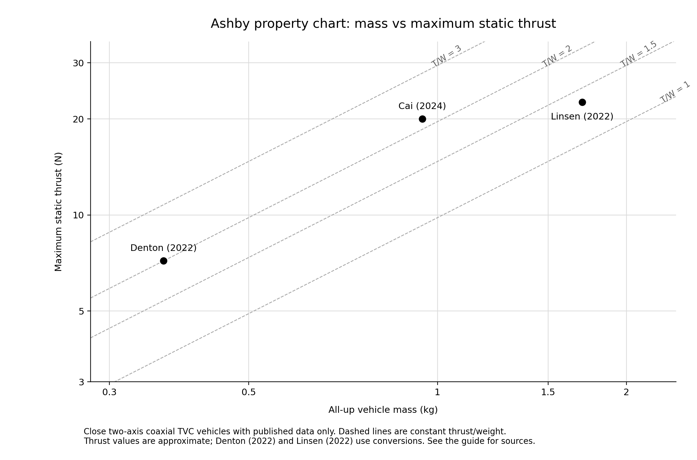
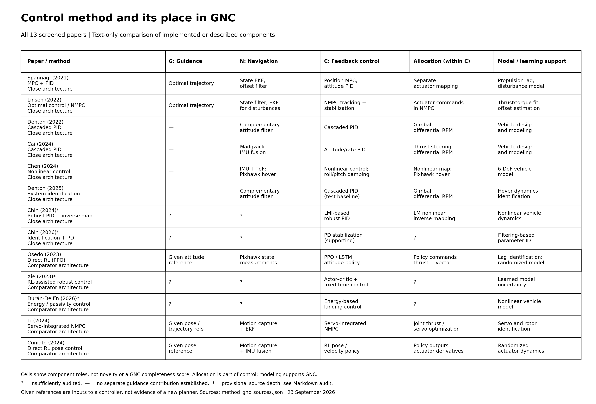
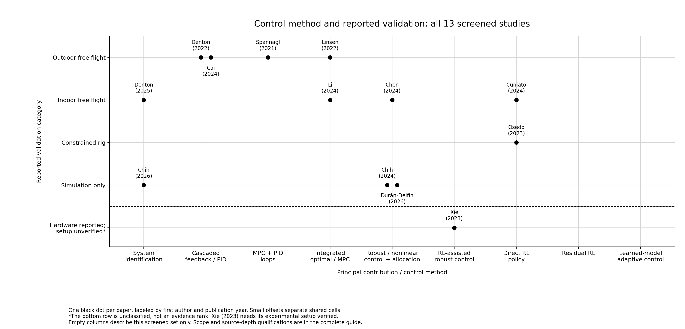

# TVC Ashby Plot Project — Complete Reading Guide

*Updated 23 September 2026. Papers are labeled by first author and publication year throughout.*

This guide brings together the project context, literature scope, physical Ashby chart, method/GNC comparison, evidence matrix and individual paper notes. It is the main reading document; the original Excel workbook and earlier focused readers are supporting records. You do not need to decode paper IDs or open those readers to understand the comparison.

The current selection contains **13 papers: eight on close architectures and five selected comparators**. Three additional papers explain transferable learning methods. The physical mass–thrust chart currently contains three verified literature points. All 13 selected papers appear in the method/GNC and validation comparisons.

The review is still a screened research map. Relevant full-text sections were inspected for many papers, but the full corpus has not been read exhaustively. Reading depth and unresolved claims are stated below. An empty cell is a search lead, not proof that a topic is novel.

## Contents

1. [Our project and its current status](#1-our-project-and-its-current-status)
2. [What literature belongs in the comparison](#2-what-literature-belongs-in-the-comparison)
3. [How to read the physical Ashby chart](#3-how-to-read-the-physical-ashby-chart)
4. [Compare methods by their role in GNC](#4-compare-methods-by-their-role-in-gnc)
5. [Compare technical problems and experimental evidence](#5-compare-technical-problems-and-experimental-evidence)
6. [Read the 13 papers one by one](#6-read-the-13-papers-one-by-one)
7. [Residual RL and Neural-Fly as transfer ideas](#7-residual-rl-and-neural-fly-as-transfer-ideas)
8. [Use the maps to narrow a thesis question](#8-use-the-maps-to-narrow-a-thesis-question)
9. [Evidence limits and remaining checks](#9-evidence-limits-and-remaining-checks)
10. [Glossary and supporting files](#10-glossary-and-supporting-files)

## 1. Our project and its current status

The project is an electric TVC demonstrator with **two counter-rotating propellers and a central two-axis gimbal**. Changing total thrust affects translation; tilting the propulsion unit changes the force direction and creates a moment through the distance to the center of mass. Differential rotor torque controls rotation around the thrust axis. These effects are coupled, so control allocation matters alongside the feedback controller.

The repository is currently the **simulation foundation** for the POSTECH UGRP demonstrator. The intended embedded hardware is Raspberry Pi 5 plus Pixhawk 6C. The current code demonstrates attitude recovery and position/altitude holding; it does not establish a completed hardware flight system or an autonomous takeoff–descent–landing experiment.

| Item | Current project information | How to interpret it |
|---|---|---|
| Propulsion | Two counter-rotating propellers | A central coaxial propulsion system, unlike distributed tiltable multicopters |
| Vectoring | Two gimbal axes | Changes force direction and attitude moment together |
| Baseline control | Position and altitude loops, attitude/rate feedback, actuator allocation | The reference architecture against which later control changes can be assessed |
| Navigation in Python | `PerfectEstimator`, passing the simulated state through | Current tracking performance does not validate a real sensor-fusion algorithm |
| Navigation in Gazebo route | Simulation odometry supplied to the controller | Also distinct from real onboard sensing |
| Vehicle model | Six degrees of freedom, quaternion attitude and full inertia tensor | Includes translation and rotation |
| Actuator model | Gimbal travel/rate/delay and coupled motor thrust/torque calibration | Important candidate sources of tracking limits |
| Mass setting | 1.328 kg | Retained design estimate; not established here as the final hardware mass |
| Maximum-thrust setting | 17.79 N | Configured simulation value; not a newly verified final-vehicle thrust measurement |
| Planned computers | Raspberry Pi 5 and Pixhawk 6C | Integration and responsibility split remain hardware work |
| Physical evidence established by this repository | Simulation plus retained calibration information | No free-flight validation is inferred from code or simulation plots |

These facts come from the [repository README](../../README.md), [pipeline guide](../../docs/GUIDE.md), [vehicle settings](../../src/tvc_control/tvc_control/settings/vehicle.yaml) and [simulation implementation](../../src/tvc_control/tvc_control/simulation.py). The calibration annotations are useful context; their original raw bench data have not been independently audited in this literature pass.

The configured mass and thrust imply `17.79 / (1.328 × 9.81) ≈ 1.37` as a **simulation thrust-to-weight ratio**. It is kept separate from the measured literature points. A comparison with published hardware needs the final all-up mass, calibrated total thrust, battery condition and test configuration.

### Axis names require care

The repository uses a rocket convention: body **+z is the thrust axis and its rotation is called roll**; body +x rotation is called pitch and body +y rotation is called yaw. Many UAV papers call rotation about their vertical thrust axis yaw. Compare **physical axes and actuator effects**, not axis names alone. In this guide, “two lateral attitude axes” means the two axes controlled by the gimbal, regardless of a paper's naming convention.

### Where our existing functions fit

| GNC function | Current implementation or status |
|---|---|
| Guidance | Supplied position/attitude setpoints; a complete autonomous trajectory/landing planner has not been established |
| Navigation | Ideal state feed in Python and simulated odometry in Gazebo |
| Control | Position/altitude holding and attitude/rate stabilization |
| Allocation | Requested thrust/moments converted into gimbal angles and two motor commands |
| Modeling | Rigid-body dynamics, actuator response and retained thrust/torque calibration |

This table defines our starting point. Planned hardware capabilities should be compared with other plans; demonstrated capabilities should be compared with published experiments.

## 2. What literature belongs in the comparison

Scope follows the **actuation and control problem**: a compact rigid body controlled by direction-changing thrust, with coupled translation and attitude. Vehicle appearance alone is insufficient.

| Group | Included studies | Purpose |
|---|---|---|
| Close architecture: eight papers | Spannagl (2021), Linsen (2022), Denton (2022), Cai (2024), Chen (2024), Denton (2025), Chih (2024), Chih (2026) | Central/coaxial TVC hardware, modeling, allocation or GNC comparisons |
| Selected comparators: five papers | Osedo (2023), Xie (2023), Durán-Delfín (2026), Li (2024), Cuniato (2024) | Different thrust-vectoring arrangements that expose relevant control mechanisms |
| Method transfer: three examples | Johannink (2019), Liu (2022), O'Connell (2022) | Explain residual RL and learned adaptive control without treating distant vehicles as direct benchmarks |

The main selection uses peer-reviewed primary studies. Reviews and standalone preprints are excluded from its evidence count. An accessible arXiv copy of a paper that subsequently appeared in a peer-reviewed venue is a reading source for that publication, rather than an extra paper.

This is a **selected corpus, not a census of the field**. Thirteen entries should not be interpreted as all relevant publications. The original broader workbook included more distant and method-only material; those entries were narrowed to make comparisons meaningful. Future additions should meet the same rules and disclose how they change the scope.

## 3. How to read the physical Ashby chart

An Ashby-style selection chart places designs in a space of **comparable quantitative properties** and overlays physically meaningful selection constraints or performance indices. Here the horizontal axis is all-up mass and the vertical axis is maximum static thrust. Both are logarithmic, so equal visual distances represent equal ratios.

The reference lines hold thrust-to-weight ratio constant:

\[
\lambda = \frac{T_{\max}}{mg},\qquad T_{\max}=\lambda mg,\qquad g=9.81\;\mathrm{m/s^2}.
\]

On a log–log chart, each constant-\(\lambda\) line has slope one. For a fixed mass, moving upward increases static thrust reserve. For a fixed thrust, moving left reduces mass. At \(T/W=1\), available thrust equals weight under the stated static conditions. Tilt, maneuvering, losses and uncertainty affect the usable flight margin.

The figure uses identical black markers and author–year annotations. There are no color or marker-shape categories. With only three comparable designs and no consistently reported uncertainty ranges, the figure supports a small property comparison; it cannot establish reliable family envelopes, a full design frontier or controller superiority.

### The three included physical points

| First author | All-up mass | Reported thrust information | Plotted maximum static thrust | Derived T/W |
|---|---:|---|---:|---:|
| Denton (2022) | 0.366 kg | Maximum thrust/weight approximately 2 | ≈7.18 N | ≈2.00 |
| Cai (2024) | 0.946 kg | Maximum static thrust approximately 20 N | ≈20 N | ≈2.16 |
| Linsen (2022) | 1.70 kg | Maximum thrust described as about 2.3 kg | ≈22.56 N | ≈1.35 |

Denton's force is calculated as `2 × 0.366 × 9.81`. Linsen's reported “kg” of thrust is interpreted as kilogram-force and converted using `2.3 × 9.81`. These remain approximate values; the additional decimal places are conversion results, not extra measurement accuracy. Sources: [Denton, Table 1 and rotor test](https://journals.sagepub.com/doi/full/10.1177/17568293221117189), [Cai, Table 2 and propulsion tests](https://journals.sagepub.com/doi/full/10.1177/17568293241254045), [Linsen, Section II](https://infoscience.epfl.ch/server/api/core/bitstreams/ad287a78-7931-46c9-8028-1e541a1e3a40/content).

This chart helps with **hardware sizing and thrust reserve**. It does not measure tracking error, disturbance rejection, computation time, endurance or learning efficiency.

### Why the other papers are not additional physical points

| Paper | Current reason |
|---|---|
| Spannagl (2021) | A mass of 1.16 kg is reported; a comparable maximum-static-thrust value was not verified in the inspected copy |
| Chen (2024) | A matched all-up-mass/maximum-static-thrust pair has not been independently extracted and checked |
| Denton (2025) | A modified configuration used for identification; its own comparable maximum-thrust pair needs verification rather than borrowing the 2022 values |
| Chih (2024) | Simulation-focused evidence; no verified experimental property pair in the current audit |
| Chih (2026) | Identification/simulation study; no verified experimental property pair in the current audit |
| Osedo (2023) | A constrained one-axis rig rather than a comparable free-flight vehicle |
| Xie (2023) | Full experimental setup and mass/thrust pair remain unverified |
| Durán-Delfín (2026) | Simulation and a different independently vectoring arrangement |
| Li (2024) | Distributed tiltable quadrotor; a per-rotor optimization bound has not been treated as a simultaneous whole-vehicle static-thrust measurement |
| Cuniato (2024) | Distributed tilt-rotor comparator; no verified comparable property pair in the current audit |

“Not verified” does not mean that the value cannot exist elsewhere. It records the present extraction state. All these studies remain visible in the literature comparisons below.

## 4. Compare methods by their role in GNC

**GNC names the job; PID, MPC, RL and adaptive control name ways of doing a job.** One paper may combine several methods, and two papers called “MPC” may have different architectures.

| Function | Main question | Typical output |
|---|---|---|
| Guidance | Where should the vehicle go, and along what feasible trajectory? | Reference position, velocity, attitude or thrust history |
| Navigation/state estimation | What is the vehicle's current state? | Estimated position, velocity, orientation and angular rate |
| Feedback control | What commands make the state follow the reference? | Desired forces/moments or direct actuator commands |
| Allocation, within control | How should actuators realize those demands? | Motor and gimbal commands |
| Modeling/identification/adaptation | What dynamics, parameters or uncertainty should the system account for? | Identified model, parameter estimates or disturbance compensation |

Navigation feeds guidance and control. Guidance supplies control references. Control and allocation produce actuator commands. An optimizer or learned policy may combine control and allocation, while still relying on a separate estimator and supplied references.

The text table below preserves the comparison even when image preview is unavailable. Cells describe components used or discussed, not a claim that every component is a new contribution. `?` means insufficiently checked. `—` means no separate guidance contribution was established from the inspected material. An asterisk marks provisional source depth.

| First author / main method | Guidance | Navigation/estimation | Feedback control | Allocation | Model/learning support |
|---|---|---|---|---|---|
| Spannagl (2021): MPC + PID | Optimal trajectory | State EKF and offset filtering | Position MPC; attitude PID | Separate actuator map | Propulsion lag and disturbance model |
| Linsen (2022): optimal control | Optimal trajectory | State filter; disturbance/offset EKF | NMPC tracking/stabilization | Actuator commands within NMPC | Thrust/torque identification |
| Denton (2022): PID | — | Complementary attitude filter | Cascaded feedback | Gimbal and differential RPM | Vehicle modeling |
| Cai (2024): PID | — | Madgwick IMU fusion | Attitude/rate feedback | Thrust steering and differential RPM | Vehicle modeling |
| Chen (2024): nonlinear control | — | IMU/ToF; separate Pixhawk hover setup | Nonlinear feedback and damping | Nonlinear mapping; separate hover implementation | Six-DoF model |
| Denton (2025): identification | — | Complementary attitude filter | PID test baseline | Gimbal and differential RPM | Hover dynamics identification |
| Chih (2024)*: robust PID | ? | ? | LMI-based robust PID | LM nonlinear inverse map | Nonlinear dynamics |
| Chih (2026)*: identification | ? | ? | Supporting PD stabilization | ? | Filtering-based parameter identification |
| Osedo (2023): direct RL | Given attitude reference | Pixhawk state measurements | PPO/LSTM policy | Policy commands thrust/vector | Actuator identification; randomized model |
| Xie (2023)*: RL-assisted robust control | ? | ? | Actor–critic and fixed-time control | ? | Learned model uncertainty |
| Durán-Delfín (2026)*: energy/passivity | ? | ? | Energy-based landing control | ? | Nonlinear model |
| Li (2024): servo-integrated NMPC | Given pose/trajectory references | Motion capture and EKF | NMPC | Joint thrust/servo optimization | Actuator identification |
| Cuniato (2024): direct RL | Given pose reference | Motion capture/IMU fusion | Learned pose/velocity policy | Actuator-derivative outputs | Randomized actuator dynamics |

The contrast between **Spannagl and Linsen** is especially useful: the former retains separate attitude PID loops and allocation beneath position MPC, while the latter solves tracking/stabilization with actuator constraints inside NMPC. The comparison between **Li and Cuniato** concerns model-based versus learned actuator command generation; both use external state-estimation infrastructure. Sources and section locations are in the individual notes and [machine-readable GNC audit](method_gnc_sources.json).

System identification belongs in the supporting-model column. Filtering data to identify parameters does not automatically constitute a new navigation method. Similarly, demonstrating landing does not automatically establish a new guidance/planning algorithm.

## 5. Compare technical problems and experimental evidence

This is a **categorical evidence plot**. Every selected paper has one black dot, labeled with first author and year. Small offsets separate papers sharing a cell. Distances between method categories have no numerical meaning. The separated “hardware reported; setup unverified” row is unclassified, not an evidence rank.

Xie is labeled **2023**, the journal publication year; its DOI and early online publication date contain 2022. Its full experimental configuration remains unresolved. The revised plot no longer treats the earlier constrained-rig assignment as verified.

### Problem × evidence matrix

To keep the matrix readable, each paper appears under its **principal problem** below. A paper can address additional issues; these assignments are a reading organization, not mutually exclusive scientific categories. The validation column describes the paper's reported evidence, which must still be matched to the exact tested controller.

| Principal problem | Simulation | Constrained rig | Indoor free flight | Outdoor free flight | Hardware configuration unresolved |
|---|---|---|---|---|---|
| Optimal guidance and trajectory tracking | — | — | — | Spannagl (2021); Linsen (2022) | — |
| Conventional stabilization and vehicle transition | — | — | — | Denton (2022); Cai (2024) | — |
| Coupled nonlinear control/allocation | Chih (2024)* | — | Chen (2024), with implementation caveat | — | — |
| Vehicle/system identification | Chih (2026)* | — | Denton (2025) | — | — |
| Servo dynamics inside constrained control | — | — | Li (2024) | — | — |
| Learned control under model variation | — | Osedo (2023) | Cuniato (2024) | — | Xie (2023)* |
| Energy/passivity-based landing control | Durán-Delfín (2026)* | — | — | — | — |
| Residual RL or Neural-Fly-style adaptation on the selected architectures | — | — | — | — | — |

The last row means these methods are absent from the **13-paper selection**. Section 7 contains existing demonstrations on other systems. The matrix therefore supports questions about architecture transfer and validation, rather than a universal claim that the methods have not been used.

Our project would currently be listed separately as **simulation: conventional hover/attitude control and allocation**. It is not a published comparison point or a demonstrated learning-controller result.

## 6. Read the 13 papers one by one

Each entry states the problem, method, evidence and relevance. “Full-text sections inspected” refers to the relevant methods/results portions of an accessible article or accepted manuscript; it does not mean every page and reference has been exhaustively reviewed.

### Spannagl (2021)

**Design, Optimal Guidance and Control of a Low-cost Re-usable Electric Model Rocket.** IROS 2021. [Publication](https://doi.org/10.1109/IROS51168.2021.9636430) · [Author manuscript](https://arxiv.org/pdf/2103.04709).

**Reading status:** relevant full-text sections inspected. **Scope:** close electric rocket-like coaxial TVC. **Evidence:** indoor and outdoor autonomous flight.

The paper connects free-final-time optimal guidance to offset-free position MPC, attitude PID and a separate allocator. Estimation and a propulsion-response model support that architecture. Read its GNC block diagram to see what each loop computes and what runs on the embedded computers.

For our project, this is an important established optimization-based baseline. It shows that a TVC platform can combine advanced guidance with conventional inner loops. It does not establish that replacing those loops with learning will improve performance. The physical chart currently lacks a verified maximum-static-thrust value for this vehicle.

### Linsen (2022)

**Optimal Thrust Vector Control of an Electric Small-Scale Rocket Prototype.** ICRA 2022. [Publication](https://doi.org/10.1109/ICRA46639.2022.9811938) · [Institutional PDF](https://infoscience.epfl.ch/server/api/core/bitstreams/ad287a78-7931-46c9-8028-1e541a1e3a40/content).

**Reading status:** relevant full-text sections inspected. **Scope:** close coaxial two-axis TVC. **Evidence:** indoor and outdoor flight.

Optimal guidance provides a trajectory, while NMPC handles tracking and stabilization with actuator constraints. State estimation is supplemented by an EKF for disturbances and actuator offsets. Read Sections V–VI and the software architecture to understand the interfaces.

Its relevance is the integration of prediction, constraints and actuator commands on a close vehicle. It is a stronger comparison than treating “MPC” as a single generic method. Its approximate mass/thrust pair appears in the physical chart.

### Denton (2022)

**Design, Development, and Flight Testing of a Tube-Launched Coaxial-Rotor Based Micro Air Vehicle.** International Journal of Micro Air Vehicles. [Publication/full text](https://doi.org/10.1177/17568293221117189).

**Reading status:** relevant full-text sections inspected. **Scope:** close coaxial gimbal vehicle. **Evidence:** free-flight stabilization and launch-related tests, including outdoor flight.

The vehicle uses gimbal vectoring and differential rotor speed with cascaded feedback. Complementary filtering combines inertial measurements for attitude estimation. Read the stabilization overview and control diagram alongside the rotor tests.

This provides a conventional-control and hardware benchmark for our actuation family. Its mission and flight conditions differ from ours, so its results should not be interpreted as a controlled algorithm comparison. Its approximate maximum thrust-to-weight ratio supplies one Ashby point.

### Cai (2024)

**Development of a Tube-Launched Tail-Sitter Unmanned Aerial Vehicle.** International Journal of Micro Air Vehicles. [Publication/full text](https://doi.org/10.1177/17568293241254045).

**Reading status:** relevant full-text sections inspected. **Scope:** close coaxial thrust-steering mechanism, with a winged tail-sitter mission. **Evidence:** hover, translational and transition flight tests.

The controller uses attitude/rate feedback and Madgwick IMU fusion. The actuation mapping changes with flight mode. Read the control strategy and transition sections to distinguish stabilization from mission-level autonomy.

The transferable parts are estimation, feedback and actuator mapping. The wing and horizontal-flight dynamics limit direct performance comparisons with our rocket-like demonstrator. Its measured mass and approximate maximum thrust form a physical-chart point.

### Chen (2024)

**Design, Modeling, and Control of a Coaxial Drone.** IEEE Transactions on Robotics. [Publication](https://doi.org/10.1109/TRO.2024.3354161) · [Published PDF](https://faculty.sustech.edu.cn/wp-content/uploads/2024/05/2024050116133964.pdf).

**Reading status:** relevant full-text sections inspected. **Scope:** close two-rotor, two-servo coaxial arrangement. **Evidence:** simulation and real-flight tests.

A nonlinear model and allocation method include damping for lateral attitude motion. This is particularly relevant to our coupled actuator mapping.

The experiments need careful reading: custom ascent control uses IMU/time-of-flight sensing, while a later hover test uses Pixhawk fusion and an existing allocation framework after estimation drift became an issue. The hover result must not be credited automatically to the unchanged custom controller. Read Section VI-E with the model and allocation derivation; it illustrates why navigation and control must be compared together.

### Denton (2025)

**System Identification of a Thrust-Vectoring, Coaxial-Rotor-Based Gun-Launched Micro Air Vehicle in Hovering Flight.** International Journal of Micro Air Vehicles. [Publication/full text](https://doi.org/10.1177/17568293251361078).

**Reading status:** relevant full-text sections inspected. **Scope:** close coaxial TVC. **Evidence:** identification from hovering flight data.

The main output is a linearized flight-dynamics model. Cascaded feedback and complementary attitude filtering support the tests. Read the excitation, estimation and independent model-validation procedures.

This is useful for deciding how to identify our platform and test whether a model is predictive. Its main contribution should remain visible as identification rather than being counted as a new control family. The experimental vehicle is modified relative to the earlier platform; its physical properties require their own source check.

### Chih (2024)

**Dynamics Modeling and Nonlinear Attitude Controller Design for a Rocket-Type Unmanned Aerial Vehicle.** ISA Transactions. [Publication](https://doi.org/10.1016/j.isatra.2024.06.029) · [Publisher record](https://www.sciencedirect.com/science/article/pii/S0019057824003173).

**Reading status:** publisher abstract/highlights; full methods/results PDF still needed. **Scope:** close gimbaled coaxial rotor. **Evidence coded:** numerical simulation.

The reported method combines LMI-based robust PID with Levenberg–Marquardt inverse mapping for the coupled force/torque problem. Its value is a close mathematical comparator for modeling and allocation.

The architecture and algorithm descriptions are useful leads, but estimator details, experimental claims and quantitative baselines need full-text verification. It should not be represented as a demonstrated free-flight controller.

### Chih (2026)

**Modeling, Control Stabilization and Parameter Identification of a Thrust Vectoring Rocket-Type Aerial Robot.** Applied Mathematical Modelling. [Publication](https://doi.org/10.1016/j.apm.2026.117000) · [Publisher record](https://www.sciencedirect.com/science/article/pii/S0307904X26002611).

**Reading status:** publisher abstract/record; full PDF still needed. **Scope:** close rocket-like TVC. **Evidence coded:** numerical study.

The emphasis is filtering-based parameter identification, with supporting stabilization. It belongs beside identification studies when considering model uncertainty and calibration requirements.

The available record does not justify treating its identification filter as a navigation innovation. Read the complete regression model, noise assumptions, parameter observability and validation before adopting its procedure or making a performance claim.

### Osedo (2023)

**Uniaxial Attitude Control of Uncrewed Aerial Vehicle with Thrust Vectoring under Model Variations by Deep Reinforcement Learning and Domain Randomization.** ROBOMECH Journal. [Publication](https://doi.org/10.1186/s40648-023-00260-0) · [Open PDF](https://robomechjournal.springeropen.com/counter/pdf/10.1186/s40648-023-00260-0.pdf).

**Reading status:** relevant full-text sections inspected. **Scope:** one-axis TVC comparator. **Evidence:** mechanically constrained rotation experiments.

A PPO/LSTM policy commands thrust and vectoring. Domain randomization targets changes in mass, inertia and center of gravity; actuator response is modeled. The paper examines performance within and beyond the randomization range.

For us, this suggests concrete tests of learned-policy robustness to parameter variation. The constraint removes translational and multi-axis flight challenges, so it does not establish free-flight performance for our vehicle. Read the experimental apparatus before interpreting the learning results.

### Xie (2023; online 2022)

**Fixed-Time Convergence Attitude Control for a Tilt Trirotor Unmanned Aerial Vehicle Based on Reinforcement Learning.** ISA Transactions. [Publication](https://doi.org/10.1016/j.isatra.2022.06.006) · [Publisher record](https://www.sciencedirect.com/science/article/pii/S0019057822003111) · [Publication-date record](https://pubmed.ncbi.nlm.nih.gov/35753810/).

**Reading status:** publisher abstract only. **Scope:** tilt-trirotor comparator. **Evidence:** hardware experiments reported; free versus constrained flight unresolved.

Actor–critic networks address model uncertainty, combined with a fixed-time robust controller. This is a hybrid architecture, whose learning and conventional components must be identified separately.

The earlier rig assignment was not adequately verified and has been removed from the active plot. The complete control law and experimental section are required before identifying an exact residual-RL interface or claiming a particular flight validation level.

### Durán-Delfín (2026)

**Nonlinear Modeling and Energy-Based Flight Control of a Coaxial VTOL UAV with Independent Thrust Vectoring for Autonomous Landing Maneuvers.** Drones. [Publication/full text](https://doi.org/10.3390/drones10070512).

**Reading status:** prior full-text coding exists; the publisher page could not be re-opened in the latest audit. Detailed entries remain provisional. **Scope:** independently tilting propulsion comparator. **Evidence coded:** simulation.

The reported contribution uses nonlinear modeling and energy/passivity-based control for landing. Its relevance is an alternative nonlinear design approach.

Independent propulsion tilting changes the attainable forces and moments relative to our central gimbal. A landing task also does not establish a distinct guidance algorithm. Recheck the actuation assumptions, allocation and reference generation before using this as a close theoretical benchmark.

### Li (2024)

**Servo Integrated Nonlinear Model Predictive Control for Overactuated Tiltable-Quadrotors.** IEEE Robotics and Automation Letters. [Publication](https://doi.org/10.1109/LRA.2024.3451391) · [Accepted author copy](https://arxiv.org/pdf/2405.09871).

**Reading status:** relevant full-text sections inspected. **Scope:** distributed tiltable-quadrotor comparator. **Evidence:** indoor flight.

The controller explicitly includes servo dynamics and optimizes actuator commands subject to constraints. Motion capture and an EKF provide state estimates; actuator identification supports the model.

This is relevant when testing whether our gimbal lag limits a simpler controller. Its allocation freedom differs substantially from our underactuated central-gimbal system. Compare model treatment and interfaces before transferring performance claims. Read the servo-model ablations and flight experiments together.

### Cuniato (2024)

**Learning to Fly Omnidirectional Micro Aerial Vehicles with an End-to-End Control Network.** Experimental Robotics / ISER proceedings. [Publication](https://doi.org/10.1007/978-3-031-63596-0_33) · [Author manuscript](https://arxiv.org/pdf/2312.05125).

**Reading status:** relevant full-text sections inspected. **Scope:** distributed omnidirectional tilt-rotor comparator. **Evidence:** indoor real flight.

The learned controller produces tilt-arm velocity and rotor acceleration commands using a state estimate and reference. Training randomizes actuator dynamics; tests include model changes and disturbances, with a model-based comparison.

Its value is evidence that learned actuator coordination can fly on a thrust-vectoring platform. Its omnidirectional authority is different from our gimbal. Also inspect the reported real-world trials and subsequent retraining: the final flight result does not imply a completely untouched simulation-only development process.

## 7. Residual RL and Neural-Fly as transfer ideas

These methods belong in the guide because they may inform a research question. Their source systems remain outside the 13-paper direct/comparator count.

### Johannink (2019): residual reinforcement learning

**Residual Reinforcement Learning for Robot Control.** ICRA 2019. [Publication](https://doi.org/10.1109/ICRA.2019.8794127) · [Author manuscript](https://arxiv.org/abs/1812.03201).

The architecture retains a conventional controller and learns an additional action:

\[
u_t=u_{\mathrm{base}}(x_t)+\Delta u_\theta(o_t).
\]

The residual policy is trained through reward to improve task performance despite limitations of the baseline. In this paper the experimental system is manipulation, so it supplies an architecture concept rather than TVC flight evidence.

For a TVC study, the key choice is what the action means: a residual wrench, thrust command or gimbal/motor command. Addition is only meaningful with compatible units and a defined interface; actuator limits still apply. The residual can be small even when the baseline performs most of the stabilization.

### Liu (2022): an aerial residual-RL example

**Deep Residual Reinforcement Learning Based Autonomous Blimp Control.** IROS 2022. [Publication](https://doi.org/10.1109/IROS47612.2022.9981182) · [Author manuscript](https://arxiv.org/abs/2203.05360).

The study combines a PID baseline with learned residual actions and reports real blimp flight. It matters because it prevents the broad claim that residual RL has never been applied to aerial thrust-vectoring systems. Buoyancy and the blimp's dynamics make it a method-transfer example rather than a direct performance comparator for our compact TVC demonstrator.

### O'Connell (2022): Neural-Fly

**Neural-Fly Enables Rapid Learning for Agile Flight in Strong Winds.** Science Robotics. [Publication](https://doi.org/10.1126/scirobotics.abm6597) · [Accepted manuscript and supplement](https://authors.library.caltech.edu/records/q3grb-3vz72).

Neural-Fly learns a disturbance representation offline and adapts a low-dimensional coefficient vector online inside a model-based controller. A simplified representation is

\[
\hat f(x,t)=\phi(x)\hat a(t).
\]

The offline-trained basis \(\phi\) and online estimate \(\hat a\) are different learning stages. This is learning-based adaptive control, rather than a policy trained by reinforcement reward. Its quadrotor wind experiments motivate a question about learned uncertainty compensation on our platform, but transferring the method requires identifying the relevant residual forces and torques.

### Keep these mechanisms distinct

| Method | What changes through learning? | Usual role in these examples |
|---|---|---|
| Direct RL | Principal control policy | Feedback control and possibly actuator command selection |
| Residual RL | Correction added to a baseline action | Feedback control or allocation, depending on the correction interface |
| Learned residual model | Prediction of dynamics missing from the nominal model | Model support for a conventional or optimizing controller |
| Neural-Fly-style adaptation | Offline representation plus online coefficients | Disturbance compensation within adaptive feedback control |

The word “residual” alone does not tell us whether an algorithm is RL. Look for the learned quantity, training objective, online update and point where the learned result enters the controller.

## 8. Use the maps to narrow a thesis question

The maps serve different decisions. The mass–thrust chart concerns physical feasibility. The method/GNC matrix identifies which functional block a paper changes. The problem/evidence matrix identifies the kind of experiment supporting the claim. Use them together before selecting a contribution.

| Candidate question | Main GNC role | Starting comparisons | Example outcomes to measure | Present status |
|---|---|---|---|---|
| Does explicit gimbal/motor dynamics improve tracking under limits? | Control/allocation | Current baseline; Spannagl, Linsen and Li | Tracking error, saturation time, recovery, runtime | Testable question; lag-aware control already exists in related work |
| Can a bounded learned correction improve robustness to CG/actuator mismatch? | Control/adaptation | Baseline alone; a conventional compensation method; residual RL transfer studies | Held-out tracking, constraint violations, sensitivity to mismatch | Transfer hypothesis; novelty and experimental feasibility unproven |
| Can learned disturbance compensation adapt efficiently to changed conditions? | Control/model adaptation | Disturbance observer/adaptive baseline; O'Connell method | Recovery and error after a change; data and computation needs | Requires a well-defined residual and suitable measurements |
| Which vehicle parameters matter enough to identify experimentally? | Modeling/identification | Denton (2025), Chih (2026) | Prediction on separate data, parameter uncertainty, control impact | Strong prerequisite question, not automatically a new controller |
| Can estimation support accurate motion without external tracking? | Navigation | Current ideal-state simulation and relevant onboard-estimation work | State error, drift, tracking dependence on sensing | Needs a dedicated navigation literature extension |

These are candidate questions, not a selected thesis or verified novelty claims. The selected papers already establish substantial conventional and optimization-based TVC work. A contribution must identify a specific limitation and demonstrate an improvement under a meaningful comparison.

For a controller experiment, hold the reference trajectory, state-estimation source, vehicle model and disturbance protocol constant where possible. Then report both benefits and costs. If guidance or navigation also changes, describe the result as a whole-system comparison and analyze which changes could explain it.

A future quantitative performance frontier could plot **tracking error versus computation cost**, or **disturbance rejection versus actuator effort**, using the same vehicle and test protocol. The present cross-paper metrics are not sufficiently standardized to populate such a frontier honestly. A method-family axis is categorical, so it should remain a matrix/evidence view.

## 9. Evidence limits and remaining checks

The guide is complete as a consolidated reading document; the evidence collection remains incomplete. The following limits affect how strongly its conclusions can be used:

| Issue | Current handling | Needed to strengthen the claim |
|---|---|---|
| Chih (2024), Chih (2026), Xie (2023) full text unavailable in the audit | Detailed cells marked provisional or unknown | Obtain and inspect methods, baselines, apparatus and results |
| Durán-Delfín (2026) detailed coding not rechecked | Provisional source-depth flag | Re-open the paper and verify assumptions and experiments |
| Xie experiment type unresolved | Separate unclassified hardware row | Verify whether the apparatus is free flight, constrained or another setup |
| Chen uses different experimental implementations | Explicit caveat in its entry | Attribute each metric and experiment to the actual implemented controller |
| Physical data missing or incomparable | Three audited literature points only | Verify additional all-up mass/thrust pairs and test conditions |
| Scope is a selected search | Empty cells treated as leads | Reproducible database queries and backward/forward citation checks |
| Our final hardware properties not verified here | Simulation values identified as settings | Final mass, thrust, actuator response and sensor measurements |

For a formal review, record search databases, dates, query strings, inclusion/exclusion decisions and duplicate publications. Search the close architecture together with terms such as thrust vector control, coaxial gimbal, residual reinforcement learning, adaptive neural control, system identification and free flight. Read the control law and apparatus before assigning method and validation categories.

The author-year labels use publication years consistently. Xie is 2023 with an early online date in 2022; Cuniato is the 2024 publication with an earlier author preprint. Reading an author copy does not create a separate publication entry.

## 10. Glossary and supporting files

| Term | Meaning here |
|---|---|
| TVC | Thrust vector control: changing propulsion direction |
| Coaxial | Rotors arranged around a shared axis |
| GNC | Guidance, navigation and control |
| PID / PD | Proportional–integral–derivative / proportional–derivative feedback |
| MPC / NMPC | Model predictive control / nonlinear MPC |
| EKF | Extended Kalman filter, a nonlinear state-estimation method |
| IMU | Inertial measurement unit |
| ToF | Time-of-flight range/distance sensing |
| Allocation | Mapping desired forces/moments to realizable actuator commands |
| LMI | Linear matrix inequality, used in some controller designs/proofs |
| LM | Levenberg–Marquardt nonlinear least-squares method |
| RL / PPO | Reinforcement learning / proximal policy optimization |
| LSTM | Long short-term memory recurrent neural network |
| Domain randomization | Varying simulated parameters/conditions during training |
| CG / CoM | Center of gravity / center of mass; the distinction matters when gravitational assumptions differ |
| Free flight | Vehicle motion without a mechanical rig constraining the relevant flight degrees of freedom |
| All-up mass | Complete vehicle mass in the stated test configuration |
| Static thrust | Force measured without forward flight under the stated test conditions |

The Markdown tables contain the comparisons directly. Keep the image files beside this document for illustrated viewing; SVG copies can be exported at publication quality.

| Supporting artifact | Purpose |
|---|---|
| [Mass–thrust PNG](tvc_mass_thrust_ashby.png) / [SVG](tvc_mass_thrust_ashby.svg) | Quantitative physical chart |
| [Method/GNC PNG](tvc_method_gnc_matrix.png) / [SVG](tvc_method_gnc_matrix.svg) | All 13 papers and their functional components |
| [Method/validation PNG](tvc_control_method_map.png) / [SVG](tvc_control_method_map.svg) | All 13 papers by method and reported evidence |
| [Mass/thrust source data](mass_thrust_sources.json) | Raw values, conversions, qualifiers and source locations |
| [GNC source data](method_gnc_sources.json) | Methods, source links and section locations |
| [Original curated data](curated_corpus.json) | Earlier screening archive; some evidence-status fields predate later corrections |

Internal record keys are retained in source data for reproducibility. All reader-facing paper labels and current figures use first author and year. The original Excel file remains an archive, while this guide is the main document to read and update.
