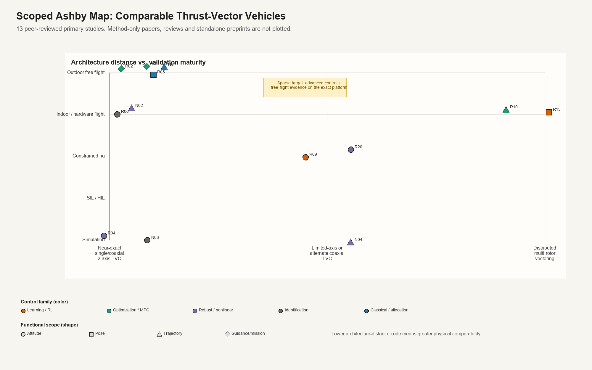

# Curated TVC Ashby research reader

> **Superseded reading view:** Use the [two-axis TVC literature map](TVC_Literature_Map.md) for the revised, monochrome control-method-versus-validation plot and paper-by-paper discussion. The older figure below is retained only as a screening audit trail.

Main Ashby corpus: **13 peer-reviewed primary studies**.

## Scope rule

- Peer-reviewed primary research only in the main plot.
- Physical thrust vectoring must be central to the vehicle, not merely a transferable method.
- Near-exact coaxial/single-propulsion two-axis systems are retained regardless of evidence level.
- Only a small comparator set of alternate servo-vectoring architectures is retained.
- Reviews, standalone preprints, generic vehicles and method-only papers are excluded from the main plot.
- Neural-Fly and residual RL are retained separately as method inspiration.

## What changed

- Main plotted corpus reduced from 45 to **13** studies.
- **34** original records moved out of scope.
- Four directly relevant peer-reviewed papers missing from the original corpus were added as N01–N04.
- Neural-Fly and residual RL are retained only as method inspiration.

## Main plotted papers

### R01 — [Design, Optimal Guidance and Control of a Low-cost Re-usable Electric Model Rocket](https://doi.org/10.1109/IROS51168.2021.9636430)

**Citation:** Spannagl et al. (2021), IROS 2021.  
**Architecture:** Single electric propulsion unit with 2-axis TVC (Near-exact single/coaxial 2-axis TVC).  
**Vectoring:** Two-axis thrust vectoring.  
**Control:** Optimization-based — Offset-free MPC position control.  
**Function:** Online guidance.  
**Validation:** Outdoor free flight; hardware: Yes; free flight: Yes.  
**Evidence:** Reliable autonomous operation reported.  
**Why it belongs:** Direct low-cost electric rocket-like GNC benchmark  
**Evidence status:** Abstract verified. All computation reported onboard; platform cost below USD 1000.

### R02 — [Optimal Thrust Vector Control of an Electric Small-Scale Rocket Prototype](https://doi.org/10.1109/ICRA46639.2022.9811938)

**Citation:** Linsen et al. (2022), ICRA 2022.  
**Architecture:** Small-scale electric thrust-vectored rocket (Near-exact single/coaxial 2-axis TVC).  
**Vectoring:** Thrust vectoring.  
**Control:** Optimization-based — Real-time optimal control / NMPC.  
**Function:** Online guidance.  
**Validation:** Outdoor free flight; hardware: Yes; free flight: Yes.  
**Evidence:** Flight validation reported.  
**Why it belongs:** Direct benchmark for integrated optimal GNC  
**Evidence status:** Abstract verified. Guidance and tracking solved online on embedded hardware.

### R05 — [Design, Development, and Flight Testing of a Tube-Launched Coaxial-Rotor Based Micro Air Vehicle](https://doi.org/10.1177/17568293221117189)

**Citation:** Denton et al. (2022), International Journal of Micro Air Vehicles.  
**Architecture:** Coaxial rotors with pitch/roll thrust vectoring (Near-exact single/coaxial 2-axis TVC).  
**Vectoring:** Pitch/roll thrust vectoring; differential RPM yaw.  
**Control:** Classical — Cascaded feedback control.  
**Function:** Position/pose control.  
**Validation:** Outdoor free flight; hardware: Yes; free flight: Yes.  
**Evidence:** Hover and flight-test performance.  
**Why it belongs:** Exact mechanism family without rocket-testbed framing  
**Evidence status:** Metadata and follow-up-reference verified. Important example of architecture-first rather than rocket-first literature.

### N01 — [Development of a Tube-Launched Tail-Sitter Unmanned Aerial Vehicle](https://doi.org/10.1177/17568293241254045)

**Citation:** Cai et al. (2024), International Journal of Micro Air Vehicles.  
**Architecture:** Single coaxial propulsion unit on a two-axis gimbal; tail-sitter airframe (Near-exact single/coaxial 2-axis TVC).  
**Vectoring:** Two-axis gimbal, ±30°; differential rotor RPM for yaw.  
**Control:** Classical — Cascaded attitude/rate PID on custom autopilot.  
**Function:** Hover, translation and vertical-to-horizontal transition.  
**Validation:** Outdoor free flight; hardware: Yes; free flight: Yes.  
**Evidence:** 946 g vehicle; about 20 N maximum static thrust; indoor/outdoor hover and transition flight.  
**Why it belongs:** Near-exact propulsion and gimbal architecture with unusually detailed full-text hardware evidence.  
**Evidence status:** Full text verified. Peer-reviewed journal paper; earlier conference version noted by authors.

### N02 — [Design, Modeling, and Control of a Coaxial Drone](https://doi.org/10.1109/TRO.2024.3354161)

**Citation:** Chen et al. (2024), IEEE Transactions on Robotics.  
**Architecture:** Two contra-rotating rotors with serial dual-axis servo rotation (Near-exact single/coaxial 2-axis TVC).  
**Vectoring:** Independent dual-axis rotation of the coaxial propulsion assembly.  
**Control:** Nonlinear / allocation — Six-DOF nonlinear model and nonlinear control allocation with damping injection.  
**Function:** Position and yaw stabilization with maneuvering trajectory.  
**Validation:** Hardware experiments; hardware: Yes; free flight: Yes.  
**Evidence:** Numerical simulations and physical experiments reported in IEEE T-RO.  
**Why it belongs:** One of the closest peer-reviewed architecture matches and missing from the original corpus.  
**Evidence status:** Full text verified. Publisher DOI and author-hosted accepted PDF located.

### R06 — [System Identification of a Thrust-Vectoring, Coaxial-Rotor-Based Gun-Launched Micro Air Vehicle in Hovering Flight](https://doi.org/10.1177/17568293251361078)

**Citation:** Denton et al. (2025), International Journal of Micro Air Vehicles.  
**Architecture:** Coaxial rotors with pitch/roll thrust vectoring (Near-exact single/coaxial 2-axis TVC).  
**Vectoring:** Pitch/roll thrust vectoring; differential RPM yaw.  
**Control:** Model identification — Flight-test-based LTI state-space identification.  
**Function:** Attitude stabilization.  
**Validation:** Indoor free flight; hardware: Yes; free flight: Yes.  
**Evidence:** Mode decoupling, eigenvalues and damping terms.  
**Why it belongs:** Direct evidence that system identification itself is not an empty field  
**Evidence status:** Full-text verified. Longitudinal and lateral modes were nearly identical due to axisymmetry.

### R04 — [Dynamics Modeling and Nonlinear Attitude Controller Design for a Rocket-Type Unmanned Aerial Vehicle](https://www.sciencedirect.com/science/article/abs/pii/S0019057824003173)

**Citation:** Chih et al. (2024), ISA Transactions.  
**Architecture:** Gimbal-based coaxial rotor system (Near-exact single/coaxial 2-axis TVC).  
**Vectoring:** Gimbal-based coaxial rotor system.  
**Control:** Robust / nonlinear — LMI-based robust PID with nonlinear allocation.  
**Function:** Attitude stabilization.  
**Validation:** Simulation; hardware: No convincing flight validation located; free flight: No.  
**Evidence:** Simulation tracking and robustness.  
**Why it belongs:** Exact architecture but weak experimental evidence  
**Evidence status:** Abstract verified. Do not plot as free-flight evidence without full-text confirmation.

### N03 — [Modeling, Control Stabilization and Parameter Identification of a Thrust Vectoring Rocket-Type Aerial Robot](https://doi.org/10.1016/j.apm.2026.117000)

**Citation:** Chih and Peng (2026), Applied Mathematical Modelling.  
**Architecture:** Gimbal-based coaxial rotor system with two servos (Near-exact single/coaxial 2-axis TVC).  
**Vectoring:** Two-axis servo gimbal; differential coaxial torque.  
**Control:** Identification / model-based — Filtering-operator least squares with PSO tuning; PD stabilization.  
**Function:** Attitude and altitude stabilization for identification.  
**Validation:** Simulation; hardware: No; free flight: No.  
**Evidence:** Noisy-measurement nonlinear parameter identification demonstrated numerically.  
**Why it belongs:** Exact architecture; useful for model identification, but it is simulation evidence only.  
**Evidence status:** Publisher full text/record verified. Volume 158, article 117000; published online April 2026.

### R09 — [Uniaxial Attitude Control of Uncrewed Aerial Vehicle with Thrust Vectoring under Model Variations by Deep Reinforcement Learning and Domain Randomization](https://doi.org/10.1186/s40648-023-00260-0)

**Citation:** Osedo et al. (2023), ROBOMECH Journal.  
**Architecture:** Two EDFs with synchronized vectoring on one-axis rig (Limited-axis or alternate coaxial TVC).  
**Vectoring:** Two synchronized vector actuators.  
**Control:** Reinforcement learning — PPO policy with LSTM and domain randomization.  
**Function:** Attitude stabilization.  
**Validation:** Constrained rig; hardware: Yes; free flight: No.  
**Evidence:** Success within randomization range; failure outside range.  
**Why it belongs:** Closest hardware RL evidence, but only one rotational axis  
**Evidence status:** Full-text verified. Pixhawk operated at 200 Hz; neural controller at 50 Hz; ±25° vector range.

### R20 — [Fixed-Time Convergence Attitude Control for a Tilt Trirotor Unmanned Aerial Vehicle Based on Reinforcement Learning](https://doi.org/10.1016/j.isatra.2022.06.006)

**Citation:** Xie, Xian and Gu (2023), ISA Transactions.  
**Architecture:** Tilt trirotor on limited-motion ball joint (Limited-axis or alternate coaxial TVC).  
**Vectoring:** Tilt rotors.  
**Control:** RL-enhanced robust control — Fixed-time robust attitude control with RL.  
**Function:** Attitude stabilization.  
**Validation:** Constrained rig; hardware: Yes; free flight: No.  
**Evidence:** Fixed-time convergence.  
**Why it belongs:** Additional evidence that RL on TVC hardware is not wholly absent  
**Evidence status:** Publisher record verified. Rig allows free yaw and limited roll/pitch, not free flight.

### N04 — [Nonlinear Modeling and Energy-Based Flight Control of a Coaxial VTOL UAV with Independent Thrust Vectoring for Autonomous Landing Maneuvers](https://doi.org/10.3390/drones10070512)

**Citation:** Durán-Delfín et al. (2026), Drones.  
**Architecture:** Coaxial VTOL with independently tilting propulsion units (Limited-axis or alternate coaxial TVC).  
**Vectoring:** Independent propulsion tilt with nonlinear allocation.  
**Control:** Nonlinear / passivity-based — Quaternion IDA-PBC and nonlinear control allocation.  
**Function:** Trajectory tracking and autonomous landing.  
**Validation:** Simulation; hardware: No; free flight: No.  
**Evidence:** Three-dimensional numerical hover, cruise, transition and landing studies.  
**Why it belongs:** Close coaxial TVC comparator; propulsion topology is not the same single gimballed unit.  
**Evidence status:** Full text verified. Peer-reviewed open-access journal article published July 2026.

### R10 — [Servo Integrated Nonlinear Model Predictive Control for Overactuated Tiltable-Quadrotors](https://doi.org/10.1109/LRA.2024.3451391)

**Citation:** Li et al. (2024), IEEE Robotics and Automation Letters.  
**Architecture:** Overactuated tiltable quadrotor (Distributed multi-rotor vectoring).  
**Vectoring:** Independent rotor tilt.  
**Control:** Optimization-based — Full-dynamics servo-integrated NMPC.  
**Function:** Trajectory tracking.  
**Validation:** Indoor free flight; hardware: Yes; free flight: Yes.  
**Evidence:** Rapid, robust and smooth pose tracking.  
**Why it belongs:** Shows actuator dynamics in advanced TVC control is not generally novel  
**Evidence status:** Abstract verified. Servo integration was reported as important for optimizer convergence.

### R13 — [Learning to Fly Omnidirectional Micro Aerial Vehicles with an End-To-End Control Network](https://doi.org/10.1007/978-3-031-63596-0_33)

**Citation:** Cuniato et al. (2024), Experimental Robotics / ISER.  
**Architecture:** Overactuated tilt-rotor platform (Distributed multi-rotor vectoring).  
**Vectoring:** Distributed tilt.  
**Control:** Reinforcement learning — End-to-end pose controller.  
**Function:** Position/pose control.  
**Validation:** Indoor free flight; hardware: Yes; free flight: Yes.  
**Evidence:** Compared with traditional controller under disturbances.  
**Why it belongs:** Early experimental end-to-end control for omnidirectional flight  
**Evidence status:** Abstract verified. Useful predecessor to 2026 tiltable-quadrotor work.

## Method inspiration — not plotted

These papers can motivate controller design, but they cannot establish the experimental state of the art for your architecture.

### R32 — [Neural-Fly Enables Rapid Learning for Agile Flight in Strong Winds](https://doi.org/10.1126/scirobotics.abm6597)

Neural-Fly: offline learned residual basis plus online adaptive coefficients; useful for disturbance compensation, not a direct TVC competitor.

### R39 — [Residual Reinforcement Learning for Robot Control](https://doi.org/10.1109/ICRA.2019.8794127)

Residual RL: adds a learned correction to a fixed controller; useful as a controller architecture, not evidence on a TVC aircraft.

## Excluded records

| ID | Year | Paper | Reason |
|---|---:|---|---|
| R03 | 2025 | [The E-Rocket: Low-cost Testbed for TVC Rocket GNC Validation](https://arxiv.org/abs/2512.06535) | Standalone preprint or publication status not confirmed. |
| R07 | 2026 | [Dynamic Modeling and LQR Control of a Single Coaxial Drone with 2DOF Thrust Vectoring Mechanism](https://arxiv.org/abs/2609.21099) | Standalone preprint or publication status not confirmed. |
| R08 | 2026 | [QuadRocket: An Aerial Robotic Testbed for Adaptive Thrust-Vector Control of Rocket-Like Vehicles](https://arxiv.org/abs/2607.02474) | Standalone preprint or publication status not confirmed. |
| R11 | 2026 | [Learning Agile and Robust Omnidirectional Aerial Motion on Overactuated Tiltable-Quadrotors](https://arxiv.org/abs/2602.21583) | Standalone preprint or publication status not confirmed. |
| R12 | 2024 | [Allocation for Omnidirectional Aerial Robots: Incorporating Power Dynamics](https://arxiv.org/abs/2412.16107) | Standalone preprint or publication status not confirmed. |
| R14 | 2025 | [Geometric Tracking Control of Omnidirectional Multirotors for Aggressive Maneuvers](https://arxiv.org/abs/2209.10024) | Peer-reviewed but architecture is farther than the retained comparator set. |
| R15 | 2025 | [FLOAT Drone: A Fully-Actuated Coaxial Aerial Robot for Close-Proximity Operations](https://arxiv.org/abs/2503.00785) | Standalone preprint or publication status not confirmed. |
| R16 | 2026 | [FLOAT Drone for Physical Interaction: Lateral Airflow Reduction, Wrench Modeling, and Adaptive Control](https://arxiv.org/abs/2607.04260) | Standalone preprint or publication status not confirmed. |
| R17 | 2025 | [Gimballed Rotor Mechanism for Omnidirectional Quadrotors](https://arxiv.org/pdf/2511.15909) | Standalone preprint or publication status not confirmed. |
| R18 | 2020 | [Developmental Reinforcement Learning of Control Policy of a Quadcopter UAV with Thrust Vectoring Rotors](https://arxiv.org/abs/2007.07793) | Standalone preprint or publication status not confirmed. |
| R19 | 2020 | [Quaternion Feedback Based Autonomous Control of a Quadcopter UAV with Thrust Vectoring Rotors](https://arxiv.org/abs/2006.15686) | Standalone preprint or publication status not confirmed. |
| R21 | 2023 | [Soliro: A Hybrid Dynamic Tilt-Wing Aerial Manipulator with Minimal Actuators](https://arxiv.org/abs/2312.05110) | Standalone preprint or publication status not confirmed. |
| R22 | 2023 | [Control and Experiments of a Novel Tiltable-Rotor Aerial Platform Comprising Quadcopters and Passive Hinges](https://www.sciencedirect.com/science/article/abs/pii/S0957415822001453) | Peer-reviewed but architecture is farther than the retained comparator set. |
| R23 | 2020 | [Deep Reinforcement Learning for Six Degree-of-Freedom Planetary Powered Descent and Landing](https://arxiv.org/abs/1810.08719) | Physical architecture/control problem is too distant for the main plot. |
| R24 | 2025 | [Propulsive Landing of Launchers' First Stages with Deep Reinforcement Learning](https://www.sciencedirect.com/science/article/abs/pii/S0094576524006751) | Physical architecture/control problem is too distant for the main plot. |
| R25 | 2025 | [End-to-End GNC Solution for Reusable Launch Vehicles](https://doi.org/10.3390/aerospace12040339) | Physical architecture/control problem is too distant for the main plot. |
| R26 | 2024 | [Coupling of Advanced Guidance and Robust Control for the Descent and Precise Landing of Reusable Launchers](https://www.mdpi.com/2226-4310/11/11/914) | Physical architecture/control problem is too distant for the main plot. |
| R27 | 2025 | [Autonomous Planning In-Space Assembly Reinforcement-Learning Free-Flyer (APIARY) International Space Station Astrobee Testing](https://arxiv.org/abs/2512.03729) | Standalone preprint or publication status not confirmed. |
| R28 | 2024 | [Learning to Swim: Reinforcement Learning for 6-DOF Control of Thruster-Driven Autonomous Underwater Vehicles](https://arxiv.org/abs/2410.00120) | Standalone preprint or publication status not confirmed. |
| R29 | 2021 | [Deep Reinforcement Learning for Vectored Thruster Autonomous Underwater Vehicle Control](https://onlinelibrary.wiley.com/doi/10.1155/2021/6649625) | Physical architecture/control problem is too distant for the main plot. |
| R30 | 2018 | [Adaptive Low-Level Control of Autonomous Underwater Vehicles Using Deep Reinforcement Learning](https://www.sciencedirect.com/science/article/abs/pii/S0921889018301519) | Physical architecture/control problem is too distant for the main plot. |
| R31 | 2026 | [Power-Budgeted Underwater Vehicle Control via Constrained Reinforcement Learning](https://arxiv.org/abs/2606.25680) | Standalone preprint or publication status not confirmed. |
| R33 | 2022 | [A Comparative Study of Nonlinear MPC and Differential-Flatness-Based Control for Quadrotor Agile Flight](https://arxiv.org/abs/2109.01365) | Physical architecture/control problem is too distant for the main plot. |
| R34 | 2017 | [Dynamic System Identification, and Control for a Cost Effective Open-Source VTOL MAV](https://arxiv.org/abs/1701.08623) | Standalone preprint or publication status not confirmed. |
| R35 | 2016 | [Sampling-Based Motion Planning for Active Multirotor System Identification](https://arxiv.org/abs/1612.05143) | Standalone preprint or publication status not confirmed. |
| R36 | 2021 | [Review of Advanced Guidance and Control Algorithms for Space/Aerospace Vehicles](https://www.sciencedirect.com/science/article/abs/pii/S0376042121000014) | Review/survey; not a primary experimental or modeling study. |
| R37 | 2025 | [Review of Data-Driven Computational Guidance for Unmanned Aerospace Vehicles](https://doi.org/10.1016/j.paerosci.2025.101129) | Review/survey; not a primary experimental or modeling study. |
| R38 | 2022 | [Reinforcement Learning in Spacecraft Control Applications: Advances, Prospects, and Challenges](https://www.sciencedirect.com/science/article/abs/pii/S136757882200089X) | Review/survey; not a primary experimental or modeling study. |
| R40 | 2022 | [Safe Learning in Robotics: From Learning-Based Control to Safe Reinforcement Learning](https://www.annualreviews.org/doi/10.1146/annurev-control-042920-020211) | Review/survey; not a primary experimental or modeling study. |
| R41 | 2022 | [Robot Learning from Randomized Simulations: A Review](https://www.frontiersin.org/journals/robotics-and-ai/articles/10.3389/frobt.2022.799893/full) | Review/survey; not a primary experimental or modeling study. |
| R42 | 2021 | [safe-control-gym: A Unified Benchmark Suite for Safe Learning-Based Control and Reinforcement Learning in Robotics](https://arxiv.org/abs/2109.06325) | Standalone preprint or publication status not confirmed. |
| R43 | 2024 | [Learning Control Barrier Functions and Their Application in Reinforcement Learning: A Survey](https://arxiv.org/abs/2404.16879) | Review/survey; not a primary experimental or modeling study. |
| R44 | 2023 | [Reinforcement Learning for Safe Robot Control Using Control Lyapunov Barrier Functions](https://arxiv.org/abs/2305.09793) | Standalone preprint or publication status not confirmed. |
| R45 | 2025 | [A Survey of Sim-to-Real Methods in Reinforcement Learning: Progress, Prospects and Challenges with Foundation Models](https://arxiv.org/abs/2502.13187) | Review/survey; not a primary experimental or modeling study. |

## Interpretation caution

Sparse cells describe this curated corpus, not universal absence. Before a novelty claim, search citations around the closest exact-architecture papers, especially N02, R04, R05, R06 and N01.
